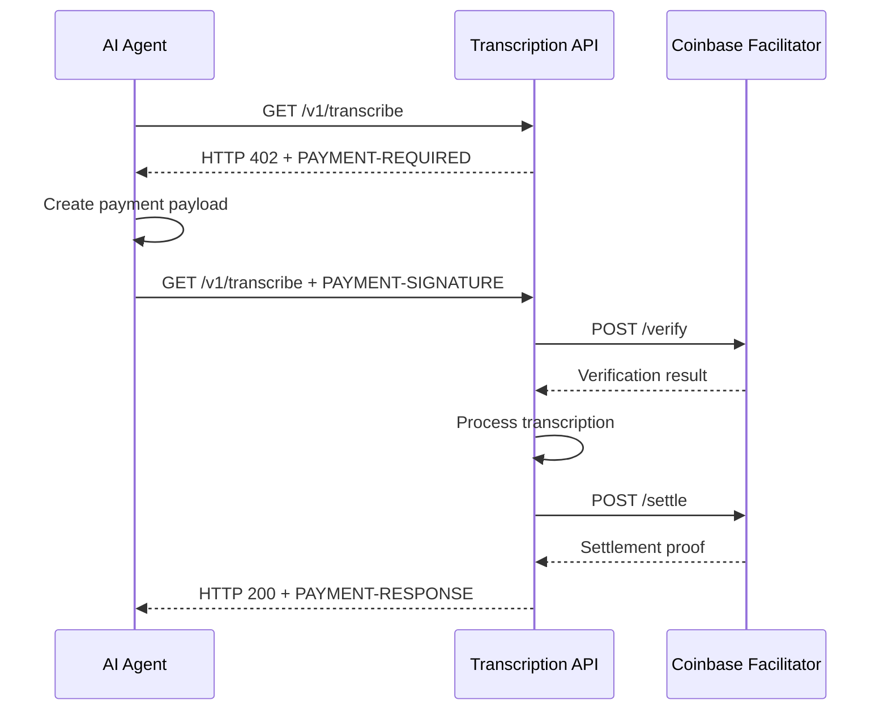

# AI Agent Integration Specification

## Industry Standards Compliance - Version 3.0

**Version:** 3.0.0  
**Date:** 2026-03-25

**Primary Service:** Transcription (`/transcribe`)  
**Secondary Service:** Translation (`/translate`)

This specification aligns with emerging industry standards for AI Agent integration:

| Standard | Purpose | Implementation |
|----------|---------|----------------|
| **MCP (Model Context Protocol)** | Tool discovery & invocation | MCP Server for transcription/translation tools |
| **A2A (Agent-to-Agent)** | Inter-agent communication | JSON-RPC based agent messaging |
| **OpenAPI 3.0** | REST API documentation | Complete OpenAPI spec |
| **OAuth 2.0 / OIDC** | Agent authentication | Machine-to-machine OAuth flow |
| **SIWE (EIP-4361)** | Web3 authentication | Ethereum wallet sign-in |
| **x402 v2** | HTTP-native crypto payments | USDC via Coinbase facilitator |

---

## 1. MCP (Model Context Protocol) Integration

### Overview

[MCP](https://modelcontextprotocol.io/) is Anthropic's open protocol for connecting AI models to external tools and data sources. Our implementation provides an MCP server that exposes transcription and translation capabilities as tools.

### MCP Tools

| Tool | Description | Primary |
|------|-------------|---------|
| `transcribe` | Transcribe audio/video to text | ✅ |
| `transcribe_stream` | Real-time streaming transcription | ✅ |
| `get_transcription` | Get transcription by ID | ✅ |
| `list_transcriptions` | List user's transcriptions | ✅ |
| `translate` | Translate text | |
| `translate_transcription` | Translate existing transcription | |
| `get_usage` | Get API usage statistics | |
| `check_quota` | Check remaining API quota | |
| `get_supported_languages` | Get list of supported languages | |

### MCP Server Implementation

```typescript
// packages/mcp-server/src/index.ts
import { Server } from '@modelcontextprotocol/sdk/server/index.js';
import { StdioServerTransport } from '@modelcontextprotocol/sdk/server/stdio.js';
import {
  CallToolRequestSchema,
  ListToolsRequestSchema,
  ListResourcesRequestSchema,
  ReadResourceRequestSchema,
} from '@modelcontextprotocol/sdk/types.js';
import { TranscriptionClient } from './transcription-client.js';

interface TranscribeToolArgs {
  audio_url: string;
  language?: string;
  format?: 'json' | 'text' | 'srt' | 'vtt';
}

interface TranslateToolArgs {
  text: string;
  source_language: string;
  target_language: string;
}

export class TranscriptionMCPServer {
  private server: Server;
  private client: TranscriptionClient;

  constructor() {
    this.client = new TranscriptionClient();
    
    this.server = new Server(
      {
        name: 'live-transcription-mcp',
        version: '3.0.0',
      },
      {
        capabilities: {
          tools: {},
          resources: {},
        },
      }
    );

    this.setupToolHandlers();
    this.setupResourceHandlers();
  }

  private setupToolHandlers(): void {
    this.server.setRequestHandler(ListToolsRequestSchema, async () => ({
      tools: [
        // PRIMARY: Transcription Tools
        {
          name: 'transcribe',
          description: 'Transcribe audio or video file to text. Supports multiple formats including MP3, MP4, WAV, and WebM.',
          inputSchema: {
            type: 'object',
            properties: {
              audio_url: {
                type: 'string',
                description: 'URL or path to the audio/video file to transcribe',
              },
              language: {
                type: 'string',
                description: 'Language code for the audio (e.g., "en", "es", "fr"). Auto-detected if not specified.',
                default: 'auto',
              },
              format: {
                type: 'string',
                enum: ['json', 'text', 'srt', 'vtt'],
                description: 'Output format for the transcription',
                default: 'json',
              },
            },
            required: ['audio_url'],
          },
        },
        {
          name: 'transcribe_stream',
          description: 'Real-time streaming transcription for live audio. Returns transcription chunks as they are processed.',
          inputSchema: {
            type: 'object',
            properties: {
              language: {
                type: 'string',
                description: 'Language code for the audio',
              },
              include_word_timestamps: {
                type: 'boolean',
                description: 'Include word-level timestamps',
                default: true,
              },
            },
          },
        },
        {
          name: 'get_transcription',
          description: 'Retrieve a previously created transcription by ID',
          inputSchema: {
            type: 'object',
            properties: {
              transcription_id: {
                type: 'string',
                description: 'The ID of the transcription to retrieve',
              },
            },
            required: ['transcription_id'],
          },
        },
        {
          name: 'list_transcriptions',
          description: 'List all transcriptions for the authenticated user',
          inputSchema: {
            type: 'object',
            properties: {
              limit: {
                type: 'integer',
                description: 'Maximum number of transcriptions to return',
                default: 20,
              },
              offset: {
                type: 'integer',
                description: 'Number of transcriptions to skip',
                default: 0,
              },
              status: {
                type: 'string',
                enum: ['processing', 'completed', 'failed'],
                description: 'Filter by status',
              },
            },
          },
        },
        // SECONDARY: Translation Tools
        {
          name: 'translate',
          description: 'Translate text from one language to another',
          inputSchema: {
            type: 'object',
            properties: {
              text: {
                type: 'string',
                description: 'The text to translate',
              },
              source_language: {
                type: 'string',
                description: 'Source language code',
              },
              target_language: {
                type: 'string',
                description: 'Target language code',
              },
            },
            required: ['text', 'source_language', 'target_language'],
          },
        },
        {
          name: 'translate_transcription',
          description: 'Translate an existing transcription to another language',
          inputSchema: {
            type: 'object',
            properties: {
              transcription_id: {
                type: 'string',
                description: 'ID of the transcription to translate',
              },
              target_language: {
                type: 'string',
                description: 'Target language code',
              },
            },
            required: ['transcription_id', 'target_language'],
          },
        },
        // Utility Tools
        {
          name: 'get_usage',
          description: 'Get API usage statistics',
          inputSchema: {
            type: 'object',
            properties: {},
          },
        },
        {
          name: 'check_quota',
          description: 'Check remaining API quota',
          inputSchema: {
            type: 'object',
            properties: {},
          },
        },
        {
          name: 'get_supported_languages',
          description: 'Get list of supported languages for transcription and translation',
          inputSchema: {
            type: 'object',
            properties: {},
          },
        },
      ],
    }));

    this.server.setRequestHandler(CallToolRequestSchema, async (request) => {
      const { name, arguments: args } = request.params;

      switch (name) {
        // Transcription Tools
        case 'transcribe': {
          const { audio_url, language = 'auto', format = 'json' } = args as TranscribeToolArgs;
          const result = await this.client.transcribe({ audio_url, language, format });
          return {
            content: [{ type: 'text', text: JSON.stringify(result, null, 2) }],
          };
        }

        case 'get_transcription': {
          const { transcription_id } = args as { transcription_id: string };
          const result = await this.client.getTranscription(transcription_id);
          return {
            content: [{ type: 'text', text: JSON.stringify(result, null, 2) }],
          };
        }

        case 'list_transcriptions': {
          const result = await this.client.listTranscriptions(args as any);
          return {
            content: [{ type: 'text', text: JSON.stringify(result, null, 2) }],
          };
        }

        // Translation Tools
        case 'translate': {
          const { text, source_language, target_language } = args as TranslateToolArgs;
          const result = await this.client.translate({ text, source_language, target_language });
          return {
            content: [{ type: 'text', text: JSON.stringify(result, null, 2) }],
          };
        }

        case 'translate_transcription': {
          const { transcription_id, target_language } = args as { transcription_id: string; target_language: string };
          const result = await this.client.translateTranscription({ transcription_id, target_language });
          return {
            content: [{ type: 'text', text: JSON.stringify(result, null, 2) }],
          };
        }

        // Utility Tools
        case 'get_usage': {
          const result = await this.client.getUsage();
          return {
            content: [{ type: 'text', text: JSON.stringify(result, null, 2) }],
          };
        }

        case 'check_quota': {
          const result = await this.client.checkQuota();
          return {
            content: [{ type: 'text', text: JSON.stringify(result, null, 2) }],
          };
        }

        case 'get_supported_languages': {
          const result = await this.client.getSupportedLanguages();
          return {
            content: [{ type: 'text', text: JSON.stringify(result, null, 2) }],
          };
        }

        default:
          throw new Error(`Unknown tool: ${name}`);
      }
    });
  }

  private setupResourceHandlers(): void {
    this.server.setRequestHandler(ListResourcesRequestSchema, async () => ({
      resources: [
        {
          uri: 'transcription://languages',
          name: 'Supported Languages',
          description: 'List of all supported languages for transcription',
          mimeType: 'application/json',
        },
        {
          uri: 'transcription://pricing',
          name: 'Pricing Tiers',
          description: 'Current pricing and subscription tiers',
          mimeType: 'application/json',
        },
        {
          uri: 'transcription://formats',
          name: 'Export Formats',
          description: 'Available export formats for transcriptions',
          mimeType: 'application/json',
        },
      ],
    }));

    this.server.setRequestHandler(ReadResourceRequestSchema, async (request) => {
      const { uri } = request.params;

      switch (uri) {
        case 'transcription://languages': {
          const languages = await this.client.getSupportedLanguages();
          return {
            contents: [{ uri, mimeType: 'application/json', text: JSON.stringify(languages) }],
          };
        }

        case 'transcription://pricing': {
          const pricing = await this.client.getPricing();
          return {
            contents: [{ uri, mimeType: 'application/json', text: JSON.stringify(pricing) }],
          };
        }

        case 'transcription://formats': {
          const formats = {
            json: 'JSON format with word-level timestamps and confidence scores',
            text: 'Plain text format',
            srt: 'SubRip subtitle format with timestamps',
            vtt: 'WebVTT format for web video',
          };
          return {
            contents: [{ uri, mimeType: 'application/json', text: JSON.stringify(formats) }],
          };
        }

        default:
          throw new Error(`Unknown resource: ${uri}`);
      }
    });
  }

  async run(): Promise<void> {
    const transport = new StdioServerTransport();
    await this.server.connect(transport);
    console.error('Live Transcription MCP Server running on stdio');
  }
}

const server = new TranscriptionMCPServer();
server.run().catch(console.error);
```

### MCP Client Configuration

```json
{
  "mcpServers": {
    "live-transcription": {
      "command": "npx",
      "args": ["-y", "@live-transcription/mcp-server@latest"],
      "env": {
        "LIVE_TRANSCRIPTION_API_KEY": "ltk_xxx",
        "LIVE_TRANSCRIPTION_API_SECRET": "lts_xxx",
        "LIVE_TRANSCRIPTION_BASE_URL": "https://api.livetranscription.app"
      }
    }
  }
}
```

### Claude Desktop Integration

```json
{
  "mcpServers": {
    "live-transcription": {
      "command": "node",
      "args": ["/path/to/live-transcription-mcp-server/dist/index.js"],
      "env": {
        "LIVE_TRANSCRIPTION_API_KEY": "ltk_xxx",
        "LIVE_TRANSCRIPTION_API_SECRET": "lts_xxx"
      }
    }
  }
}
```

---

## 2. A2A (Agent-to-Agent) Protocol

### Primary Methods

| Method | Description |
|--------|-------------|
| `transcription.request` | Request transcription of audio/video |
| `transcription.stream.start` | Start real-time transcription stream |
| `transcription.stream.chunk` | Send audio chunk for streaming |
| `transcription.stream.stop` | Stop transcription stream |
| `translation.request` | Request translation |

### A2A Message Format

```json
{
  "jsonrpc": "2.0",
  "method": "transcription.request",
  "params": {
    "from_agent": "agent_123",
    "to_agent": "transcription_service",
    "conversation_id": "conv_456",
    "payload": {
      "audio_url": "https://example.com/audio.mp3",
      "language": "en",
      "format": "json"
    }
  },
  "id": "req_789"
}
```

### A2A Response

```json
{
  "jsonrpc": "2.0",
  "result": {
    "from_agent": "transcription_service",
    "to_agent": "agent_123",
    "conversation_id": "conv_456",
    "payload": {
      "id": "trans_xxx",
      "text": "Hello, welcome to our meeting...",
      "language": "en",
      "duration": 300,
      "word_count": 450,
      "segments": [
        {"start": 0, "end": 5, "text": "Hello, welcome to our meeting"}
      ],
      "status": "completed"
    }
  },
  "id": "req_789"
}
```

---

## 3. x402 v2 Payment Protocol

### Overview

The [x402 v2 protocol](X402_PAYMENTS.md) enables AI agents to make automatic crypto payments for transcription and translation services using HTTP 402 Payment Required status codes.

### Payment Flow



### Supported Networks

| Network | Chain ID | Asset | Payment Scheme |
|---------|----------|-------|----------------|
| Base Sepolia | 84532 | USDC | EIP-3009 |
| Base | 8453 | USDC | EIP-3009 / Permit2 |
| Polygon | 137 | USDC | EIP-3009 |
| Ethereum | 1 | USDC | EIP-3009 |
| Solana Devnet | solana-devnet | USDC | Solana Pay |

### Pricing

| Endpoint | Price (USD) | Payment Model |
|----------|-------------|---------------|
| `/v1/transcribe` | $0.01 | Pay-per-request |
| `/v1/transcribe/stream` | $0.05 | Pay-per-minute |
| `/v1/translate` | $0.001 | Pay-per-request |

### Agent SDK Integration

```typescript
import { X402Client } from '@live-transcription/agent-sdk';

const client = new X402Client({
  privateKey: process.env.AGENT_WALLET_PRIVATE_KEY,
  facilitatorUrl: 'https://x402.org/facilitator',
  baseUrl: 'https://api.livetranscription.app',
});

// Transcribe with automatic payment
const result = await client.transcribe({
  audio_url: 'https://example.com/meeting.mp3',
  language: 'en',
});

// Translate with automatic payment
const translation = await client.translate({
  text: 'Hello, world!',
  source_language: 'en',
  target_language: 'es',
});
```

For complete x402 v2 implementation details, see [X402_PAYMENTS.md](X402_PAYMENTS.md).

---

## 4. OAuth 2.0 Machine-to-Machine Authentication

### Scopes

| Scope | Description |
|-------|-------------|
| `transcribe:read` | Read transcriptions |
| `transcribe:write` | Create new transcriptions |
| `translate:read` | Read translations |
| `translate:write` | Create new translations |
| `agent:read` | Read agent information |
| `agent:write` | Modify agent settings |

### Token Request

```bash
curl -X POST https://auth.livetranscription.app/oauth/token \
  -H "Content-Type: application/x-www-form-urlencoded" \
  -d "grant_type=client_credentials" \
  -d "client_id=your-client-id" \
  -d "client_secret=your-client-secret" \
  -d "scope=transcribe:write translate:read"
```

---

## 5. OpenAPI 3.0 Specification

```yaml
openapi: 3.0.3
info:
  title: Live Transcription API
  description: |
    API for AI Agents to access transcription and translation services.
    
    ## Primary Service: Transcription
    
    The `/transcribe` endpoint provides real-time transcription of audio and video content.
    
    ## Authentication
    
    - API Key + HMAC Signature
    - OAuth 2.0 Client Credentials
    - MCP Protocol
  version: 3.0.0

servers:
  - url: https://api.livetranscription.app/v1

paths:
  /transcribe:
    post:
      summary: Transcribe audio/video
      description: Transcribe audio or video file to text
      operationId: transcribeAudio
      tags:
        - Transcription
      requestBody:
        required: true
        content:
          application/json:
            schema:
              type: object
              required:
                - audio_url
              properties:
                audio_url:
                  type: string
                  description: URL to audio/video file
                language:
                  type: string
                  default: auto
                format:
                  type: string
                  enum: [json, text, srt, vtt]
                  default: json
      responses:
        '200':
          description: Successful transcription
          content:
            application/json:
              schema:
                type: object
                properties:
                  id:
                    type: string
                  text:
                    type: string
                  language:
                    type: string
                  duration:
                    type: integer
                  word_count:
                    type: integer
                  segments:
                    type: array
                  status:
                    type: string

  /translate:
    post:
      summary: Translate text
      description: Translate text from one language to another
      operationId: translateText
      tags:
        - Translation
      requestBody:
        required: true
        content:
          application/json:
            schema:
              type: object
              required:
                - text
                - source_language
                - target_language
              properties:
                text:
                  type: string
                source_language:
                  type: string
                target_language:
                  type: string
      responses:
        '200':
          description: Successful translation
          content:
            application/json:
              schema:
                type: object
                properties:
                  id:
                    type: string
                  original_text:
                    type: string
                  translated_text:
                    type: string
```

---

## 6. Agent Subscription Tiers

| Tier | Monthly | Transcription | Translation | API Rate Limit |
|------|---------|---------------|-------------|----------------|
| Free | $0 | 60 min/month | 1,000 chars/month | 10/min |
| Starter | $29 | 10 hours/month | 50,000 chars/month | 60/min |
| Pro | $99 | 50 hours/month | Unlimited | 300/min |
| Enterprise | $499 | Unlimited | Unlimited | 1,000/min |

---

## 7. Agent SDK (TypeScript)

```typescript
// packages/agent-sdk/src/client.ts
export class AgentClient {
  // Primary: Transcription
  async transcribe(request: TranscribeRequest): Promise<TranscribeResponse> {
    return this.request('/v1/transcribe', request);
  }

  async transcribeStream(): Promise<WebSocket> {
    return this.connectWebSocket('/v1/transcribe/stream');
  }

  async getTranscription(id: string): Promise<Transcription> {
    return this.request(`/v1/transcriptions/${id}`);
  }

  async listTranscriptions(params?: ListParams): Promise<Transcription[]> {
    return this.request('/v1/transcriptions', { params });
  }

  // Secondary: Translation
  async translate(request: TranslateRequest): Promise<TranslateResponse> {
    return this.request('/v1/translate', request);
  }

  async translateTranscription(id: string, targetLanguage: string): Promise<Translation> {
    return this.request(`/v1/transcriptions/${id}/translate`, { target_language: targetLanguage });
  }

  // Utility
  async getUsage(): Promise<UsageResponse> {
    return this.request('/v1/agents/me/usage');
  }

  async checkQuota(): Promise<QuotaResponse> {
    return this.request('/v1/agents/me/quota');
  }
}
```

---

## 8. Legacy Payment Systems

### Stripe Crypto (Deprecated)

The Stripe Crypto payment system has been deprecated in favor of x402 v2. Existing integrations should migrate to the x402 protocol for improved agent-to-agent commerce support.

For migration guidance, see [X402_PAYMENTS.md](X402_PAYMENTS.md#migration-from-legacy-system).

---

*Document Version: 3.0.0*
*Last Updated: 2026-03-25*
