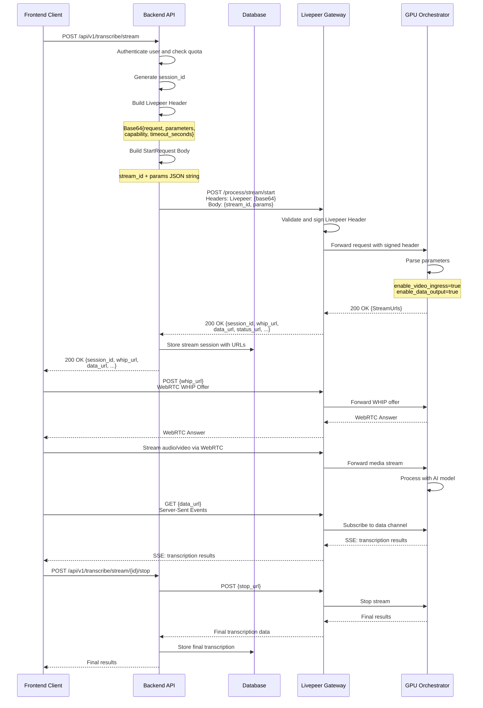
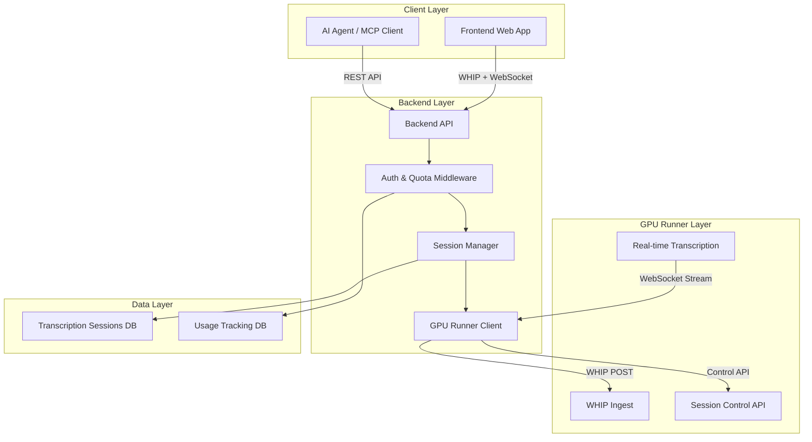
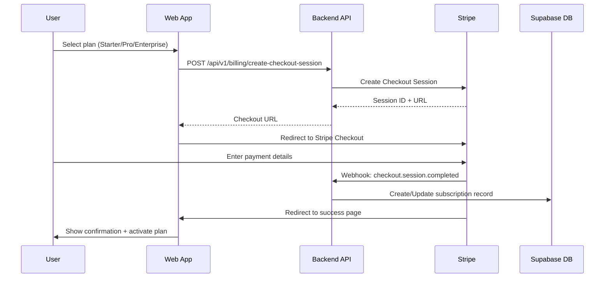
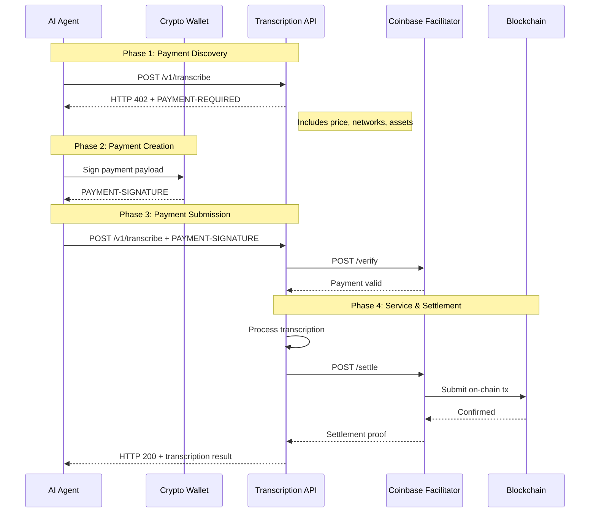
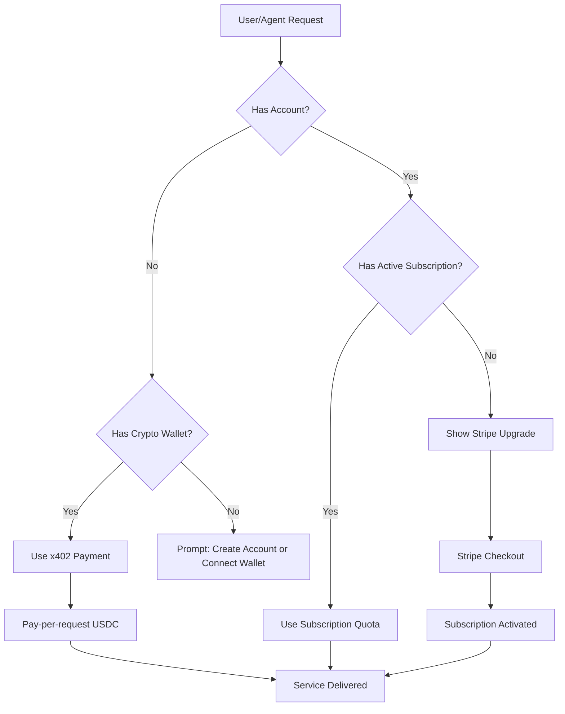

# Live Transcription & Translation Platform
## Technical Specification Document - Version 5.0

**Version:** 5.0.0
**Date:** 2026-03-27
**Author:** Principal Software Architect

**Primary Offering:** Real-time Audio/Video Transcription (`/transcribe`)
**Secondary Offering:** Translation (`/translate`)

**Architecture:** Backend Proxy with Worker-based Processing

**Model Architecture:**
- **Batch Transcription (`/transcribe`)**: Granite 4.0 1B Speech ONNX (CPU Worker)
- **Real-time Streaming (`/transcribe/stream`)**: VLLM Voxtral Realtime (GPU Worker)
- **Translation (`/translate`)**: Granite 4.0 1B Speech ONNX (CPU Worker)

---

## Table of Contents

1. [Executive Summary](#1-executive-summary)
2. [System Architecture Overview](#2-system-architecture-overview)
3. [Backend Proxy Architecture](#3-backend-proxy-architecture)
4. [Worker Architecture](#4-worker-architecture)
5. [Model Architecture](#5-model-architecture)
6. [Monorepo Structure](#6-monorepo-structure)
7. [Supabase Integration](#7-supabase-integration)
8. [Ethereum Authentication (SIWE)](#8-ethereum-authentication-siwe)
9. [x402 v2 Crypto Payments](#9-x402-v2-crypto-payments)
10. [Payments and Subscription Management](#10-payments-and-subscription-management)
11. [Transcription Service](#11-transcription-service)
12. [Translation Service](#12-translation-service)
13. [Chrome Extension Architecture](#13-chrome-extension-architecture)
14. [Shared Libraries](#14-shared-libraries)
15. [Database Schema](#15-database-schema)
16. [Security Protocol](#16-security-protocol)
17. [Environment Setup](#17-environment-setup)
18. [Migration Roadmap](#18-migration-roadmap)
19. [CI/CD Pipeline](#19-cicd-pipeline)

---

## 1. Executive Summary

This document defines the architecture for a **Live Transcription & Translation Platform** consisting of:

1. **Chrome Extension (Manifest V3)** - Browser-based transcription overlay for video/audio content
2. **Standalone Web Application** - Full-featured dashboard for transcription management
3. **AI Agent API** - Programmatic access to transcription and translation services

The system utilizes a **hybrid model architecture**:

| Service | Model | Hardware | Use Case |
|---------|-------|----------|----------|
| `/transcribe` (batch) | Granite 4.0 1B Speech ONNX | CPU | File uploads, recorded audio |
| `/transcribe/stream` | VLLM Voxtral Realtime | GPU | Live streaming, real-time captions |
| `/translate` | Granite 4.0 1B Speech ONNX | CPU | Text translation |

### Primary Offering: Transcription (`/transcribe`)

The core service provides transcription of:
- Live video conferences (Zoom, Google Meet, Teams) - **Voxtral (streaming)**
- YouTube videos and livestreams - **Voxtral (streaming)**
- Podcast audio files - **Granite 4.0 (batch)**
- Meeting recordings - **Granite 4.0 (batch)**
- Voice notes and dictation - **Granite 4.0 (batch)**

### Secondary Offering: Translation (`/translate`)

After transcription, users can:
- Translate transcribed text to 20+ languages
- Get real-time translated subtitles
- Export translated transcripts

### Key Objectives

- **Cost Efficiency**: CPU-based Granite 4.0 for batch processing reduces GPU costs
- **Low Latency**: Voxtral for real-time streaming ensures sub-second response
- **Web3 Authentication**: Sign-In with Ethereum (SIWE) for decentralized identity
- **Crypto Payments**: Accept USDC via x402 v2 protocol with Coinbase facilitator
- **AI Agent Support**: MCP, A2A, and OAuth 2.0 for programmatic access

---

## 2. System Architecture Overview

```
┌─────────────────────────────────────────────────────────────────────────────┐
│                              CLIENT LAYER                                    │
├─────────────────────────────────┬───────────────────────────────────────────┤
│     CHROME EXTENSION            │         WEB APPLICATION                   │
│  ┌─────────────────────────┐    │    ┌─────────────────────────────────┐    │
│  │  Popup (React/TS)       │    │    │  Dashboard (React/TS)           │    │
│  │  - Transcribe Button    │    │    │  - Transcription Library        │    │
│  │  - Live Captions        │    │    │  - Export Options               │    │
│  ├─────────────────────────┤    │    ├─────────────────────────────────┤    │
│  │  Content Script         │    │    │  Settings Panel                 │    │
│  │  - Video Overlay        │    │    │  - Language Preferences         │    │
│  │  - Caption Display      │    │    │  - Subscription Management      │    │
│  ├─────────────────────────┤    │    └─────────────────────────────────┘    │
│  │  Background Worker      │                                                 │
│  │  - Audio Capture        │    ┌─────────────────────────────────┐        │
│  │  - Stream Processing    │    │      AI AGENTS (SDK)            │        │
│  └─────────────────────────┘    │    - LangChain Integration      │        │
│                                  │    - AutoGPT Commands           │        │
│                                  │    - MCP Tool Server            │        │
│                                  └─────────────────────────────────┘        │
└─────────────────────────────────────────────────────────────────────────────┘
                                    │
                                    ▼
┌─────────────────────────────────────────────────────────────────────────────┐
│                           SHARED LIBRARIES                                   │
│  ┌──────────────┐  ┌──────────────┐  ┌──────────────┐  ┌──────────────┐     │
│  │ @lib/ui      │  │ @lib/supabase│  │ @lib/web3    │  │ @lib/types   │     │
│  │ Components   │  │ Client       │  │ SIWE/Auth    │  │ TypeScript   │     │
│  └──────────────┘  └──────────────┘  └──────────────┘  └──────────────┘     │
│  ┌──────────────┐  ┌──────────────┐  ┌──────────────┐                       │
│  │ @lib/mcp     │  │ @lib/agent   │  │ @lib/audio   │                       │
│  │ MCP Server   │  │ SDK          │  │ Audio Utils  │                       │
│  └──────────────┘  └──────────────┘  └──────────────┘                       │
└─────────────────────────────────────────────────────────────────────────────┘
                                    │
                                    ▼
┌─────────────────────────────────────────────────────────────────────────────┐
│                         SUPABASE PLATFORM                                    │
│  ┌──────────────┐  ┌──────────────┐  ┌──────────────┐  ┌──────────────┐     │
│  │ Supabase Auth│  │   Database   │  │   Realtime   │  │   Storage    │     │
│  │ • Email      │  │  (PostgreSQL)│  │  Subscriptions│  │   (Assets)   │     │
│  │ • Google     │  │  • RLS       │  │  • Presence  │  │              │     │
│  │ • Ethereum   │  │  • Triggers  │  │  • Broadcast │  │              │     │
│  │   (SIWE)     │  │              │  │              │  │              │     │
│  └──────────────┘  └──────────────┘  └──────────────┘  └──────────────┘     │
│  ┌──────────────────────────────────────────────────────────────────────┐   │
│  │                    Edge Functions                                     │   │
│  │  • verify-siwe  • process-payment  • transcribe  • translate         │   │
│  └──────────────────────────────────────────────────────────────────────┘   │
└─────────────────────────────────────────────────────────────────────────────┘
                                    │
                    ┌───────────────┴───────────────┐
                    ▼                               ▼
┌─────────────────────────────┐     ┌─────────────────────────────┐
│   BATCH PROCESSING (CPU)    │     │   STREAMING (GPU)           │
│  ┌───────────────────────┐  │     │  ┌───────────────────────┐  │
│  │  Granite 4.0 1B       │  │     │  │  VLLM Voxtral         │  │
│  │  Speech ONNX          │  │     │  │  Realtime             │  │
│  │                       │  │     │  │                       │  │
│  │  - /transcribe        │  │     │  │  - /transcribe/stream │  │
│  │  - /translate         │  │     │  │  - Live captions      │  │
│  │                       │  │     │  │                       │  │
│  │  Cost: Low (CPU)      │  │     │  │  Cost: Higher (GPU)   │  │
│  │  Latency: ~1-5s       │  │     │  │  Latency: <500ms      │  │
│  └───────────────────────┘  │     │  └───────────────────────┘  │
└─────────────────────────────┘     └─────────────────────────────┘
                                    │
                                    ▼
┌─────────────────────────────────────────────────────────────────────────────┐
│                          x402 v2 PAYMENTS                                    │
│  ┌──────────────┐  ┌──────────────┐  ┌──────────────┐                       │
│  │  x402        │  │   Coinbase   │  │  Pay-per     │                       │
│  │  Protocol    │  │  Facilitator │  │  Request     │                       │
│  │  HTTP 402    │  │  Verification│  │  Settlement  │                       │
│  │              │  │  & Settle    │  │  Automatic   │                       │
│  └──────────────┘  └──────────────┘  └──────────────┘                       │
└─────────────────────────────────────────────────────────────────────────────┘
```

---

## 3. Model Architecture

### 3.1 Granite 4.0 1B Speech ONNX (CPU)

**Model:** [forkjoin-ai/granite-4.0-1b-speech-onnx](https://huggingface.co/forkjoin-ai/granite-4.0-1b-speech-onnx)

**Use Cases:**
- Batch transcription of uploaded audio/video files
- Translation of transcribed text
- Offline processing

**Hardware Requirements:**
- CPU: 4+ cores recommended
- RAM: 8GB minimum, 16GB recommended
- No GPU required

**Performance:**
- Transcription speed: ~0.5x real-time on CPU
- Translation speed: ~10x real-time on CPU
- Latency: 1-5 seconds depending on audio length

**Implementation:**

```python
# backend/granite_transcriber.py
import onnxruntime as rt
import numpy as np
from pathlib import Path
import librosa

class Granite4Transcriber:
    """Granite 4.0 1B Speech ONNX transcriber for CPU-based batch processing."""
    
    def __init__(self, model_path: str = "models/granite-4.0-1b-speech-onnx"):
        self.model_path = Path(model_path)
        
        # Initialize ONNX runtime session with CPU
        session_options = rt.SessionOptions()
        session_options.intra_op_num_threads = 4
        session_options.inter_op_num_threads = 2
        
        self.session = rt.InferenceSession(
            str(self.model_path / "model.onnx"),
            sess_options=session_options,
            providers=["CPUExecutionProvider"]
        )
        
        # Load tokenizer
        self.tokenizer = self._load_tokenizer()
        
    def _load_tokenizer(self):
        """Load tokenizer from model directory."""
        from transformers import AutoTokenizer
        return AutoTokenizer.from_pretrained(self.model_path)
    
    def transcribe(self, audio_path: str, language: str = "en") -> dict:
        """
        Transcribe audio file using Granite 4.0 on CPU.
        
        Args:
            audio_path: Path to audio file (mp3, wav, etc.)
            language: Language code for transcription
            
        Returns:
            Dictionary with transcription results
        """
        # Load and preprocess audio
        audio, sample_rate = librosa.load(audio_path, sr=16000)
        
        # Process in chunks for long audio
        chunk_duration = 30  # seconds
        chunk_samples = chunk_duration * sample_rate
        
        transcriptions = []
        segments = []
        
        for i in range(0, len(audio), chunk_samples):
            chunk = audio[i:i + chunk_samples]
            
            # Pad if necessary
            if len(chunk) < chunk_samples:
                chunk = np.pad(chunk, (0, chunk_samples - len(chunk)))
            
            # Run inference
            inputs = self._prepare_inputs(chunk, language)
            outputs = self.session.run(None, inputs)
            
            # Decode output
            text = self.tokenizer.decode(outputs[0][0], skip_special_tokens=True)
            transcriptions.append(text)
            
            # Calculate segment timestamps
            segments.append({
                "start": i / sample_rate,
                "end": min((i + chunk_samples) / sample_rate, len(audio) / sample_rate),
                "text": text
            })
        
        return {
            "text": " ".join(transcriptions),
            "segments": segments,
            "language": language,
            "duration": len(audio) / sample_rate,
            "model": "granite-4.0-1b",
            "hardware": "cpu"
        }
    
    def _prepare_inputs(self, audio: np.ndarray, language: str) -> dict:
        """Prepare audio input for model inference."""
        # Convert to mel spectrogram
        mel = librosa.feature.melspectrogram(
            y=audio,
            sr=16000,
            n_mels=128,
            hop_length=160,
            n_fft=400
        )
        mel = librosa.power_to_db(mel, ref=np.max)
        
        # Normalize
        mel = (mel - mel.mean()) / (mel.std() + 1e-8)
        
        # Add batch dimension
        mel = np.expand_dims(mel, 0).astype(np.float32)
        
        # Prepare language token
        lang_token = self.tokenizer.encode(f"<|{language}|>", add_special_tokens=False)[0]
        lang_tokens = np.array([[lang_token]], dtype=np.int64)
        
        return {
            "input_features": mel,
            "decoder_input_ids": lang_tokens
        }
    
    def translate(self, text: str, source_lang: str, target_lang: str) -> dict:
        """
        Translate text using Granite 4.0.
        
        Args:
            text: Text to translate
            source_lang: Source language code
            target_lang: Target language code
            
        Returns:
            Dictionary with translation results
        """
        # Prepare input
        input_text = f"<|translate|> from {source_lang} to {target_lang}: {text}"
        inputs = self.tokenizer(input_text, return_tensors="np")
        
        # Run inference
        outputs = self.session.run(None, {
            "input_ids": inputs["input_ids"].astype(np.int64),
            "attention_mask": inputs["attention_mask"].astype(np.int64)
        })
        
        # Decode output
        translated = self.tokenizer.decode(outputs[0][0], skip_special_tokens=True)
        
        return {
            "original_text": text,
            "translated_text": translated,
            "source_language": source_lang,
            "target_language": target_lang,
            "model": "granite-4.0-1b",
            "hardware": "cpu"
        }
```

### 3.2 VLLM Voxtral Realtime (GPU)

**Model:** mistralai/Voxtral-Mini-4B-Realtime-2602

**Use Cases:**
- Real-time streaming transcription
- Live captions for video conferences
- Interactive voice applications

**Hardware Requirements:**
- GPU: NVIDIA GPU with 8GB+ VRAM (RTX 3060 or better)
- CUDA 11.8+
- RAM: 16GB minimum

**Performance:**
- Latency: <500ms for streaming chunks
- Real-time factor: ~0.1x (10x faster than real-time)

**Implementation:**

```python
# backend/voxtral_streamer.py
import asyncio
import websockets
import json
from typing import AsyncGenerator

class VoxtralStreamer:
    """VLLM Voxtral Realtime streamer for GPU-based live transcription."""
    
    def __init__(self, ws_url: str = "ws://vllm:6000/v1/realtime"):
        self.ws_url = ws_url
        self.websocket = None
        
    async def connect(self):
        """Connect to VLLM Voxtral realtime endpoint."""
        self.websocket = await websockets.connect(self.ws_url)
        
        # Initialize session
        await self.websocket.send(json.dumps({
            "type": "session.update",
            "session": {
                "modalities": ["text"],
                "input_audio_format": "pcm16",
                "output_audio_format": "none",
                "turn_detection": {"type": "none"},
            }
        }))
        
    async def stream_transcribe(self, audio_chunks: AsyncGenerator[bytes, None]) -> AsyncGenerator[dict, None]:
        """
        Stream audio chunks and receive real-time transcriptions.
        
        Args:
            audio_chunks: Async generator of PCM16 audio chunks
            
        Yields:
            Transcription results with confidence scores
        """
        async for chunk in audio_chunks:
            # Send audio chunk
            await self.websocket.send(json.dumps({
                "type": "input_audio_buffer.append",
                "audio": chunk.hex(),
            }))
            
            # Receive transcription update
            response = await self.websocket.recv()
            data = json.loads(response)
            
            if data.get("type") == "transcription_update":
                yield {
                    "text": data.get("text", ""),
                    "is_final": data.get("is_final", False),
                    "confidence": data.get("confidence", 0.0),
                    "timestamp": data.get("timestamp"),
                }
                
    async def close(self):
        """Close websocket connection."""
        if self.websocket:
            await self.websocket.close()
```

### 3.3 Model Selection Logic

```python
# backend/model_router.py
from enum import Enum
from typing import Optional

class ModelType(Enum):
    GRANITE_CPU = "granite-4.0-1b"
    VOXTRAL_GPU = "voxtral-realtime"

class ModelRouter:
    """Routes transcription requests to appropriate model based on use case."""
    
    def select_model(
        self,
        is_streaming: bool = False,
        audio_duration: Optional[float] = None,
        latency_requirement: Optional[str] = None
    ) -> ModelType:
        """
        Select the appropriate model based on request parameters.
        
        Args:
            is_streaming: Whether this is a real-time streaming request
            audio_duration: Duration of audio in seconds
            latency_requirement: 'low', 'medium', or 'high'
            
        Returns:
            ModelType enum value
        """
        # Real-time streaming always uses Voxtral
        if is_streaming:
            return ModelType.VOXTRAL_GPU
            
        # Check latency requirement
        if latency_requirement == "low":
            return ModelType.VOXTRAL_GPU
            
        # For batch processing, use Granite for cost efficiency
        if audio_duration and audio_duration > 60:
            # Long audio files benefit from CPU processing
            return ModelType.GRANITE_CPU
            
        # Default to Granite for cost efficiency
        return ModelType.GRANITE_CPU
```

---

## 4. API Endpoints Overview

### Primary: Transcription

| Method | Endpoint | Model | Description |
|--------|----------|-------|-------------|
| POST | `/api/v1/transcribe` | Granite 4.0 (CPU) | Transcribe audio/video file |
| POST | `/api/v1/transcribe/stream` | Voxtral (GPU) | Real-time transcription stream |
| GET | `/api/v1/transcriptions` | - | List user transcriptions |
| GET | `/api/v1/transcriptions/:id` | - | Get transcription by ID |
| DELETE | `/api/v1/transcriptions/:id` | - | Delete transcription |
| POST | `/api/v1/transcribe/whip` | Voxtral (GPU) | WHIP endpoint for WebRTC |

### Secondary: Translation

| Method | Endpoint | Model | Description |
|--------|----------|-------|-------------|
| POST | `/api/v1/translate` | Granite 4.0 (CPU) | Translate text |
| POST | `/api/v1/translate/transcription` | Granite 4.0 (CPU) | Translate existing transcription |
| GET | `/api/v1/languages` | - | Get supported languages |

---

## 3. Backend Proxy Architecture

### Overview

The platform uses a **backend proxy architecture** where all requests flow through the backend, which proxies to downstream workers at the GPU_RUNNER_URL. This eliminates edge functions and provides centralized control, session management, and quota enforcement.

```mermaid
flowchart TB
    subgraph Client Layer
        A[Frontend Web App]
        B[AI Agent / MCP Client]
    end
    
    subgraph Backend Layer
        C[Backend API]
        D[Auth & Quota Middleware]
        E[Session Manager]
    end
    
    subgraph Worker Layer (GPU_RUNNER_URL)
        F[Worker Router]
        G[Transcribe Worker]
        H[Translate Worker]
        I[Stream Worker]
    end
    
    subgraph Data Layer
        J[Transcription Sessions DB]
        K[Usage Tracking DB]
    end
    
    A -->|WHIP + WebSocket| C
    B -->|REST API| C
    C --> D
    D --> E
    E --> F
    F -->|/process/request/transcribe| G
    F -->|/process/request/translate| H
    F -->|/process/stream/start| I
    E --> J
    D --> K
```

### Request Routing

The backend proxies requests to workers using URL path routing:

| Backend Endpoint | Worker Route | Description |
|-----------------|--------------|-------------|
| `/v1/transcribe` | `/process/request/transcribe` | Batch transcription |
| `/v1/translate` | `/process/request/translate` | Translation |
| `/v1/transcribe/stream` | `/process/stream/start` | Start streaming session |

---

## 4. Worker Architecture

### Overview

Workers are deployed at the `GPU_RUNNER_URL` and handle the actual transcription/translation processing. The backend routes requests to appropriate workers based on the URL path.

### Worker Types

| Worker | Route | Hardware | Model |
|--------|-------|----------|-------|
| Transcribe Worker | `/process/request/transcribe` | CPU | Granite 4.0 1B Speech ONNX |
| Translate Worker | `/process/request/translate` | CPU | Granite 4.0 1B Speech ONNX |
| Stream Worker | `/process/stream/start` | GPU | VLLM Voxtral Realtime |

### Worker Router

The worker router at `/process` routes requests based on the appended path:

```
/process/request/transcribe  → Transcribe Worker
/process/request/translate   → Translate Worker
/process/stream/start        → Stream Worker
```

### Worker API

All workers share a common interface:

**Request:**
```json
{
  "session_id": "uuid-here",  // Optional, for tracking
  "language": "en",
  "model": "granite-4.0-1b",
  ...  // Worker-specific parameters
}
```

**Response:**
```json
{
  "job_id": "uuid-here",
  "status": "completed",
  ...  // Worker-specific results
}
```

---

### 4.1 BYOC AI Stream API Integration

The Stream Worker integrates with the **BYOC AI Stream API** (Bring Your Own Cloud) for real-time video streaming with AI processing capabilities. This API is served by the Livepeer Gateway and provides standardized interfaces for stream management.

#### Base URL

All Stream Worker endpoints are rooted at `/process/stream` and are served by the Livepeer Gateway:

```
Base URL: https://{gateway-host}/process/stream
```

#### Livepeer Header Authentication

Stream requests must include a `Livepeer` HTTP header containing a Base64-encoded JSON object (the _Livepeer Header_). The header includes the job request, parameters, capability name, and timeout. The client sends the header **unsigned**; the Gateway signs it before forwarding to Orchestrators.

**Livepeer Header Structure (before Base64 encoding):**

```json
{
  "request": "{\"stream_id\": \"<session_id>\"}",
  "parameters": "{\"enable_video_ingress\":true,\"enable_data_output\":true}",
  "capability": "video-analysis",
  "timeout_seconds": 120
}
```

**Header Fields:**

| Field | Type | Required | Description |
|-------|------|----------|-------------|
| `timeout_seconds` | integer | Yes | Maximum processing time in seconds |
| `capability` | string | Yes | Name of the AI capability to use (e.g., "video-analysis") |
| `request` | string | Yes | JSON-encoded `JobRequestDetails` object |
| `parameters` | string | Yes | JSON-encoded `JobParameters` object |

#### JobRequestDetails

```json
{
  "stream_id": "string"
}
```

| Field | Type | Required | Description |
|-------|------|----------|-------------|
| `stream_id` | string | Yes | Identifier of the stream to create or operate on |

#### JobParameters

```json
{
  "orchestrators": {
    "exclude": ["orch1_url", "orch2_url"],
    "include": ["orch1_url", "orch2_url"]
  },
  "enable_video_ingress": true,
  "enable_video_egress": true,
  "enable_data_output": true
}
```

| Field | Type | Required | Description |
|-------|------|----------|-------------|
| `orchestrators` | object | No | Optional filter to select specific orchestrators |
| `enable_video_ingress` | boolean | Yes | Allow video input (required: `true` for streaming) |
| `enable_video_egress` | boolean | No | Allow video output (default: `false`) |
| `enable_data_output` | boolean | Yes | Enable server-sent events data channel (required: `true` for transcripts) |

#### StartRequest Body Structure

The request body for `/process/stream/start` uses the `StartRequest` format:

```json
{
  "stream_name": "optional stream name that will be part of the stream_id returned",
  "rtmp_output": "optional custom RTMP output URL",
  "stream_id": "optional custom stream identifier",
  "params": "JSON-encoded string of pipeline parameters passed to worker"
}
```

| Field | Type | Required | Description |
|-------|------|----------|-------------|
| `stream_name` | string | No | Stream name that will be part of the generated stream_id |
| `rtmp_output` | string | No | Custom RTMP output URL |
| `stream_id` | string | No | Custom stream identifier (auto-generated if omitted) |
| `params` | string | No | JSON-encoded string of pipeline parameters (e.g., `{"language":"en","model":"voxtral-realtime"}`) |

**Note:** All `StartRequest` fields are optional. If `stream_id` is omitted, a unique ID will be generated by the worker.

#### StreamUrls Response Structure

```json
{
  "stream_id": "string",
  "whip_url": "string (WebRTC WHIP ingest endpoint)",
  "whep_url": "string (WebRTC WHEP egress endpoint)",
  "rtmp_url": "string (RTMP ingest endpoint)",
  "rtmp_output_url": "string (comma-separated RTMP egress URLs)",
  "update_url": "string (POST to update parameters)",
  "status_url": "string (GET current status)",
  "data_url": "string (SSE data channel, optional)",
  "stop_url": "string"
}
```

| Field | Type | Description |
|-------|------|-------------|
| `stream_id` | string | Unique identifier for the stream |
| `whip_url` | string | WebRTC WHIP ingest endpoint |
| `whep_url` | string | WebRTC WHEP egress endpoint |
| `rtmp_url` | string | RTMP ingest endpoint |
| `rtmp_output_url` | string | Comma-separated RTMP egress URLs |
| `update_url` | string | POST endpoint to update stream parameters |
| `status_url` | string | GET endpoint for current status |
| `data_url` | string | Server-Sent Events data channel (when `enable_data_output: true`) |
| `stop_url` | string | POST endpoint to stop the stream |

#### Python Implementation Example

```python
import base64
import json
import aiohttp

async def create_stream_session(session_id: str, language: str = "en"):
    """Create a streaming session with the BYOC AI Stream API."""
    
    # Build Livepeer header payload
    livepeer_payload = {
        "request": json.dumps({"stream_id": session_id}),
        "parameters": json.dumps({
            "enable_video_ingress": True,
            "enable_data_output": True
        }),
        "capability": "video-analysis",
        "timeout_seconds": 120
    }
    
    # Base64 encode the Livepeer header
    livepeer_header = base64.b64encode(
        json.dumps(livepeer_payload).encode()
    ).decode()
    
    # Build StartRequest body with params field
    start_request = {
        "stream_id": session_id,
        "params": json.dumps({
            "language": language,
            "model": "voxtral-realtime"
        })
    }
    
    # Send request to GPU Runner
    async with aiohttp.ClientSession() as session:
        async with session.post(
            f"{GPU_RUNNER_URL}/process/stream/start",
            headers={"Livepeer": livepeer_header},
            json=start_request,
            timeout=aiohttp.ClientTimeout(total=30)
        ) as runner_response:
            if runner_response.status != 200:
                raise Exception("Failed to create streaming session")
            
            return await runner_response.json()
```

#### Stream Endpoints Reference

| Method | Path | Description |
|--------|------|-------------|
| **POST** | `/process/stream/start` | Create a new stream. Requires `Livepeer` header. Body = `StartRequest` JSON. Returns `StreamUrls` JSON. |
| **POST** | `/process/stream/{streamId}/stop` | Stop and clean up a running stream. |
| **POST** | `/process/stream/{streamId}/whip` | WebRTC WHIP ingest endpoint (requires `LIVE_AI_WHIP_ADDR` set on Gateway). |
| **POST** | `/process/stream/{streamId}/rtmp` | RTMP ingest endpoint. Called by MediaMTX to signal an RTMP stream is being received. |
| **POST** | `/process/stream/{streamId}/update` | Update stream parameters. Requires `Livepeer` header with `timeout_seconds` and `request` fields. |
| **GET** | `/process/stream/{streamId}/status` | Retrieve current stream status. Returns JSON with `whep_url`, `orchestrator`, and `ingest_metrics`. |
| **GET** | `/process/stream/{streamId}/data` | Server-Sent Events endpoint for data channel output. Returns `text/event-stream` with JSONL from the pipeline worker. Returns `503` if no data output exists. |

#### Update Stream Request Format

Update requests also require a `Livepeer` header with reduced fields:

```json
{
  "request": "{\"stream_id\": \"<stream_id>\"}",
  "parameters": "{}",
  "timeout_seconds": 15
}
```

The request body contains the updated parameters to pass to the pipeline worker.

### 4.2 BYOC AI Stream API Flow Diagram

The following sequence diagram illustrates the complete flow for creating and managing a streaming session:



### 4.3 Key Implementation Notes

1. **Livepeer Header is Required**: All `/process/stream/start` and `/process/stream/{id}/update` requests must include the `Livepeer` HTTP header. The header is Base64-encoded JSON containing `request`, `parameters`, `capability`, and `timeout_seconds`.

2. **Parameters Field Encoding**: The `params` field in the `StartRequest` body must be a JSON-encoded string, not a JSON object. For example: `"params": "{\"language\":\"en\",\"model\":\"voxtral-realtime\"}"`

3. **Request Timing**: The request is sent to the Gateway when the Gateway, Orchestrator, and capability runner are up and registered with the Orchestrator.

4. **Capability Names**: Use the correct capability name registered with the Orchestrator:
   - `"transcription"` for batch transcription
   - `"translation"` for translation
   - `"video-analysis"` for streaming transcription

### 4.4 Python Implementation Example for /process/request Endpoints

```python
import base64
import json
import aiohttp

async def send_request_to_gateway(endpoint: str, request_body: dict, capability: str, timeout_seconds: int = 60):
    """
    Send a request to the Gateway using BYOC AI Stream API format.
    
    Args:
        endpoint: The endpoint path (e.g., '/process/request/transcribe')
        request_body: The request body as a dictionary
        capability: The capability name registered with the orchestrator
        timeout_seconds: How long the request should wait for a response
    
    Returns:
        The response from the Gateway
    """
    # Build Livepeer header payload
    livepeer_payload = {
        "request": json.dumps(request_body),
        "capability": capability,
        "timeout_seconds": timeout_seconds
    }
    
    # Base64 encode the Livepeer header
    livepeer_header = base64.b64encode(
        json.dumps(livepeer_payload).encode()
    ).decode()
    
    # Send request to Gateway
    async with aiohttp.ClientSession() as session:
        async with session.post(
            f"{GPU_RUNNER_URL}{endpoint}",
            headers={"Livepeer": livepeer_header},
            json=request_body,
            timeout=aiohttp.ClientTimeout(total=timeout_seconds)
        ) as response:
            if response.status != 200:
                raise Exception(f"Gateway request failed: {response.status}")
            return await response.json()


# Example: Send transcription request
async def transcribe_audio(audio_url: str, language: str = "en"):
    """Transcribe audio using the Gateway."""
    request_body = {
        "audio_url": audio_url,
        "language": language,
        "format": "json"
    }
    
    result = await send_request_to_gateway(
        endpoint="/process/request/transcribe",
        request_body=request_body,
        capability="transcription",
        timeout_seconds=300
    )
    
    return result


# Example: Send translation request
async def translate_text(text: str, source_language: str, target_language: str):
    """Translate text using the Gateway."""
    request_body = {
        "text": text,
        "source_language": source_language,
        "target_language": target_language
    }
    
    result = await send_request_to_gateway(
        endpoint="/process/request/translate",
        request_body=request_body,
        capability="translation",
        timeout_seconds=60
    )
    
    return result
```

### 4.5 cURL Examples

**Transcribe Request:**
```bash
curl -X POST http://localhost:9935/process/request/transcribe \
  -H "Content-Type: application/json" \
  -H "Livepeer: eyJyZXF1ZXN0IjogIntcImF1ZGlvX3VybFwiOlwiaHR0cHM6Ly9leGFtcGxlLmNvbS9hdWRpby5tcDNcIixcImxhbmd1YWdlXCI6XCJlblwiLFwiZm9ybWF0XCI6XCJqc29uXCJ9IiwiY2FwYWJpbGl0eSI6ICJ0cmFuc2NyaXB0aW9uIiwgInRpbWVvdXRfc2Vjb25kcyI6IDMwMH0=" \
  -d '{"audio_url":"https://example.com/audio.mp3","language":"en","format":"json"}'
```

**Translate Request:**
```bash
curl -X POST http://localhost:9935/process/request/translate \
  -H "Content-Type: application/json" \
  -H "Livepeer: eyJyZXF1ZXN0IjogIntcInRleHRcIjpcIkhlbGxvLCB3b3JsZCFcIixcInNvdXJjZV9sYW5ndWFnZVwiOlwiZW5cIixcInRhcmdldF9sYW5ndWFnZVwiOlwiZXNcIn0iLCJjYXBhYmlsaXR5IjogInRyYW5zbGF0aW9uIiwgInRpbWVvdXRfc2Vjb25kcyI6IDYwfQ==" \
  -d '{"text":"Hello, world!","source_language":"en","target_language":"es"}'
```

**Stream Start Request:**
```bash
curl -X POST http://localhost:9935/process/stream/start \
  -H "Content-Type: application/json" \
  -H "Livepeer: eyJyZXF1ZXN0IjogIntcInN0cmVhbV9pZFwiOiBcInV1aWQtaGVyZVwifSwgInBhcmFtZXRlcnMiOiAie1wiZW5hYmxlX3ZpZGVvX2luZ3Jlc3NcIjp0cnVlLFwiZW5hYmxlX2RhdGFfb3V0cHV0XCI6dHJ1ZX0iLCAiY2FwYWJpbGl0eSI6ICJ2aWRlby1hbmFseXNpcyIsICJ0aW1lb3V0X3NlY29uZHMiOiAxMjB9" \
  -d '{"stream_id":"uuid-here","params":"{\\"language\\":\\"en\\",\\"model\\":\\"voxtral-realtime\\"}"}'
```

3. **JobParameters Configuration**:
   - `enable_video_ingress: true` - Required for receiving video input via WHIP/RTMP
   - `enable_data_output: true` - Required for receiving transcription results via SSE data channel
   - `enable_video_egress: false` - Set to `true` only if video output is needed

4. **Timeout Configuration**:
   - Start requests: `timeout_seconds: 120` (2 minutes for session initialization)
   - Update requests: `timeout_seconds: 15` (15 seconds for parameter updates)

5. **Capability Name**: Use `"capability": "video-analysis"` for transcription/streaming workloads.

---

## 11. Transcription Service

### Architecture Overview

The transcription service uses a **backend proxy architecture** where all requests flow through the backend, which proxies to downstream workers. This eliminates edge functions and provides centralized control, session management, and quota enforcement.



### 8.1 Batch Transcription (Backend Proxy)

The batch transcription endpoint proxies requests to a downstream CPU/GPU runner and keeps the connection open until processing completes.

```python
# backend/main.py - /v1/transcribe endpoint
import aiohttp
import asyncio
from aiohttp import web

async def transcribe_handler(request):
    """
    Batch transcription endpoint - proxies to downstream runner.
    Request stays open until processing completes.
    
    Uses BYOC AI Stream API with Livepeer header authentication.
    """
    try:
        import base64
        
        # Get authenticated user from middleware
        user = request['user']
        
        # Check quota (implemented in middleware)
        await check_quota(request, service_type='transcribe_cpu')
        
        data = await request.json()
        audio_url = data.get('audio_url')
        language = data.get('language', 'en')
        format = data.get('format', 'json')
        
        # Build Livepeer header payload for BYOC AI Stream API
        request_body = {
            'audio_url': audio_url,
            'language': language,
            'format': format,
        }
        livepeer_payload = {
            "request": json.dumps(request_body),
            "capability": "transcription",
            "timeout_seconds": 300
        }
        
        # Base64 encode the Livepeer header
        livepeer_header = base64.b64encode(
            json.dumps(livepeer_payload).encode()
        ).decode()
        
        # Proxy to transcribe worker using /process/request/transcribe endpoint
        # Uses Livepeer header authentication as per BYOC AI Stream API spec
        async with aiohttp.ClientSession() as session:
            async with session.post(
                f"{GPU_RUNNER_URL}/process/request/transcribe",
                headers={"Livepeer": livepeer_header},
                json=request_body,
                timeout=aiohttp.ClientTimeout(total=600)  # 10 min timeout
            ) as runner_response:
                if runner_response.status != 200:
                    return web.json_response(
                        {'error': 'Transcription failed'},
                        status=500
                    )
                
                result = await runner_response.json()
        
        # Store in database
        transcription_id = await store_transcription(
            user_id=user['id'],
            audio_url=audio_url,
            text=result.get('text'),
            language=language,
            duration=result.get('duration'),
            segments=result.get('segments'),
            model_used='granite-4.0-1b',
            hardware='cpu'
        )
        
        # Record usage
        await record_usage(
            user_id=user['id'],
            duration_seconds=result.get('duration', 0),
            service_type='transcribe_cpu'
        )
        
        return web.json_response({
            'id': transcription_id,
            'text': result.get('text'),
            'language': language,
            'duration': result.get('duration'),
            'segments': result.get('segments'),
            'model': 'granite-4.0-1b',
            'hardware': 'cpu',
        })
        
    except asyncio.TimeoutError:
        return web.json_response(
            {'error': 'Transcription timeout - file may be too large'},
            status=408
        )
    except Exception as e:
        return web.json_response(
            {'error': str(e)},
            status=500
        )
```

### 8.2 Real-time Streaming Transcription (Backend Proxy)

The streaming transcription endpoint creates a session with the GPU runner and returns session URLs for the frontend to connect directly.

```python
# backend/main.py - /v1/transcribe/stream endpoint
import aiohttp
import uuid
from aiohttp import web

async def create_stream_session_handler(request):
    """
    Create streaming transcription session using BYOC AI Stream API.
    Returns session_id and URLs for frontend to connect.
    
    The request to GPU_RUNNER_URL uses the Livepeer Header authentication
    and StartRequest body format as defined in the BYOC AI Stream API spec.
    """
    try:
        import base64
        
        # Get authenticated user from middleware
        user = request['user']
        
        # Check quota for GPU streaming
        await check_quota(request, service_type='transcribe_gpu')
        
        data = await request.json()
        language = data.get('language', 'en')
        
        # Create unique session ID
        session_id = str(uuid.uuid4())
        
        # Build Livepeer header payload for BYOC AI Stream API
        # The Livepeer header contains Base64-encoded JSON with request, parameters, capability, and timeout
        livepeer_payload = {
            "request": json.dumps({"stream_id": session_id}),
            "parameters": json.dumps({
                "enable_video_ingress": True,
                "enable_data_output": True
            }),
            "capability": "video-analysis",
            "timeout_seconds": 120
        }
        
        # Base64 encode the Livepeer header
        livepeer_header = base64.b64encode(
            json.dumps(livepeer_payload).encode()
        ).decode()
        
        # Build StartRequest body with params field
        # The params field contains JSON-encoded pipeline parameters
        start_request = {
            "stream_id": session_id,
            "params": json.dumps({
                "language": language,
                "model": "voxtral-realtime"
            })
        }
        
        # Request new session from stream worker using /process/stream/start endpoint
        # Uses Livepeer header authentication and StartRequest body format
        async with aiohttp.ClientSession() as session:
            async with session.post(
                f"{GPU_RUNNER_URL}/process/stream/start",
                headers={"Livepeer": livepeer_header},
                json=start_request,
                timeout=aiohttp.ClientTimeout(total=30)
            ) as runner_response:
                if runner_response.status != 200:
                    return web.json_response(
                        {'error': 'Failed to create streaming session'},
                        status=500
                    )
                
                runner_data = await runner_response.json()
        
        # Store session in database with URLs from GPU runner
        await store_stream_session(
            session_id=session_id,
            user_id=user['id'],
            whip_url=runner_data.get('whip_url'),
            data_url=runner_data.get('data_url'),
            update_url=runner_data.get('update_url'),
            status_url=runner_data.get('status_url'),
            stop_url=runner_data.get('stop_url'),
            language=language,
            status='active'
        )
        
        # Return session info to frontend
        return web.json_response({
            'session_id': session_id,
            'whip_url': runner_data.get('whip_url'),
            'data_url': runner_data.get('data_url'),
            'language': language,
            'model': 'voxtral-realtime',
        })
        
    except Exception as e:
        return web.json_response(
            {'error': str(e)},
            status=500
        )


async def get_stream_status_handler(request):
    """Get status of a streaming session."""
    session_id = request.match_info.get('session_id')
    
    # Get session from database
    session = await get_stream_session(session_id)
    
    if not session:
        return web.json_response(
            {'error': 'Session not found'},
            status=404
        )
    
    # Query GPU runner for current status
    async with aiohttp.ClientSession() as session:
        async with session.get(session['status_url']) as runner_response:
            status_data = await runner_response.json()
    
    return web.json_response({
        'session_id': session_id,
        'status': status_data.get('status'),
        'duration': status_data.get('duration'),
        'transcription_preview': status_data.get('preview'),
    })


async def stop_stream_session_handler(request):
    """Stop a streaming session and get final results."""
    session_id = request.match_info.get('session_id')
    
    # Get session from database
    session = await get_stream_session(session_id)
    
    if not session:
        return web.json_response(
            {'error': 'Session not found'},
            status=404
        )
    
    # Request session stop from GPU runner
    async with aiohttp.ClientSession() as session:
        async with session.post(session['stop_url']) as runner_response:
            final_data = await runner_response.json()
    
    # Update session status in database
    await update_stream_session(
        session_id=session_id,
        status='completed',
        final_text=final_data.get('text'),
        final_segments=final_data.get('segments'),
        duration=final_data.get('duration')
    )
    
    # Store final transcription
    transcription_id = await store_transcription(
        user_id=session['user_id'],
        audio_url=session['data_url'],
        text=final_data.get('text'),
        language=session['language'],
        duration=final_data.get('duration'),
        segments=final_data.get('segments'),
        model_used='voxtral-realtime',
        hardware='gpu'
    )
    
    # Record usage
    await record_usage(
        user_id=session['user_id'],
        duration_seconds=final_data.get('duration', 0),
        service_type='transcribe_gpu'
    )
    
    return web.json_response({
        'session_id': session_id,
        'transcription_id': transcription_id,
        'text': final_data.get('text'),
        'duration': final_data.get('duration'),
        'segments': final_data.get('segments'),
    })
```

### 11.3 Worker API Specification

Workers at GPU_RUNNER_URL expose the following endpoints:

| Endpoint | Method | Worker | Description |
|----------|--------|--------|-------------|
| `/process/request/transcribe` | POST | Transcribe | Batch transcription |
| `/process/request/translate` | POST | Translate | Translation |
| `/process/stream/start` | POST | Stream | Start streaming session |
| `/process/stream/{id}/whip` | POST | Stream | WHIP ingest endpoint for WebRTC |
| `/process/stream/{id}/data` | GET | Stream | SSE connection for real-time session data (transcripts, translations, events) |
| `/process/stream/{id}/update` | PATCH | Stream | Update session parameters |
| `/process/stream/{id}/status` | GET | Stream | Get session status and preview |
| `/process/stream/{id}/stop` | POST | Stream | Stop session and get final results |

#### Livepeer Header for /process/request Endpoints

All `/process/request/*` endpoints require a `Livepeer` HTTP header containing Base64-encoded JSON. The header structure is:

```json
{
  "request": "{\"<field>\":\"<value>\",...}",  // JSON string of the request body
  "capability": "<capability-name>",           // The capability name registered with the orchestrator
  "timeout_seconds": <integer>                 // How long the request should wait for a response
}
```

**Example Livepeer Header (before Base64 encoding):**
```json
{
  "request": "{\"audio_url\":\"https://example.com/audio.mp3\",\"language\":\"en\",\"format\":\"json\"}",
  "capability": "transcription",
  "timeout_seconds": 300
}
```

**Sending the Request:**
```bash
curl -X POST http://localhost:9935/process/request/transcribe \
  -H "Content-Type: application/json" \
  -H "Livepeer: eyJyZXF1ZXN0IjogIntcImF1ZGlvX3VybFwiOlwiaHR0cHM6Ly9leGFtcGxlLmNvbS9hdWRpby5tcDNcIixcImxhbmd1YWdlXCI6XCJlblwiLFwiZm9ybWF0XCI6XCJqc29uXCJ9IiwiY2FwYWJpbGl0eSI6ICJ0cmFuc2NyaXB0aW9uIiwgInRpbWVvdXRfc2Vjb25kcyI6IDMwMH0=" \
  -d '{"audio_url":"https://example.com/audio.mp3","language":"en","format":"json"}'
```

**Note:** The request is sent to the Gateway when the Gateway, Orchestrator, and capability runner are up and registered with the Orchestrator.

#### Transcribe Worker Request (`/process/request/transcribe`)

**Request Headers:**
```
Content-Type: application/json
Livepeer: <Base64-encoded JSON with request, capability, timeout_seconds>
```

**Request Body:**
```json
{
  "audio_url": "https://example.com/audio.mp3",
  "language": "en",
  "format": "json"
}
```

**Livepeer Header Payload (before Base64 encoding):**
```json
{
  "request": "{\"audio_url\":\"https://example.com/audio.mp3\",\"language\":\"en\",\"format\":\"json\"}",
  "capability": "transcription",
  "timeout_seconds": 300
}
```

**Response:**
```json
{
  "job_id": "uuid-here",
  "status": "completed",
  "text": "Transcription text...",
  "duration": 300.5,
  "segments": [...],
  "language": "en",
  "word_count": 450
}
```

#### Translate Worker Request (`/process/request/translate`)

**Request Headers:**
```
Content-Type: application/json
Livepeer: <Base64-encoded JSON with request, capability, timeout_seconds>
```

**Request Body:**
```json
{
  "text": "Hello, world!",
  "source_language": "en",
  "target_language": "es"
}
```

**Livepeer Header Payload (before Base64 encoding):**
```json
{
  "request": "{\"text\":\"Hello, world!\",\"source_language\":\"en\",\"target_language\":\"es\"}",
  "capability": "translation",
  "timeout_seconds": 60
}
```

**Response:**
```json
{
  "job_id": "uuid-here",
  "status": "completed",
  "original_text": "Hello, world!",
  "translated_text": "¡Hola, mundo!",
  "source_language": "en",
  "target_language": "es",
  "token_count": 6
}
```

#### Stream Worker Request (`/process/stream/start`)

The Stream Worker integrates with the **BYOC AI Stream API** and requires:
1. A `Livepeer` HTTP header containing Base64-encoded JSON with `request`, `parameters`, `capability`, and `timeout_seconds`
2. A `StartRequest` body with `stream_id` and `params` (JSON-encoded string)

**Request Headers:**
```
Livepeer: eyJyZXF1ZXN0IjogeyJzdHJlYW1faWQiOiAidXVpZC1oZXJlIn0sICJwYXJhbWV0ZXJzIjogeyJlbmFibGVfdmlkZW9faW5ncmVzcyI6IHRydWUsICJlbmFibGVfZGF0YV9vdXRwdXQiOiB0cnVlfSwgImNhcGFiaWxpdHkiOiAidmlkZW8tYW5hbHlzaXMiLCAidGltZW91dF9zZWNvbmRzIjogMTIwfQ==
```

**Request Body (StartRequest format):**
```json
{
  "stream_id": "uuid-here",
  "params": "{\"language\":\"en\",\"model\":\"voxtral-realtime\"}"
}
```

**Livepeer Header Payload (before Base64 encoding):**
```json
{
  "request": "{\"stream_id\": \"uuid-here\"}",
  "parameters": "{\"enable_video_ingress\":true,\"enable_data_output\":true}",
  "capability": "video-analysis",
  "timeout_seconds": 120
}
```

**Response (StreamUrls format):**
```json
{
  "stream_id": "uuid-here",
  "whip_url": "https://gpu-runner.internal/process/stream/{id}/whip",
  "whep_url": "https://gpu-runner.internal/process/stream/{id}/whep",
  "rtmp_url": "https://gpu-runner.internal/process/stream/{id}/rtmp",
  "rtmp_output_url": "https://gpu-runner.internal/process/stream/{id}/rtmp-output",
  "update_url": "https://gpu-runner.internal/process/stream/{id}/update",
  "status_url": "https://gpu-runner.internal/process/stream/{id}/status",
  "data_url": "https://gpu-runner.internal/process/stream/{id}/data",
  "stop_url": "https://gpu-runner.internal/process/stream/{id}/stop"
}
```

**Field Descriptions:**

| Field | Type | Description |
|-------|------|-------------|
| `stream_id` | string | Unique identifier for the stream |
| `whip_url` | string | WebRTC WHIP ingest endpoint |
| `whep_url` | string | WebRTC WHEP egress endpoint |
| `rtmp_url` | string | RTMP ingest endpoint |
| `rtmp_output_url` | string | Comma-separated RTMP egress URLs |
| `update_url` | string | POST endpoint to update stream parameters |
| `status_url` | string | GET endpoint for current status |
| `data_url` | string | Server-Sent Events data channel (when `enable_data_output: true`) |
| `stop_url` | string | POST endpoint to stop the stream |

#### Status Response

```json
{
  "status": "active",
  "duration": 125.5,
  "preview": "Hello, welcome to our meeting. Today we will discuss...",
  "participants": 1,
  "language_detected": "en"
}
```

#### Stop Response

```json
{
  "session_id": "uuid-here",
  "status": "completed",
  "text": "Full transcription text...",
  "duration": 300.5,
  "segments": [
    {"start": 0, "end": 5, "text": "Hello, welcome to our meeting."}
  ],
  "language": "en",
  "word_count": 450
}
```

### 8.4 Frontend Integration

The frontend receives session URLs from the backend and connects directly to the GPU runner for streaming.

```javascript
// Frontend: Create streaming session
async function startStreaming() {
  // Request session from backend
  const response = await fetch('/api/v1/transcribe/stream', {
    method: 'POST',
    headers: { 'Authorization': `Bearer ${token}` },
    body: JSON.stringify({ language: 'en' })
  });
  
  const session = await response.json();
  
  // session contains:
  // - session_id: Unique identifier
  // - whip_url: WebRTC ingest URL (GPU runner: /process/stream/{id}/whip)
  // - data_url: Data stream URL
  // - status_url: Status monitoring URL
  // - stop_url: Session termination URL
  
  // Connect via WebRTC to WHIP endpoint
  const peerConnection = new RTCPeerConnection();
  
  // Add audio track from microphone
  const stream = await navigator.mediaDevices.getUserMedia({ audio: true });
  stream.getTracks().forEach(track => {
    peerConnection.addTrack(track, stream);
  });
  
  // Create and send WHIP offer
  const offer = await peerConnection.createOffer();
  await peerConnection.setLocalDescription(offer);
  
  const whipResponse = await fetch(session.whip_url, {
    method: 'POST',
    headers: {
      'Content-Type': 'application/sdp',
    },
    body: offer.sdp
  });
  
  const answer = await whipResponse.text();
  await peerConnection.setRemoteDescription({ type: 'answer', sdp: answer });
  
  // Store session_id for status/stop calls
  return session.session_id;
}

// Frontend: Check session status
async function getSessionStatus(sessionId) {
  // Backend proxies to GPU runner's /process/stream/{id}/status
  const response = await fetch(`/api/v1/transcribe/stream/${sessionId}/status`);
  return await response.json();
}

// Frontend: Stop session
async function stopSession(sessionId) {
  // Backend proxies to GPU runner's /process/stream/{id}/stop
  const response = await fetch(`/api/v1/transcribe/stream/${sessionId}/stop`, {
    method: 'POST'
  });
  return await response.json();
}
```

### 8.5 Database Schema for Streaming Sessions

```sql
-- Streaming transcription sessions
CREATE TABLE stream_sessions (
  id UUID PRIMARY KEY DEFAULT uuid_generate_v4(),
  session_id TEXT NOT NULL UNIQUE,
  user_id UUID NOT NULL REFERENCES users(id) ON DELETE CASCADE,
  
  -- URLs from GPU runner
  whip_url TEXT NOT NULL,
  data_url TEXT NOT NULL,
  update_url TEXT NOT NULL,
  status_url TEXT NOT NULL,
  stop_url TEXT NOT NULL,
  
  -- Session metadata
  language TEXT NOT NULL DEFAULT 'en',
  status TEXT NOT NULL DEFAULT 'active' CHECK (status IN ('active', 'paused', 'completed', 'failed')),
  
  -- Final results (populated on stop)
  final_text TEXT,
  final_segments JSONB,
  duration_seconds INTEGER,
  
  created_at TIMESTAMPTZ NOT NULL DEFAULT NOW(),
  updated_at TIMESTAMPTZ NOT NULL DEFAULT NOW(),
  completed_at TIMESTAMPTZ
);

CREATE INDEX idx_stream_sessions_user_id ON stream_sessions(user_id);
CREATE INDEX idx_stream_sessions_status ON stream_sessions(status);
CREATE INDEX idx_stream_sessions_session_id ON stream_sessions(session_id);
```
---

## 12. Translation Service

The translation service provides text translation capabilities using Granite 4.0 1B Speech ONNX model running on CPU. This is the secondary offering of the platform, complementing the primary transcription service.

### 12.1 Backend Proxy Architecture

Translation requests are proxied through the backend to a downstream CPU worker. The request stays open until translation completes.

```python
# backend/main.py - /v1/translate endpoint
import aiohttp
from aiohttp import web

async def translate_handler(request):
    """
    Translation endpoint - proxies to downstream CPU runner.
    Request stays open until translation completes.
    
    Uses BYOC AI Stream API with Livepeer header authentication.
    """
    try:
        import base64
        
        # Get authenticated user from middleware
        user = request['user']
        
        # Check quota (implemented in middleware)
        await check_quota(request, service_type='translate')
        
        data = await request.json()
        text = data.get('text')
        source_language = data.get('source_language', 'auto')
        target_language = data.get('target_language', 'en')
        
        if not text:
            return web.json_response(
                {'error': 'text is required'},
                status=400
            )
        
        # Build Livepeer header payload for BYOC AI Stream API
        request_body = {
            'text': text,
            'source_language': source_language,
            'target_language': target_language,
        }
        livepeer_payload = {
            "request": json.dumps(request_body),
            "capability": "translation",
            "timeout_seconds": 60
        }
        
        # Base64 encode the Livepeer header
        livepeer_header = base64.b64encode(
            json.dumps(livepeer_payload).encode()
        ).decode()
        
        # Proxy to translate worker using /process/request/translate endpoint
        # Uses Livepeer header authentication as per BYOC AI Stream API spec
        async with aiohttp.ClientSession() as session:
            async with session.post(
                f"{GPU_RUNNER_URL}/process/request/translate",
                headers={"Livepeer": livepeer_header},
                json=request_body,
                timeout=aiohttp.ClientTimeout(total=120)  # 2 min timeout
            ) as runner_response:
                if runner_response.status != 200:
                    return web.json_response(
                        {'error': 'Translation failed'},
                        status=500
                    )
                
                result = await runner_response.json()
        
        # Store translation in database
        translation_id = await store_translation(
            user_id=user['id'],
            original_text=text,
            translated_text=result.get('translated_text'),
            source_language=source_language,
            target_language=target_language,
            model_used='granite-4.0-1b',
            hardware='cpu'
        )
        
        # Record usage
        await record_usage(
            user_id=user['id'],
            characters_translated=len(text),
            service_type='translate'
        )
        
        return web.json_response({
            'id': translation_id,
            'original_text': text,
            'translated_text': result.get('translated_text'),
            'source_language': source_language,
            'target_language': target_language,
            'model': 'granite-4.0-1b',
            'hardware': 'cpu',
            'token_count': result.get('token_count'),
        })
        
    except aiohttp.ClientTimeoutError:
        return web.json_response(
            {'error': 'Translation timeout'},
            status=408
        )
    except Exception as e:
        return web.json_response(
            {'error': str(e)},
            status=500
        )


async def translate_transcription_handler(request):
    """
    Translate an existing transcription by ID.
    """
    try:
        user = request['user']
        data = await request.json()
        transcription_id = data.get('transcription_id')
        target_language = data.get('target_language')
        
        # Get original transcription
        transcription = await get_transcription(transcription_id, user['id'])
        
        if not transcription:
            return web.json_response(
                {'error': 'Transcription not found'},
                status=404
            )
        
        # Call translate endpoint internally
        translate_request = request.clone(
            method='POST',
            headers=request.headers,
            body=aiohttp.JsonPayload({
                'text': transcription['text'],
                'source_language': transcription['language'],
                'target_language': target_language,
            })
        )
        
        return await translate_handler(translate_request)
        
    except Exception as e:
        return web.json_response(
            {'error': str(e)},
            status=500
        )
```

### 9.2 Translation API Endpoints

| Method | Endpoint | Description |
|--------|----------|-------------|
| POST | `/v1/translate` | Translate text |
| POST | `/v1/translate/transcription` | Translate existing transcription by ID |
| GET | `/v1/languages` | Get supported languages |

### 9.3 Supported Languages

The translation service supports the following languages:

| Code | Language | Code | Language |
|------|----------|------|----------|
| en | English | es | Spanish |
| fr | French | de | German |
| it | Italian | pt | Portuguese |
| ru | Russian | ja | Japanese |
| ko | Korean | zh | Chinese (Simplified) |
| zh-TW | Chinese (Traditional) | ar | Arabic |
| hi | Hindi | bn | Bengali |
| id | Indonesian | vi | Vietnamese |
| th | Thai | tr | Turkish |
| pl | Polish | nl | Dutch |
| sv | Swedish | da | Danish |
| no | Norwegian | fi | Finnish |

### 9.2 Translation Backend Endpoint

```python
# backend/main.py - /v1/translate endpoint
async def translate_handler(request):
    """
    Handle text translation requests using Granite 4.0 ONNX (CPU).
    
    Request body:
    {
        "text": "Hello, world!",
        "source_language": "en",
        "target_language": "es",
        "model": "granite-4.0-1b"  # optional
    }
    
    Response:
    {
        "original_text": "Hello, world!",
        "translated_text": "¡Hola, mundo!",
        "source_language": "en",
        "target_language": "es",
        "model": "granite-4.0-1b",
        "hardware": "cpu",
        "token_count": 6
    }
    """
    try:
        data = await request.json()
        text = data.get('text')
        source_language = data.get('source_language', 'auto')
        target_language = data.get('target_language', 'en')
        
        if not text or not isinstance(text, str):
            return web.json_response(
                {'error': 'text is required and must be a string'},
                status=400
            )
        
        # Call Granite 4.0 ONNX model for translation
        translated_text, token_count = await translate_with_granite(
            text, source_language, target_language
        )
        
        return web.json_response({
            'original_text': text,
            'translated_text': translated_text,
            'source_language': source_language,
            'target_language': target_language,
            'model': 'granite-4.0-1b',
            'hardware': 'cpu',
            'token_count': token_count,
        })
        
    except Exception as e:
        logger.error(f"Translation error: {e}")
        return web.json_response(
            {'error': str(e)},
            status=500
        )


async def translate_with_granite(text: str, source_lang: str, target_lang: str) -> tuple[str, int]:
    """
    Translate text using Granite 4.0 1B Speech ONNX model.
    
    Args:
        text: Text to translate
        source_lang: Source language code (e.g., 'en')
        target_lang: Target language code (e.g., 'es')
        
    Returns:
        Tuple of (translated_text, token_count)
    """
    # Initialize ONNX runtime session with CPU
    session_options = rt.SessionOptions()
    session_options.intra_op_num_threads = 4
    session_options.inter_op_num_threads = 2
    
    session = rt.InferenceSession(
        str(MODEL_PATH / "model.onnx"),
        sess_options=session_options,
        providers=["CPUExecutionProvider"]
    )
    
    # Tokenize input
    tokenizer = AutoTokenizer.from_pretrained(MODEL_PATH)
    inputs = tokenizer(
        text,
        return_tensors="np",
        padding=True,
        truncation=True,
        max_length=512
    )
    
    # Prepare language tokens
    lang_token = tokenizer.encode(f"<|{target_lang}|>", add_special_tokens=False)[0]
    lang_tokens = np.array([[lang_token]], dtype=np.int64)
    
    # Run inference
    outputs = session.run(None, {
        "input_ids": inputs["input_ids"],
        "attention_mask": inputs["attention_mask"],
        "decoder_input_ids": lang_tokens
    })
    
    # Decode output
    translated_text = tokenizer.decode(outputs[0][0], skip_special_tokens=True)
    token_count = len(tokenizer.encode(translated_text))
    
    return translated_text, token_count
```

### 9.3 Translation Usage Tracking

```sql
-- Translation usage tracking table
CREATE TABLE translation_usage (
  id UUID PRIMARY KEY DEFAULT uuid_generate_v4(),
  user_id UUID NOT NULL REFERENCES users(id) ON DELETE CASCADE,
  characters_translated INTEGER NOT NULL,
  source_language TEXT NOT NULL,
  target_language TEXT NOT NULL,
  model TEXT NOT NULL DEFAULT 'granite-4.0-1b',
  hardware TEXT NOT NULL DEFAULT 'cpu',
  created_at TIMESTAMPTZ NOT NULL DEFAULT NOW()
);

CREATE INDEX idx_translation_usage_user_id ON translation_usage(user_id);
CREATE INDEX idx_translation_usage_created_at ON translation_usage(created_at);
```

### 9.4 Supported Languages

The translation service supports the following languages:

| Code | Language | Code | Language |
|------|----------|------|----------|
| en | English | es | Spanish |
| fr | French | de | German |
| it | Italian | pt | Portuguese |
| ru | Russian | ja | Japanese |
| ko | Korean | zh | Chinese (Simplified) |
| zh-TW | Chinese (Traditional) | ar | Arabic |
| hi | Hindi | bn | Bengali |
| id | Indonesian | vi | Vietnamese |
| th | Thai | tr | Turkish |
| pl | Polish | nl | Dutch |
| sv | Swedish | da | Danish |
| no | Norwegian | fi | Finnish |

### 9.5 Translation API Endpoints

| Method | Endpoint | Description |
|--------|----------|-------------|
| POST | `/v1/translate` | Translate text |
| POST | `/v1/translate/transcription` | Translate existing transcription by ID |
| GET | `/v1/languages` | Get supported languages |

---

## 12. Database Schema

### Complete Schema

```sql
-- Enable required extensions
CREATE EXTENSION IF NOT EXISTS "uuid-ossp";
CREATE EXTENSION IF NOT EXISTS "pgcrypto";

-- Users table
CREATE TABLE users (
  id UUID PRIMARY KEY DEFAULT uuid_generate_v4(),
  email TEXT NOT NULL UNIQUE,
  name TEXT NOT NULL,
  avatar TEXT,
  ethereum_address TEXT UNIQUE,
  email_verified BOOLEAN NOT NULL DEFAULT false,
  created_at TIMESTAMPTZ NOT NULL DEFAULT NOW(),
  updated_at TIMESTAMPTZ NOT NULL DEFAULT NOW()
);

-- User preferences
CREATE TABLE user_preferences (
  id UUID PRIMARY KEY DEFAULT uuid_generate_v4(),
  user_id UUID NOT NULL UNIQUE REFERENCES users(id) ON DELETE CASCADE,
  transcription_language TEXT NOT NULL DEFAULT 'en',
  translation_language TEXT NOT NULL DEFAULT 'en',
  auto_translate BOOLEAN NOT NULL DEFAULT false,
  theme TEXT NOT NULL DEFAULT 'system',
  notifications BOOLEAN NOT NULL DEFAULT true,
  created_at TIMESTAMPTZ NOT NULL DEFAULT NOW(),
  updated_at TIMESTAMPTZ NOT NULL DEFAULT NOW()
);

-- Subscriptions
CREATE TABLE subscriptions (
  id UUID PRIMARY KEY DEFAULT uuid_generate_v4(),
  user_id UUID NOT NULL UNIQUE REFERENCES users(id) ON DELETE CASCADE,
  stripe_customer_id TEXT UNIQUE,
  stripe_subscription_id TEXT UNIQUE,
  status TEXT NOT NULL DEFAULT 'trialing',
  plan TEXT NOT NULL DEFAULT 'free' CHECK (plan IN ('free', 'starter', 'pro', 'enterprise')),
  current_period_start TIMESTAMPTZ NOT NULL,
  current_period_end TIMESTAMPTZ NOT NULL,
  cancel_at_period_end BOOLEAN NOT NULL DEFAULT false,
  canceled_at TIMESTAMPTZ,
  created_at TIMESTAMPTZ NOT NULL DEFAULT NOW(),
  updated_at TIMESTAMPTZ NOT NULL DEFAULT NOW()
);

-- Transactions (with crypto support)
CREATE TABLE transactions (
  id UUID PRIMARY KEY DEFAULT uuid_generate_v4(),
  user_id UUID NOT NULL REFERENCES users(id),
  stripe_payment_id TEXT NOT NULL UNIQUE,
  amount INTEGER NOT NULL,
  currency TEXT NOT NULL DEFAULT 'usd',
  status TEXT NOT NULL,
  type TEXT NOT NULL,
  payment_method TEXT CHECK (payment_method IN ('card', 'crypto')),
  crypto_currency TEXT CHECK (crypto_currency IN ('usdc', 'btc', 'eth')),
  metadata JSONB,
  created_at TIMESTAMPTZ NOT NULL DEFAULT NOW()
);

-- Transcriptions (PRIMARY offering)
CREATE TABLE transcriptions (
  id UUID PRIMARY KEY DEFAULT uuid_generate_v4(),
  user_id UUID NOT NULL REFERENCES users(id) ON DELETE CASCADE,
  audio_url TEXT NOT NULL,
  text TEXT NOT NULL,
  language TEXT NOT NULL DEFAULT 'en',
  duration INTEGER NOT NULL DEFAULT 0, -- seconds
  word_count INTEGER NOT NULL DEFAULT 0,
  segments JSONB,
  status TEXT NOT NULL DEFAULT 'processing',
  source_type TEXT CHECK (source_type IN ('upload', 'recording', 'stream', 'whip')),
  model_used TEXT CHECK (model_used IN ('granite-4.0-1b', 'voxtral-realtime')),
  hardware TEXT CHECK (hardware IN ('cpu', 'gpu')),
  metadata JSONB,
  created_at TIMESTAMPTZ NOT NULL DEFAULT NOW(),
  updated_at TIMESTAMPTZ NOT NULL DEFAULT NOW()
);

-- Translations (SECONDARY offering)
CREATE TABLE translations (
  id UUID PRIMARY KEY DEFAULT uuid_generate_v4(),
  user_id UUID NOT NULL REFERENCES users(id) ON DELETE CASCADE,
  transcription_id UUID REFERENCES transcriptions(id) ON DELETE CASCADE,
  original_text TEXT NOT NULL,
  translated_text TEXT NOT NULL,
  source_language TEXT NOT NULL,
  target_language TEXT NOT NULL,
  mode TEXT NOT NULL DEFAULT 'text',
  token_count INTEGER NOT NULL DEFAULT 0,
  model_used TEXT CHECK (model_used IN ('granite-4.0-1b', 'voxtral-realtime')),
  hardware TEXT CHECK (hardware IN ('cpu', 'gpu')),
  created_at TIMESTAMPTZ NOT NULL DEFAULT NOW()
);

-- Transcription Usage Tracking (Rolling 30-day window)
CREATE TABLE transcription_usage (
  id UUID PRIMARY KEY DEFAULT uuid_generate_v4(),
  user_id UUID NOT NULL REFERENCES users(id) ON DELETE CASCADE,
  duration_seconds INTEGER NOT NULL,
  word_count INTEGER NOT NULL DEFAULT 0,
  source_language TEXT NOT NULL,
  model TEXT NOT NULL DEFAULT 'granite-4.0-1b',
  hardware TEXT NOT NULL DEFAULT 'cpu' CHECK (hardware IN ('cpu', 'gpu')),
  source_type TEXT NOT NULL DEFAULT 'upload' CHECK (source_type IN ('upload', 'recording', 'stream', 'whip')),
  created_at TIMESTAMPTZ NOT NULL DEFAULT NOW()
);

CREATE INDEX idx_transcription_usage_user_id ON transcription_usage(user_id);
CREATE INDEX idx_transcription_usage_created_at ON transcription_usage(created_at);
CREATE INDEX idx_transcription_usage_user_date ON transcription_usage(user_id, created_at);

-- Translation Usage Tracking (Rolling 30-day window)
CREATE TABLE translation_usage (
  id UUID PRIMARY KEY DEFAULT uuid_generate_v4(),
  user_id UUID NOT NULL REFERENCES users(id) ON DELETE CASCADE,
  characters_translated INTEGER NOT NULL,
  source_language TEXT NOT NULL,
  target_language TEXT NOT NULL,
  model TEXT NOT NULL DEFAULT 'granite-4.0-1b',
  hardware TEXT NOT NULL DEFAULT 'cpu',
  created_at TIMESTAMPTZ NOT NULL DEFAULT NOW()
);

CREATE INDEX idx_translation_usage_user_id ON translation_usage(user_id);
CREATE INDEX idx_translation_usage_created_at ON translation_usage(created_at);
CREATE INDEX idx_translation_usage_user_date ON translation_usage(user_id, created_at);

-- Agents (for API access)
CREATE TABLE agents (
  id UUID PRIMARY KEY DEFAULT uuid_generate_v4(),
  name TEXT NOT NULL,
  owner_email TEXT NOT NULL,
  status TEXT NOT NULL DEFAULT 'pending',
  created_at TIMESTAMPTZ NOT NULL DEFAULT NOW()
);

-- API Keys
CREATE TABLE api_keys (
  id UUID PRIMARY KEY DEFAULT uuid_generate_v4(),
  agent_id UUID NOT NULL REFERENCES agents(id) ON DELETE CASCADE,
  key_hash TEXT NOT NULL UNIQUE,
  key_prefix TEXT NOT NULL,
  permissions TEXT[] DEFAULT '{transcribe:read,translate:read}',
  rate_limit INTEGER NOT NULL DEFAULT 100,
  daily_quota INTEGER NOT NULL DEFAULT 1000,
  created_at TIMESTAMPTZ NOT NULL DEFAULT NOW()
);

-- SIWE nonces
CREATE TABLE siwe_nonces (
  id UUID PRIMARY KEY DEFAULT uuid_generate_v4(),
  address TEXT NOT NULL,
  nonce TEXT NOT NULL,
  expires_at TIMESTAMPTZ NOT NULL,
  created_at TIMESTAMPTZ NOT NULL DEFAULT NOW()
);

-- Indexes
CREATE INDEX idx_users_email ON users(email);
CREATE INDEX idx_users_ethereum_address ON users(ethereum_address);
CREATE INDEX idx_subscriptions_user_id ON subscriptions(user_id);
CREATE INDEX idx_subscriptions_status ON subscriptions(status);
CREATE INDEX idx_transactions_user_id ON transactions(user_id);
CREATE INDEX idx_transcriptions_user_id ON transcriptions(user_id);
CREATE INDEX idx_transcriptions_created_at ON transcriptions(created_at);
CREATE INDEX idx_transcriptions_model_used ON transcriptions(model_used);
CREATE INDEX idx_translations_user_id ON translations(user_id);
CREATE INDEX idx_translations_transcription_id ON translations(transcription_id);
CREATE INDEX idx_agents_owner_email ON agents(owner_email);
CREATE INDEX idx_api_keys_agent_id ON api_keys(agent_id);
CREATE INDEX idx_siwe_nonces_address ON siwe_nonces(address);
```

---

## Subscription Plans and Limits

All usage limits are calculated on a **rolling 30-day window**, not a calendar month. This means your usage is always calculated based on the last 30 days from the current date, providing fair and consistent quota enforcement.

### Plan Limits

| Plan | Monthly Price | CPU Transcription | GPU Transcription | Translation | Features |
|------|---------------|-------------------|-------------------|-------------|----------|
| Free | $0 | 60 min/30 days | 10 min/30 days | 1,000 chars/30 days | Basic languages, Text export |
| Starter | $19 | 10 hours/30 days | 1 hour/30 days | 50,000 chars/30 days | All languages, Audio export |
| Pro | $49 | 50 hours/30 days | 10 hours/30 days | Unlimited | Priority processing, API access |
| Enterprise | $199 | Unlimited | Unlimited | Unlimited | Custom models, SLA, Dedicated support |

### Rolling 30-Day Window Calculation

Usage is calculated using a rolling window query:

```sql
-- Get usage for the last 30 days
SELECT
  SUM(duration_seconds) / 60 as minutes_used,
  hardware
FROM transcription_usage
WHERE user_id = :user_id
  AND created_at >= NOW() - INTERVAL '30 days'
GROUP BY hardware;
```

### Hardware Types

| Hardware | Model | Use Case | Cost Efficiency |
|----------|-------|----------|-----------------|
| CPU | Granite 4.0 1B Speech ONNX | Batch transcription, file uploads | High - lower cost |
| GPU | Voxtral Realtime | Live streaming, real-time captions | Lower - premium feature |

**Note:** CPU processing (Granite 4.0) is more cost-effective for batch jobs. GPU processing (Voxtral) is reserved for real-time streaming with sub-second latency.

---

## 13. Payments and Subscription Management

The platform supports two payment methods to serve both traditional users and AI agents:

1. **Stripe Subscriptions** - Traditional recurring billing for human users
2. **x402 v2 Crypto Payments** - Wallet-based micropayments for AI agents

### 13.1 Payment Method Overview

| Feature | Stripe | x402 v2 |
|---------|--------|---------|
| **Target User** | Human users, businesses | AI agents, automated systems |
| **Payment Type** | Recurring subscription | Pay-per-request micropayments |
| **Identity** | Email + account | Wallet address |
| **Settlement** | Traditional banking | On-chain (USDC) |
| **Friction** | Higher (account required) | Minimal (wallet-only) |
| **Best For** | Long-term subscriptions | Sporadic/agent usage |

### 13.2 Stripe Subscription Flow

#### Subscription Signup Architecture



#### Stripe Edge Function Implementation

```typescript
// supabase/functions/create-checkout-session/index.ts
import { serve } from 'https://deno.land/std@0.168.0/http/server.ts';
import { createClient } from 'https://esm.sh/@supabase/supabase-js@2';
import Stripe from 'https://esm.sh/stripe@13.0.0?target=deno';

const corsHeaders = {
  'Access-Control-Allow-Origin': '*',
  'Access-Control-Allow-Headers': 'authorization, x-client-info, apikey, content-type',
};

// Plan configurations mapped to Stripe Price IDs
const PLAN_PRICES = {
  starter: {
    monthly: 'price_starter_monthly',
    yearly: 'price_starter_yearly',
    cpu_minutes: 600,
    gpu_minutes: 60,
    translation_chars: 50000,
  },
  pro: {
    monthly: 'price_pro_monthly',
    yearly: 'price_pro_yearly',
    cpu_minutes: 3000,
    gpu_minutes: 600,
    translation_chars: -1, // unlimited
  },
  enterprise: {
    monthly: 'price_enterprise_monthly',
    yearly: 'price_enterprise_yearly',
    cpu_minutes: -1,
    gpu_minutes: -1,
    translation_chars: -1,
  },
};

serve(async (req: Request) => {
  if (req.method === 'OPTIONS') {
    return new Response('ok', { headers: corsHeaders });
  }

  try {
    const supabaseAdmin = createClient(
      Deno.env.get('SUPABASE_URL') ?? '',
      Deno.env.get('SUPABASE_SERVICE_ROLE_KEY') ?? '',
      { auth: { autoRefreshToken: false, persistSession: false } }
    );

    // Get authenticated user
    const authHeader = req.headers.get('Authorization');
    if (!authHeader) {
      throw new Error('Missing authorization header');
    }

    const { data: { user } } = await supabaseAdmin.auth.getUser(authHeader.replace('Bearer ', ''));
    if (!user) {
      throw new Error('Unauthorized');
    }

    const { plan, interval = 'monthly' } = await req.json();

    if (!PLAN_PRICES[plan]) {
      throw new Error('Invalid plan selected');
    }

    // Initialize Stripe
    const stripe = new Stripe(Deno.env.get('STRIPE_SECRET_KEY') ?? '', {
      apiVersion: '2023-10-16',
    });

    // Check if user has existing Stripe customer ID
    const { data: existingSubscription } = await supabaseAdmin
      .from('subscriptions')
      .select('stripe_customer_id')
      .eq('user_id', user.id)
      .single();

    let customerId = existingSubscription?.stripe_customer_id;

    if (!customerId) {
      // Create new Stripe customer
      const customer = await stripe.customers.create({
        email: user.email,
        metadata: {
          supabase_user_id: user.id,
        },
      });
      customerId = customer.id;
    }

    // Create Stripe Checkout Session
    const session = await stripe.checkout.sessions.create({
      customer: customerId,
      mode: 'subscription',
      payment_method_types: ['card'],
      line_items: [
        {
          price: PLAN_PRICES[plan][interval],
          quantity: 1,
        },
      ],
      success_url: `${Deno.env.get('FRONTEND_URL')}/billing/success?session_id={CHECKOUT_SESSION_ID}`,
      cancel_url: `${Deno.env.get('FRONTEND_URL')}/billing/cancel`,
      metadata: {
        supabase_user_id: user.id,
        plan: plan,
        interval: interval,
      },
    });

    return new Response(
      JSON.stringify({ sessionId: session.id, url: session.url }),
      {
        headers: { ...corsHeaders, 'Content-Type': 'application/json' },
        status: 200,
      }
    );

  } catch (error) {
    console.error('Checkout session error:', error);
    return new Response(
      JSON.stringify({ error: error.message }),
      {
        headers: { ...corsHeaders, 'Content-Type': 'application/json' },
        status: 400,
      }
    );
  }
});
```

#### Stripe Webhook Handler

```typescript
// supabase/functions/stripe-webhook/index.ts
import { serve } from 'https://deno.land/std@0.168.0/http/server.ts';
import { createClient } from 'https://esm.sh/@supabase/supabase-js@2';
import Stripe from 'https://esm.sh/stripe@13.0.0?target=deno';

const stripe = new Stripe(Deno.env.get('STRIPE_SECRET_KEY') ?? '', {
  apiVersion: '2023-10-16',
});

serve(async (req: Request) => {
  const body = await req.text();
  const signature = req.headers.get('stripe-signature')!;

  let event: Stripe.Event;

  try {
    event = stripe.webhooks.constructEvent(
      body,
      signature,
      Deno.env.get('STRIPE_WEBHOOK_SECRET') ?? ''
    );
  } catch (err) {
    console.error('Webhook signature verification failed:', err);
    return new Response(
      JSON.stringify({ error: 'Invalid signature' }),
      { status: 400 }
    );
  }

  const supabaseAdmin = createClient(
    Deno.env.get('SUPABASE_URL') ?? '',
    Deno.env.get('SUPABASE_SERVICE_ROLE_KEY') ?? '',
    { auth: { autoRefreshToken: false, persistSession: false } }
  );

  switch (event.type) {
    case 'checkout.session.completed': {
      const session = event.data.object as Stripe.Checkout.Session;
      const userId = session.metadata?.supabase_user_id;
      const plan = session.metadata?.plan;
      const interval = session.metadata?.interval;

      if (userId && plan) {
        await supabaseAdmin.from('subscriptions').upsert({
          user_id: userId,
          stripe_customer_id: session.customer as string,
          stripe_subscription_id: session.subscription as string,
          status: 'active',
          plan: plan,
          current_period_start: new Date().toISOString(),
          current_period_end: new Date(Date.now() + 30 * 24 * 60 * 60 * 1000).toISOString(),
          cancel_at_period_end: false,
        });
      }
      break;
    }

    case 'customer.subscription.updated': {
      const subscription = event.data.object as Stripe.Subscription;
      const userId = subscription.metadata?.supabase_user_id;

      if (userId) {
        await supabaseAdmin.from('subscriptions').upsert({
          user_id: userId,
          stripe_subscription_id: subscription.id,
          status: subscription.status,
          current_period_start: new Date(subscription.current_period_start * 1000).toISOString(),
          current_period_end: new Date(subscription.current_period_end * 1000).toISOString(),
          cancel_at_period_end: subscription.cancel_at_period_end,
        });
      }
      break;
    }

    case 'customer.subscription.deleted': {
      const subscription = event.data.object as Stripe.Subscription;
      const userId = subscription.metadata?.supabase_user_id;

      if (userId) {
        await supabaseAdmin.from('subscriptions').update({
          status: 'canceled',
          canceled_at: new Date().toISOString(),
        }).eq('user_id', userId);
      }
      break;
    }
  }

  return new Response(JSON.stringify({ received: true }), { status: 200 });
});
```

### 13.3 x402 v2 Agent Payments

AI agents can pay for services using crypto wallets without creating accounts. The x402 v2 protocol enables pay-per-request micropayments.

#### Agent Payment Flow



#### x402 Middleware Implementation

```typescript
// backend/middleware/x402_middleware.py
import json
import aiohttp
from functools import wraps
from aiohttp import web

# Pricing configuration
PRICING = {
    'transcribe_cpu': {'usd': 0.01, 'usdc_cents': 1},
    'transcribe_gpu': {'usd': 0.05, 'usdc_cents': 5},
    'translate': {'usd': 0.001, 'usdc_cents': 0.1},
}

# Supported networks
SUPPORTED_NETWORKS = [
    {
        'chain_id': 'eip155:84532',  # Base Sepolia
        'asset': '0x833589fCD6eDb6E08f4c7C32D4f71b54bdA02913',  # USDC
        'symbol': 'USDC',
    },
    {
        'chain_id': 'eip155:8453',  # Base
        'asset': '0x833589fCD6eDb6E08f4c7C32D4f71b54bdA02913',
        'symbol': 'USDC',
    },
    {
        'chain_id': 'solana:5eykt4UsFv8P8NJdTREpY1vzqKqZKvdp',
        'asset': 'EPjFWdd5AufqSSqeM2qN1xzybapC8G4wEGGkZwyTDt1v',
        'symbol': 'USDC',
    },
]

FACILITATOR_URL = 'https://x402.org/facilitator'
PLATFORM_WALLET = '0xYourPlatformWallet'  # Replace with actual wallet

def x402_required(service_type: str):
    """Decorator to require x402 payment for an endpoint."""
    
    def decorator(handler):
        @wraps(handler)
        async def wrapper(request):
            # Check for PAYMENT-SIGNATURE header
            payment_signature = request.headers.get('PAYMENT-SIGNATURE')
            
            if not payment_signature:
                # Return 402 with payment requirements
                payment_required = {
                    'x402Version': 2,
                    'accepts': [
                        {
                            'scheme': 'exact',
                            'network': net['chain_id'],
                            'amount': str(int(PRICING[service_type]['usdc_cents'] * 10000)),  # 6 decimals
                            'asset': net['asset'],
                            'payTo': PLATFORM_WALLET,
                            'maxTimeoutSeconds': 300,
                            'resource': str(request.url),
                            'description': f"{service_type} service - ${PRICING[service_type]['usd']} USDC",
                            'mimeType': 'application/json',
                        }
                        for net in SUPPORTED_NETWORKS
                    ],
                    'resource': {
                        'url': str(request.url),
                        'description': f'{service_type} service',
                        'mimeType': 'application/json',
                    },
                }
                
                return web.json_response(
                    {'error': 'Payment required'},
                    status=402,
                    headers={'PAYMENT-REQUIRED': json.dumps(payment_required)}
                )
            
            # Verify payment with facilitator
            async with aiohttp.ClientSession() as session:
                verify_response = await session.post(
                    f'{FACILITATOR_URL}/verify',
                    json=json.loads(payment_signature)
                )
                
                if verify_response.status != 200:
                    return web.json_response(
                        {'error': 'Payment verification failed'},
                        status=402
                    )
                
                verification_result = await verify_response.json()
                
                if not verification_result.get('valid'):
                    return web.json_response(
                        {'error': 'Invalid payment'},
                        status=402
                    )
            
            # Store payment info for settlement
            request['x402_payment'] = json.loads(payment_signature)
            
            # Proceed with handler
            response = await handler(request)
            
            # After successful service, settle payment
            if response.status == 200:
                async with aiohttp.ClientSession() as session:
                    settle_response = await session.post(
                        f'{FACILITATOR_URL}/settle',
                        json=request['x402_payment']
                    )
                    
                    if settle_response.status == 200:
                        settlement = await settle_response.json()
                        # Add settlement proof to response
                        response.headers['PAYMENT-RESPONSE'] = json.dumps({
                            'x402Version': 2,
                            'settlement': settlement,
                        })
            
            return response
        
        return wrapper
    return decorator

# Usage in routes:
# @x402_required('transcribe_cpu')
# async def transcribe_handler(request):
#     ...
```

#### Agent SDK Integration

```typescript
// @live-transcription/agent-sdk
import { Wallet } from 'ethers';
import { x402Client } from '@coinbase/x402';

export class TranscriptionAgent {
  private wallet: Wallet;
  private x402: x402Client;
  private baseUrl: string;

  constructor(options: {
    privateKey: string;
    baseUrl: string;
    facilitatorUrl?: string;
  }) {
    this.wallet = new Wallet(options.privateKey);
    this.x402 = new x402Client({
      wallet: this.wallet,
      facilitatorUrl: options.facilitatorUrl || 'https://x402.org/facilitator',
    });
    this.baseUrl = options.baseUrl;
  }

  async transcribe(audioUrl: string, options?: {
    language?: string;
    format?: 'json' | 'text' | 'srt' | 'vtt';
  }): Promise<TranscriptionResult> {
    // x402 handles payment automatically
    const response = await this.x402.fetch(`${this.baseUrl}/v1/transcribe`, {
      method: 'POST',
      headers: {
        'Content-Type': 'application/json',
      },
      body: JSON.stringify({
        audio_url: audioUrl,
        ...options,
      }),
    });

    return response.json();
  }

  async translate(text: string, options: {
    source_language: string;
    target_language: string;
  }): Promise<TranslationResult> {
    const response = await this.x402.fetch(`${this.baseUrl}/v1/translate`, {
      method: 'POST',
      headers: {
        'Content-Type': 'application/json',
      },
      body: JSON.stringify({
        text,
        ...options,
      }),
    });

    return response.json();
  }
}

// Usage example:
const agent = new TranscriptionAgent({
  privateKey: process.env.AGENT_WALLET_PRIVATE_KEY,
  baseUrl: 'https://api.livetranscription.app',
});

const result = await agent.transcribe('https://example.com/meeting.mp3', {
  language: 'en',
});
```

### 13.4 Unified Payment Method Selection

Users and agents can choose their preferred payment method. The system automatically routes to the appropriate flow.



### 13.5 Payment Method Comparison

| Aspect | Stripe Subscription | x402 Pay-per-request |
|--------|--------------------|---------------------|
| **Setup** | Email + card | Wallet only |
| **Commitment** | Monthly recurring | None |
| **Pricing** | Discounted (bulk) | Standard rate |
| **Quota** | Fixed monthly limits | Unlimited (pay as you go) |
| **Best For** | Regular users | Sporadic/agent usage |
| **Refunds** | Via Stripe dashboard | On-chain (complex) |
| **Geography** | Stripe-supported countries | Global (crypto) |

### 13.6 Database Schema for Payments

```sql
-- Payment methods linked to users
CREATE TABLE payment_methods (
  id UUID PRIMARY KEY DEFAULT uuid_generate_v4(),
  user_id UUID REFERENCES users(id) ON DELETE CASCADE,
  type TEXT NOT NULL CHECK (type IN ('stripe', 'crypto')),
  stripe_payment_method_id TEXT UNIQUE,
  wallet_address TEXT,
  is_default BOOLEAN NOT NULL DEFAULT false,
  created_at TIMESTAMPTZ NOT NULL DEFAULT NOW()
);

CREATE INDEX idx_payment_methods_user_id ON payment_methods(user_id);

-- Update subscriptions table to track payment method
ALTER TABLE subscriptions ADD COLUMN payment_method TEXT CHECK (payment_method IN ('stripe', 'crypto'));
ALTER TABLE subscriptions ADD COLUMN crypto_wallet_address TEXT;

-- Track x402 payments for agents
CREATE TABLE x402_payments (
  id UUID PRIMARY KEY DEFAULT uuid_generate_v4(),
  wallet_address TEXT NOT NULL,
  amount_cents INTEGER NOT NULL,
  network TEXT NOT NULL,
  asset TEXT NOT NULL,
  service_type TEXT NOT NULL CHECK (service_type IN ('transcribe_cpu', 'transcribe_gpu', 'translate')),
  transaction_hash TEXT,
  status TEXT NOT NULL DEFAULT 'pending' CHECK (status IN ('pending', 'verified', 'settled', 'failed')),
  created_at TIMESTAMPTZ NOT NULL DEFAULT NOW()
);

CREATE INDEX idx_x402_payments_wallet ON x402_payments(wallet_address);
CREATE INDEX idx_x402_payments_status ON x402_payments(status);
CREATE INDEX idx_x402_payments_created ON x402_payments(created_at);
```

---

## 17. Environment Setup

### 17.1 Environment Variables

```env
# ===========================================
# Live Transcription App - Environment Variables
# ===========================================

NODE_ENV=development

# ===========================================
# Supabase Configuration
# ===========================================
VITE_SUPABASE_URL=https://your-project.supabase.co
VITE_SUPABASE_ANON_KEY=your-anon-key
SUPABASE_SERVICE_ROLE_KEY=your-service-role-key
SUPABASE_PROJECT_ID=your-project-id

# ===========================================
# Stripe Configuration (with Crypto Support)
# ===========================================
STRIPE_SECRET_KEY=sk_test_...
STRIPE_WEBHOOK_SECRET=whsec_...
STRIPE_PUBLIC_KEY=pk_test_...
STRIPE_STARTER_PRICE_ID=price_...
STRIPE_PRO_PRICE_ID=price_...
STRIPE_ENTERPRISE_PRICE_ID=price_...

# ===========================================
# Google OAuth (via Supabase)
# ===========================================
GOOGLE_CLIENT_ID=your-google-client-id
GOOGLE_CLIENT_SECRET=your-google-client-secret

# ===========================================
# GPU Runner Configuration (Worker Host)
# ===========================================
GPU_RUNNER_URL=https://gpu-runner.internal
RUNNER_API_KEY=optional-api-key

# ===========================================
# Application URLs
# ===========================================
WEB_APP_URL=http://localhost:5173
API_URL=http://localhost:8000
```

### 17.2 Environment Variable Descriptions

| Variable | Description | Required |
|----------|-------------|----------|
| `GPU_RUNNER_URL` | Base URL for GPU/CPU workers (transcribe, translate, stream) | Yes |
| `RUNNER_API_KEY` | API key for authenticating with workers | Optional |
| `SUPABASE_URL` | Supabase project URL | Yes |
| `SUPABASE_SERVICE_ROLE_KEY` | Supabase service role key | Yes |
| `STRIPE_SECRET_KEY` | Stripe secret key for subscriptions | Yes |
| `STRIPE_WEBHOOK_SECRET` | Stripe webhook signing secret | Yes |
| `GOOGLE_CLIENT_ID` | Google OAuth client ID | Optional |
| `GOOGLE_CLIENT_SECRET` | Google OAuth client secret | Optional |

### 17.3 Setup Instructions

```bash
# 1. Clone the repository
git clone https://github.com/your-org/live-transcription-app.git
cd live-transcription-app

# 2. Install pnpm
npm install -g pnpm

# 3. Install dependencies
pnpm install

# 4. Copy environment variables
cp .env.example .env

# 5. Edit .env with your credentials
```

### 17.4 Supabase Setup

```bash
# Install Supabase CLI
npm install -g supabase

# Login
supabase login

# Link project
supabase link --project-ref your-project-id

# Push migrations
supabase db push

# Generate TypeScript types
pnpm supabase:gen-types
```

### 17.5 Backend Setup

```bash
# Install backend dependencies
cd backend
pip install -r requirements.txt

# Start backend
python main.py
```

### 17.6 Development

```bash
# Start all apps
pnpm dev

# Start individual apps
pnpm dev:web       # Web app on port 5173
pnpm dev:extension # Chrome extension
```

### 17.7 Building for Production

```bash
# Build all
pnpm build

# Build individual
pnpm --filter web-app build
pnpm --filter chrome-extension build
```

---

*Document Version: 5.0.0*
*Last Updated: 2026-03-27*
