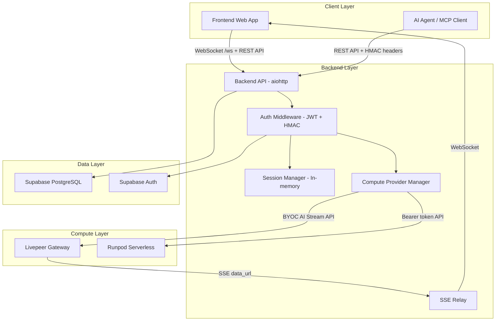

# Live Transcription & Translation Platform
## Technical Specification Document - Version 6.2

**Version:** 6.2.0
**Date:** 2026-04-18
**Author:** Principal Software Architect

**Primary Offering:** Real-time Audio/Video Transcription (`/transcribe`)
**Secondary Offering:** Translation (`/translate`)

**Architecture:** Backend Proxy with Multi-Provider Compute Abstraction & SSE→WebSocket Relay

**Model Architecture:**
- **Batch Transcription (`/transcribe`)**: Granite 4.0 1B Speech ONNX (CPU Worker) — via Compute Providers
- **Real-time Streaming (`/transcribe/stream`)**: VLLM Voxtral Realtime (GPU Worker) — via Compute Providers
- **Translation (`/translate`)**: Granite 4.0 1B Speech ONNX (CPU Worker) — via Compute Providers

> **Implementation Status Key:**
> - ✅ **IMPLEMENTED** — Feature is built and functional in the codebase
> - ⚠️ **PARTIAL** — Feature is partially implemented (details noted)
> - ❌ **NOT IMPLEMENTED** — Feature exists in roadmap but no code exists yet
> - 🔄 **DIFFERS FROM SPEC** — Implementation differs from original v5.0 spec (details noted)

---

## Table of Contents

1. [Executive Summary](#1-executive-summary)
2. [System Architecture Overview](#2-system-architecture-overview)
3. [Compute Provider Architecture](#3-compute-provider-architecture) 🔄
4. [SSE Relay Architecture](#4-sse-relay-architecture) 🔄
5. [Backend Proxy Architecture](#5-backend-proxy-architecture)
6. [API Endpoints](#6-api-endpoints) 🔄
7. [Authentication](#7-authentication) 🔄
8. [Agent API](#8-agent-api) ✅
9. [Session Management](#9-session-management) ✅ (Database-backed with write-through cache)
10. [Transcription Service](#10-transcription-service) ⚠️
11. [Translation Service](#11-translation-service) ⚠️
12. [Frontend Application](#12-frontend-application) ⚠️
13. [Chrome Extension Architecture](#13-chrome-extension-architecture) ❌
14. [Worker Architecture](#14-worker-architecture) ⚠️
15. [Model Architecture](#15-model-architecture)
16. [Monorepo Structure](#16-monorepo-structure) 🔄
17. [Supabase Integration](#17-supabase-integration)
18. [Database Schema](#18-database-schema) 🔄
19. [Payments and Subscription Management](#19-payments-and-subscription-management) ⚠️
20. [x402 v2 Crypto Payments](#20-x402-v2-crypto-payments) ⚠️
21. [Security Protocol](#21-security-protocol)
22. [Environment Setup](#22-environment-setup) 🔄
23. [Implementation Roadmap](#23-implementation-roadmap)

---

## 1. Executive Summary

This document defines the architecture for a **Live Transcription & Translation Platform** consisting of:

1. **Standalone Web Application** ✅ — Full-featured live transcription UI with Supabase auth (Email, Google, Twitter, SIWE/Web3)
2. **AI Agent API** ✅ — Programmatic access with HMAC-SHA256 authentication, usage tracking, and x402 crypto payments
3. **Chrome Extension (Manifest V3)** ❌ — Browser-based transcription overlay — *not yet implemented*

The system utilizes a **multi-provider compute architecture** 🔄 where compute requests are routed through a `ComputeProviderManager` that selects between registered providers (Livepeer, Runpod) based on job type, health, and capabilities. This replaces the original single `GPU_RUNNER_URL` design.

### Key Architectural Changes from v5.0

| Area | v5.0 Spec | v6.0 Implementation | Status |
|------|-----------|---------------------|--------|
| Compute routing | Single `GPU_RUNNER_URL` | Multi-provider `ComputeProviderManager` with scoring | 🔄 |
| Streaming data flow | Frontend → SSE `data_url` directly | Frontend → WebSocket `/ws` → `SSERelay` → Provider SSE | 🔄 |
| WHIP connection | Frontend → Provider WHIP directly | Frontend → Backend WHIP proxy → Provider WHIP | 🔄 |
| API paths | `/api/v1/transcribe`, `/api/v1/translate` | `/api/v1/transcribe/file`, `/api/v1/transcribe/url`, `/api/v1/translate/text` | 🔄 |
| Agent auth | OAuth 2.0 + x402 wallet | HMAC-SHA256 with API key/secret | 🔄 |
| User auth | Custom SIWE + Supabase | Supabase Auth (JWT) with Web3/SIWE provider | 🔄 |
| Session storage | `stream_sessions` DB table | Database-backed `SessionStore` with write-through cache | ✅ |
| Payments | Supabase Edge Functions (Deno/TS) | Python backend (`stripe.py`, `x402.py`, `payment_strategy.py`) | 🔄 |
| Frontend | React + TypeScript + shared libs | React JSX, no TypeScript, no shared UI libs | 🔄 |
| Languages | 24 languages | 11 languages | 🔄 |
| Chrome Extension | Full spec | No code exists | ❌ |

### Primary Offering: Transcription (`/transcribe`) ✅

The core service provides transcription of:
- Live video conferences (Zoom, Google Meet, Teams) — via streaming WHIP/WebRTC ✅
- Audio file uploads — via `/transcribe/file` ⚠️ (calls real provider; `file://` URLs only work for same-host providers; no async job polling)
- Audio URL transcription — via `/transcribe/url` ⚠️ (calls real provider; no async job polling or webhook callbacks)

### Secondary Offering: Translation (`/translate`) ⚠️

After transcription, users can:
- Translate text to 11 languages ⚠️ (calls real provider via `create_translation_job()`; end-to-end depends on provider configuration)
- Translate existing transcriptions ⚠️ (calls real provider; end-to-end depends on provider configuration)

---

## 2. System Architecture Overview

```
┌─────────────────────────────────────────────────────────────────────────────┐
│                              CLIENT LAYER                                    │
├─────────────────────────────────┬───────────────────────────────────────────┤
│     CHROME EXTENSION            │         WEB APPLICATION                   │
│  ┌─────────────────────────┐    │    ┌─────────────────────────────────┐    │
│  │  ❌ NOT IMPLEMENTED      │    │    │  React JSX (no TypeScript)      │    │
│  │  Popup, Content Script,  │    │    │  - Live Transcription UI        │    │
│  │  Background Worker       │    │    │  - AuthModal (SIWE/Google/      │    │
│  └─────────────────────────┘    │    │    Twitter/Email)                │    │
│                                  │    │  - WHIPClient (WebRTC proxy)    │    │
│                                  │    │  - WebSocket /ws connection      │    │
│                                  │    └─────────────────────────────────┘    │
│                                  ┌─────────────────────────────────┐        │
│                                  │      AI AGENTS (SDK)            │        │
│                                  │    - HMAC-SHA256 Auth            │        │
│                                  │    - @live-transcription/agent-sdk│       │
│                                  │    - MCP Server (Express)        │        │
│                                  └─────────────────────────────────┘        │
└─────────────────────────────────────────────────────────────────────────────┘
                                     │
                                     ▼
┌─────────────────────────────────────────────────────────────────────────────┐
│                          BACKEND (Python/aiohttp)                            │
│  ┌──────────────┐  ┌──────────────┐  ┌──────────────┐  ┌──────────────┐    │
│  │ Auth Module  │  │  Transcribe  │  │  Translate   │  │   Agents     │    │
│  │ • JWT verify │  │  • /file     │  │  • /text     │  │  • Register  │    │
│  │ • HMAC-SHA256│  │  • /url      │  │  • /transcr. │  │  • Keys      │    │
│  │ • require_   │  │  • /stream   │  │              │  │  • Usage     │    │
│  │   auth       │  │  • /whip     │  │              │  │  • Subs      │    │
│  └──────────────┘  └──────────────┘  └──────────────┘  └──────────────┘    │
│  ┌──────────────┐  ┌──────────────┐  ┌──────────────┐  ┌──────────────┐    │
│  │ Sessions     │  │  SSE Relay   │  │   Payments   │  │   Languages  │    │
│  │ • In-memory  │  │  • /ws bridge│  │  • Stripe    │  │  • 11 langs  │    │
│  │   SessionStore│  │  • Reconnect│  │  • x402      │  │              │    │
│  └──────────────┘  └──────────────┘  │  • Strategy  │  └──────────────┘    │
│                                      └──────────────┘                       │
│  ┌──────────────────────────────────────────────────────────────────────┐   │
│  │                    Compute Provider Manager                           │   │
│  │  ┌────────────────────┐  ┌────────────────────┐                      │   │
│  │  │ LivepeerProvider   │  │ RunpodProvider      │                      │   │
│  │  │ • BYOC AI Stream   │  │ • Bearer token auth │                      │   │
│  │  │ • Base64 header    │  │ • Serverless GPU    │                      │   │
│  │  └────────────────────┘  └────────────────────┘                      │   │
│  └──────────────────────────────────────────────────────────────────────┘   │
└─────────────────────────────────────────────────────────────────────────────┘
                                     │
                                     ▼
┌─────────────────────────────────────────────────────────────────────────────┐
│                         SUPABASE PLATFORM                                    │
│  ┌──────────────┐  ┌──────────────┐  ┌──────────────┐  ┌──────────────┐     │
│  │ Supabase Auth│  │   Database   │  │   Realtime   │  │   Storage    │     │
│  │ • Email      │  │  (PostgreSQL)│  │  ❌ Not used │  │  ❌ Not used │     │
│  │ • Google     │  │  • RLS       │  │              │  │              │     │
│  │ • Twitter    │  │  • Triggers  │  │              │  │              │     │
│  │ • Web3/SIWE  │  │              │  │              │  │              │     │
│  └──────────────┘  └──────────────┘  └──────────────┘  └──────────────┘     │
│  ┌──────────────────────────────────────────────────────────────────────┐   │
│  │                    ❌ Edge Functions — NOT USED                       │   │
│  └──────────────────────────────────────────────────────────────────────┘   │
└─────────────────────────────────────────────────────────────────────────────┘
                                     │
                     ┌───────────────┴───────────────┐
                     ▼                               ▼
┌─────────────────────────────┐     ┌─────────────────────────────┐
│   COMPUTE PROVIDERS          │     │   WORKER SERVICE             │
│  (Selected by Manager)       │     │  (Separate docker-compose)   │
│  ┌───────────────────────┐  │     │  ┌───────────────────────┐   │
│  │  Livepeer Gateway     │  │     │  │  Granite Transcriber  │   │
│  │  • BYOC AI Stream API │  │     │  │  • ONNX CPU inference │   │
│  │  • WHIP ingest        │  │     │  │  • vllm_client.py     │   │
│  │  • SSE data output    │  │     │  │  • webrtc/ components │   │
│  └───────────────────────┘  │     │  └───────────────────────┘   │
│  ┌───────────────────────┐  │     └─────────────────────────────┘
│  │  Runpod               │  │
│  │  • Serverless GPU     │  │     ❌ Not yet connected to backend
│  │  • Bearer token auth  │  │     (worker/ exists but runs independently)
│  └───────────────────────┘  │
└─────────────────────────────┘
```

---

## 3. Compute Provider Architecture ✅

> 🔄 **DIFFERS FROM v5.0**: The original spec used a single `GPU_RUNNER_URL` with hardcoded Livepeer BYOC AI Stream API. The implementation uses a multi-provider abstraction.

### 3.1 Overview

The platform uses a **multi-provider compute architecture** where all compute requests are routed through a `ComputeProviderManager` that dynamically selects the best provider based on job type, health, and capabilities.

```python
# backend/compute_providers/provider_manager.py
class ComputeProviderManager:
    """Manages multiple compute providers and selects the appropriate one."""
    
    def select_provider(self, job_type: str, requirements: Dict[str, Any] = None) -> BaseComputeProvider:
        """
        Select the best provider for a given job type and requirements.
        
        Scoring criteria:
        - Base score for being enabled (+10)
        - GPU capability match (+20 if gpu_required and provider has GPU)
        - Latency requirements (+5 to +15 based on max_latency_ms)
        - Default provider preference (+5)
        """
```

### 3.2 Base Provider Interface ✅

All compute providers implement the `BaseComputeProvider` abstract class:

```python
# backend/compute_providers/base_provider.py
class BaseComputeProvider(ABC):
    @abstractmethod
    async def get_whip_url(self, session_id: str, **kwargs) -> str: ...
    
    @abstractmethod
    async def get_websocket_url(self, session_id: str, **kwargs) -> str: ...
    
    @abstractmethod
    async def create_transcription_job(self, audio_url: str, language: str = "en", format: str = "json", **kwargs) -> Dict[str, Any]: ...
    
    @abstractmethod
    async def create_translation_job(self, text: str, source_language: str, target_language: str, **kwargs) -> Dict[str, Any]: ...
    
    @abstractmethod
    async def create_streaming_session(self, session_id: str, language: str = "en", **kwargs) -> StreamSessionData: ...
    
    @abstractmethod
    async def health_check(self) -> Dict[str, Any]: ...
```

### 3.3 StreamSessionData ✅

Standardized return type for streaming sessions:

```python
class StreamSessionData(TypedDict, total=False):
    provider: str              # Name of the compute provider
    provider_stream_id: str    # Provider's internal stream ID
    whip_url: str              # WHIP ingestion URL
    data_url: str              # SSE connection URL for real-time data
    update_url: str            # URL to send stream updates
    stop_url: str              # URL to stop the stream
    metadata: Dict[str, Any]   # Additional provider-specific data
```

### 3.4 Provider Definitions ✅

Providers are registered from environment-variable-driven definitions:

```python
# backend/compute_providers/provider_definitions.py
PROVIDER_DEFINITIONS = [
    {
        "name": "livepeer-primary",
        "class_path": "compute_providers.livepeer.livepeer.LivepeerComputeProvider",
        "config": {
            "name": "livepeer-primary",
            "gpu_runner_url": "${LIVEPEER_GATEWAY_URL}",
            "api_key": "${LIVEPEER_API_KEY}",
            "enabled": True
        },
        "is_default": False,
        "tags": ["livepeer", "gpu"]
    },
    {
        "name": "runpod-main",
        "class_path": "compute_providers.runpod.runpod.RunpodComputeProvider",
        "config": {
            "name": "runpod-main",
            "endpoint_id": "${RUNPOD_ENDPOINT_ID}",
            "api_key": "${RUNPOD_API_KEY}",
            "enabled": True
        },
        "is_default": True,
        "tags": ["runpod", "gpu"]
    }
]
```

### 3.5 Livepeer Provider ✅

The `LivepeerComputeProvider` implements the BYOC AI Stream API with Base64-encoded Livepeer header authentication:

- **Auth**: Base64-encoded JSON header (`Livepeer` HTTP header)
- **Streaming**: `POST /process/stream/start` with `StartRequest` body
- **Batch**: `POST /process/request/transcribe` and `/process/request/translate`
- **SSE Data**: `GET /process/stream/{id}/data` for real-time transcription output

### 3.6 Runpod Provider ✅

The `RunpodComputeProvider` implements Runpod serverless GPU API:

- **Auth**: Bearer token (`Authorization: Bearer ${RUNPOD_API_KEY}`)
- **Endpoint**: `https://api.runpod.ai/v2/${RUNPOD_ENDPOINT_ID}/run`

### 3.7 Provider Selection Algorithm ✅

```
1. Filter enabled providers
2. Filter by job type capability (currently all providers handle all types)
3. Filter by health status (prefer healthy providers)
4. Score each provider:
   - +10 for being enabled
   - +20 if GPU required and provider has GPU capability
   - +5 to +15 based on latency requirements
   - +5 for being the default provider
5. Select highest-scoring provider
```

---

## 4. SSE Relay Architecture ✅

> 🔄 **DIFFERS FROM v5.0**: The original spec had the frontend connecting directly to the provider's SSE `data_url`. The implementation routes all data through the backend via an SSE→WebSocket relay.

### 4.1 Architecture

```
GPU Worker (SSE)  ──data_url──>  SSERelay  ──WebSocket──>  Frontend
(produces transcription)        (backend)              (displays text)
```

The `SSERelay` class in [`backend/sse_relay.py`](backend/sse_relay.py:25) connects to the compute provider's SSE endpoint and relays transcription events to subscribed WebSocket clients.

### 4.2 WebSocket Protocol ✅

The frontend connects to `ws://host/ws` and sends JSON messages:

**Client → Server:**
| Message Type | Fields | Description |
|-------------|--------|-------------|
| `start_stream` | `stream_id` | Subscribe to transcription events for a stream |
| `stop_stream` | `stream_id` | Unsubscribe from transcription events |
| `config` | — | Legacy acknowledgement (no-op) |

**Server → Client (relayed from provider SSE):**
| Message Type | Fields | Description |
|-------------|--------|-------------|
| `transcription` | `text`, `is_final` | Transcription result (partial or final) |
| `status` | `text`, `stream_id` | Status update message |
| `error` | `text` | Error message |

### 4.3 SSE Relay Features ✅

- **Auto-reconnection**: Up to 5 reconnection attempts with exponential backoff
- **Last-Event-ID support**: Resumes from last received event after reconnection
- **Multi-client fan-out**: Multiple WebSocket clients can subscribe to the same stream
- **Auto-cleanup**: Relay stops when all clients disconnect
- **SSE parsing**: Full SSE protocol support (event, data, id, retry fields)

### 4.4 WHIP Proxy ✅

> 🔄 **DIFFERS FROM v5.0**: The original spec had the frontend connecting directly to the provider's WHIP endpoint. The implementation proxies WHIP through the backend.

The backend proxies WHIP SDP offers/answers at `POST /api/v1/transcribe/stream/{stream_id}/whip`:

1. Frontend sends SDP offer to backend WHIP proxy
2. Backend looks up the provider's `whip_url` from the in-memory session store
3. Backend forwards the SDP offer to the provider's WHIP endpoint
4. Provider returns SDP answer
5. Backend returns SDP answer to frontend

This ensures the provider's internal URL is never exposed to the client, and the backend can enforce auth and rate-limiting on WHIP connections.

---

## 5. Backend Proxy Architecture ✅

### Overview

The platform uses a **backend proxy architecture** where all requests flow through the Python/aiohttp backend. The backend handles authentication, rate limiting, usage tracking, compute provider selection, and SSE relay.



### Request Flow

1. **Authentication**: `require_auth` decorator tries agent HMAC auth first, then Supabase JWT user auth
2. **Rate Limiting**: `check_rate_limit` decorator enforces 60 requests/minute per agent or user
3. **Usage Tracking**: `track_usage` decorator logs to `agent_usage` table
4. **Provider Selection**: `ComputeProviderManager.select_provider()` chooses best provider
5. **Request Proxying**: Backend forwards request to selected provider
6. **Response**: Backend returns provider response to client

---

## 6. API Endpoints ✅

> 🔄 **DIFFERS FROM v5.0**: Many endpoint paths have changed. New endpoints added for agents, sessions, stream management, and health checks.

### Transcription Endpoints ✅

| Method | Endpoint | Auth | Description | Status |
|--------|----------|------|-------------|--------|
| POST | `/api/v1/transcribe/file` | Any | Upload audio file for batch transcription | ⚠️ Calls provider; `file://` URLs only work same-host; no async job polling |
| POST | `/api/v1/transcribe/url` | Any | Transcribe audio from URL | ⚠️ Calls provider; no async job polling or webhook callbacks |
| POST | `/api/v1/transcribe/stream` | Any | Create streaming transcription session | ✅ |
| POST | `/api/v1/transcribe/stream/{stream_id}/whip` | Any | WHIP SDP proxy for WebRTC | ✅ |
| GET | `/api/v1/transcriptions` | Any | List user transcriptions | ✅ |
| GET | `/api/v1/transcriptions/{id}` | Any | Get transcription by ID | ✅ |
| DELETE | `/api/v1/transcriptions/{id}` | Any | Delete transcription | ✅ |
| GET | `/api/v1/transcribe/health` | Any | Transcription service health check | ✅ |

### Translation Endpoints ⚠️

| Method | Endpoint | Auth | Description | Status |
|--------|----------|------|-------------|--------|
| POST | `/api/v1/translate/text` | Any | Translate text | ⚠️ Calls provider via `create_translation_job()`; end-to-end depends on provider |
| POST | `/api/v1/translate/transcription` | Any | Translate existing transcription by ID | ⚠️ Calls provider; end-to-end depends on provider |
| GET | `/api/v1/languages` | Any | Get supported languages (11 languages) | ✅ |

### Session Endpoints ✅

| Method | Endpoint | Auth | Description | Status |
|--------|----------|------|-------------|--------|
| POST | `/api/v1/sessions` | Any | Create a user session (user_id derived from auth token) | ✅ |
| GET | `/api/v1/sessions/{session_id}` | Any | Get session info (ownership verified) | ✅ |
| GET | `/api/v1/sessions/{session_id}/transcriptions` | Any | Get session transcriptions (ownership verified) | ✅ |
| POST | `/api/v1/transcriptions/session` | Any | Create transcription session record (ownership verified) | ✅ |
| POST | `/api/v1/transcriptions/{id}/result` | Any | Update transcription result (ownership verified) | ✅ |

### Stream Management Endpoints ✅

| Method | Endpoint | Auth | Description | Status |
|--------|----------|------|-------------|--------|
| POST | `/api/v1/stream/session` | Any | Create stream session with provider negotiation (ownership verified + x402/subscription) | ✅ |
| POST | `/api/v1/stream/{stream_id}/update` | Any | Update stream session (ownership verified) | ✅ |
| POST | `/api/v1/stream/{stream_id}/close` | Any | Close stream session (ownership verified) | ✅ |
| POST | `/api/v1/stream/{stream_id}/stop` | Any | Stop stream via provider's stop_url (ownership verified) | ✅ |

### Agent Endpoints ✅

| Method | Endpoint | Auth | Description | Status |
|--------|----------|------|-------------|--------|
| POST | `/api/v1/agents/register` | None | Register new agent, receive API key/secret | ✅ |
| GET | `/api/v1/agents/usage` | Agent | Get agent usage statistics | ✅ |
| GET | `/api/v1/agents/keys` | Agent | List API keys | ✅ |
| POST | `/api/v1/agents/keys` | Agent | Create new API key | ✅ |
| DELETE | `/api/v1/agents/keys` | Agent | Revoke API key | ✅ |
| GET | `/api/v1/agents/subscription` | Agent | Get subscription status | ✅ |
| POST | `/api/v1/agents/subscription` | Agent | Create subscription (x402 or Stripe) | ⚠️ x402 returns 402 (expected); Stripe checkout for agents returns 501 |
| DELETE | `/api/v1/agents/subscription` | Agent | Cancel subscription | ✅ |
| POST | `/api/v1/agents/subscription/reactivate` | Agent | Reactivate subscription | ✅ |

### Auth Endpoints ✅

| Method | Endpoint | Auth | Description | Status |
|--------|----------|------|-------------|--------|
| GET | `/api/v1/auth/me` | User | Get current authenticated user info | ✅ |

### WebSocket Endpoint ✅

| Endpoint | Description | Status |
|----------|-------------|--------|
| `GET /ws` | WebSocket for real-time transcription relay | ✅ |

### Health Endpoint ✅

| Method | Endpoint | Description | Status |
|--------|----------|-------------|--------|
| GET | `/health` | Backend health check (providers, Supabase, WebSocket count, SSE relay count) | ✅ |

### Billing Endpoints ✅

> ✅ **NEW in v6.0**: User-facing billing endpoints for Stripe subscription management. These are implemented in [`backend/billing.py`](backend/billing.py) but not documented in previous spec versions.

| Method | Endpoint | Auth | Description | Status |
|--------|----------|------|-------------|--------|
| POST | `/api/v1/billing/create-checkout-session` | User | Create Stripe Checkout Session for subscription | ✅ |
| GET | `/api/v1/billing/subscription` | User | Get current subscription status | ✅ |
| POST | `/api/v1/billing/cancel` | User | Cancel active subscription | ✅ |
| POST | `/api/v1/billing/update` | User | Update subscription (change tier) | ✅ |
| GET | `/api/v1/billing/usage` | User | Get usage statistics for billing period | ✅ |
| POST | `/api/v1/billing/webhook` | None | Stripe webhook event handler (verifies signature) | ✅ |

---

## 7. Authentication ✅

> 🔄 **DIFFERS FROM v5.0**: The original spec described custom SIWE implementation and OAuth 2.0 for agents. The implementation uses Supabase Auth JWT for users (with Web3/SIWE as a Supabase provider) and HMAC-SHA256 for agents.

### 7.1 Dual Authentication System ✅

The backend supports two authentication methods, tried in order:

1. **Agent Authentication** (HMAC-SHA256) — tried first
2. **User Authentication** (Supabase JWT) — fallback

```python
# backend/auth.py
def require_auth(handler):
    """Decorator that accepts either agent OR user authentication."""
    async def wrapper(request):
        # Try agent authentication first
        verified_agent, agent_result = verify_agent_request(request)
        if verified_agent:
            return await handler(request)
        
        # If agent auth failed, try user authentication
        verified_user, user_result = verify_supabase_user(request)
        if verified_user:
            return await handler(request)
        
        # Both failed
        return agent_result
    return wrapper
```

### 7.2 Agent Authentication (HMAC-SHA256) ✅

Agents authenticate using API key + HMAC-SHA256 signature:

**Required Headers:**
| Header | Description |
|--------|-------------|
| `X-API-Key` | Agent's API key |
| `X-Timestamp` | Current timestamp in seconds |
| `X-Nonce` | Random nonce to prevent replay attacks |
| `X-Signature` | HMAC-SHA256 of `METHOD + PATH + TIMESTAMP + NONCE + BODY` |

**Verification Steps:**
1. Check all required headers are present
2. Verify timestamp is within 5-minute window
3. Look up agent by API key in `agents` table
4. Verify agent is active (`is_active = true`)
5. Recompute HMAC-SHA256 signature using `api_secret`
6. Compare signatures using constant-time comparison (`hmac.compare_digest`)

### 7.3 User Authentication (Supabase JWT) ✅

Users authenticate via Supabase Auth, which supports:

- **Email/Password** ✅ — via `signInWithEmail`
- **Google OAuth** ✅ — via `signInWithGoogle`
- **Twitter/X OAuth** ✅ — via `signInWithTwitter`
- **Web3/SIWE (Ethereum)** ✅ — via Supabase Web3 auth provider

The backend validates the JWT token from the `Authorization: Bearer <token>` header using `supabase.auth.get_user(token)`.

### 7.4 Rate Limiting ✅

`check_rate_limit` decorator enforces 60 requests per minute per agent or user, tracked via the `agent_usage` table.

### 7.5 Usage Tracking ✅

`track_usage` decorator logs every API request to the `agent_usage` table with:
- `agent_id` (used for both agents and users)
- `endpoint`, `method`, `success`
- `cost_usdc_cents` (placeholder — currently 0)
- `metadata` (processing time, user agent, auth type)

---

## 8. Agent API ✅

> ✅ **NEW in v6.0**: This section documents the fully implemented agent system not present in v5.0.

### 8.1 Agent Registration ✅

```
POST /api/v1/agents/register
Body: { "agent_name": "...", "contact_email": "..." }
Response: { "agent_id", "agent_name", "api_key", "api_secret", "subscription_tier": "free" }
```

- Generates 32-character API key and 64-character API secret
- Stores in `agents` table with `is_active = true` and `subscription_tier = 'free'`
- API secret is only returned once on registration

### 8.2 Agent API Key Management ✅

| Endpoint | Description |
|----------|-------------|
| `GET /api/v1/agents/keys` | List API keys (currently returns primary key only) |
| `POST /api/v1/agents/keys` | Create new API key (replaces primary key) |
| `DELETE /api/v1/agents/keys` | Revoke key (deactivates agent — simplified) |

### 8.3 Agent Usage Tracking ✅

```
GET /api/v1/agents/usage
Response: {
  "agent_id": "...",
  "subscription_tier": "free",
  "usage": {
    "today": { "transcriptions", "translations", "total_requests", "successful_requests", "failed_requests", "total_cost_usdc", "total_cost_usdc_cents" },
    "total": { ... }
  }
}
```

### 8.4 Agent Subscriptions ⚠️

| Endpoint | Description | Status |
|----------|-------------|--------|
| `GET /api/v1/agents/subscription` | Get subscription status | ✅ |
| `POST /api/v1/agents/subscription` | Create subscription | ⚠️ x402 returns 402; Stripe returns 501 |
| `DELETE /api/v1/agents/subscription` | Cancel (sets tier to free) | ✅ |
| `POST /api/v1/agents/subscription/reactivate` | Reactivate subscription | ✅ |

---

## 9. Session Management ✅

> 🔄 **DIFFERS FROM v5.0**: The original spec described a `stream_sessions` database table. v6.0 used an in-memory `SessionStore`. v6.1 migrates to database-backed storage with write-through caching.

### 9.1 Database-Backed SessionStore ✅

[`backend/sessions.py`](backend/sessions.py) uses a **write-through cache** pattern — writes persist to Supabase first, then update the in-memory cache; reads hit the cache first, falling back to Supabase on miss:

```python
# backend/sessions.py
class SessionStore:
    def __init__(self):
        # In-memory cache layers (hot-path reads)
        self._sessions_cache: Dict[str, Dict] = {}
        self._transcriptions_cache: Dict[str, Dict] = {}
        self._stream_sessions_cache: Dict[str, Dict] = {}
```

**Supabase tables** (migration [`20260418_01_create_session_tables.sql`](supabase/migrations/20260418_01_create_session_tables.sql)):
- `user_sessions` — User session tracking with settings JSONB
- `stream_sessions` — Live streaming session data with provider_session JSONB
- `transcription_sessions` — Batch transcription job tracking with result JSONB

**Session data includes:**
- User session tracking with transcription and stream ID arrays
- Stream session with provider session data (whip_url, data_url, update_url, stop_url) stored as JSONB
- Transcription session records with status tracking and result JSONB

### 9.2 Stream Session Lifecycle ✅

1. **Create**: `POST /api/v1/transcribe/stream` → selects provider → `provider.create_streaming_session()` → stores in `SessionStore`
2. **WHIP Connect**: `POST /api/v1/transcribe/stream/{stream_id}/whip` → proxies SDP to provider
3. **SSE Relay**: Frontend sends `start_stream` via WebSocket → `SSERelay` connects to provider `data_url` → relays to WebSocket
4. **Update**: `POST /api/v1/stream/{stream_id}/update` → forwards to provider `update_url`
5. **Stop**: `POST /api/v1/stream/{stream_id}/stop` → calls provider `stop_url` → marks session completed

> ✅ Sessions are now persisted to Supabase with write-through caching, surviving backend restarts. Cache provides fast reads for hot-path operations like WebSocket relay lookups.

---

## 10. Transcription Service ⚠️

### 10.1 Streaming Transcription ✅

The streaming transcription flow is fully implemented:

1. Frontend calls `POST /api/v1/transcribe/stream` with `session_id` and `language`
2. Backend selects compute provider via `ComputeProviderManager`
3. Provider creates streaming session, returns `whip_url`, `data_url`, `update_url`, `stop_url`
4. Backend stores session in `SessionStore`, returns `stream_id` and URLs to frontend
5. Frontend creates `WHIPClient` and sends SDP offer to `POST /api/v1/transcribe/stream/{stream_id}/whip`
6. Backend proxies SDP to provider's WHIP endpoint, returns answer
7. Frontend connects WebSocket to `/ws`, sends `start_stream` with `stream_id`
8. Backend creates `SSERelay` connecting to provider's `data_url`
9. Transcription events flow: Provider SSE → SSERelay → WebSocket → Frontend

### 10.2 Batch Transcription ⚠️

Batch transcription endpoints call real compute providers but have **infrastructure gaps**:

- `POST /api/v1/transcribe/file` — Accepts multipart file upload, saves to temp file, selects provider via `ComputeProviderManager`, calls `provider.create_transcription_job()`, stores result in Supabase, returns real provider response. ⚠️ Uses `file://` URLs which only work for same-host providers; remote providers need accessible storage (e.g., Supabase Storage).
- `POST /api/v1/transcribe/url` — Accepts audio URL, selects provider, calls `provider.create_transcription_job()`, stores result, returns real provider response. ⚠️ No async job polling or webhook callback system for long-running jobs.

> ⚠️ **Needs completion**: Async job processing with polling/webhook callbacks, and audio file upload to Supabase Storage for remote provider access.

### 10.3 WHIP Proxy ✅

The WHIP proxy at `POST /api/v1/transcribe/stream/{stream_id}/whip` is fully implemented:
- Looks up `whip_url` from session store
- Forwards SDP offer with `Content-Type: application/sdp`
- Returns SDP answer from provider
- Handles connection errors and timeouts

---

## 11. Translation Service ⚠️

### 11.1 Translation Endpoints ⚠️

Both translation endpoints call real compute providers but **end-to-end functionality depends on provider configuration**:

- `POST /api/v1/translate/text` — Accepts `text`, `source_language`, `target_language`, selects provider via `ComputeProviderManager`, calls `provider.create_translation_job()`, stores result in Supabase, returns real provider response.
- `POST /api/v1/translate/transcription` — Looks up transcription by ID, extracts text, calls translate_text internally.

> ⚠️ **Needs completion**: End-to-end testing with live compute providers; async job polling for long translations.

### 11.2 Supported Languages ✅

The implementation supports **11 languages** (vs. 24 in v5.0 spec):

| Code | Language | Code | Language |
|------|----------|------|----------|
| en | English | es | Spanish |
| fr | French | de | German |
| it | Italian | pt | Portuguese |
| ru | Russian | ja | Japanese |
| ko | Korean | zh | Chinese |
| ar | Arabic | | |

> ❌ **Not yet implemented**: hi (Hindi), bn (Bengali), id (Indonesian), vi (Vietnamese), th (Thai), tr (Turkish), pl (Polish), nl (Dutch), sv (Swedish), da (Danish), no (Norwegian), fi (Finnish), zh-TW (Traditional Chinese)

---

## 12. Frontend Application ⚠️

> 🔄 **DIFFERS FROM v5.0**: The original spec described React + TypeScript with shared UI libraries, a full dashboard, and subscription management. The implementation is React JSX with client-side routing and billing/subscription pages.

### 12.1 Current Implementation ✅

- **Framework**: React (JSX, no TypeScript) with React Router v6
- **Build**: Vite
- **Auth**: `AuthModal` component supporting Google, Twitter, Email/Password, and SIWE/Web3 via Supabase
- **Live Transcription**: Single-page UI with start/stop, real-time transcript display
- **WHIP Client**: Custom `WHIPClient` class that proxies SDP through backend
- **WebSocket**: Connects to `/ws` for real-time transcription events
- **Billing & Subscription**: BillingPage, SubscriptionPlans, and CheckoutResult components wired via React Router
- **Navigation**: Header nav with Transcribe and Billing links (visible when authenticated)

### 12.2 Frontend Components ✅

| Component | Description | Status |
|-----------|-------------|--------|
| `App.jsx` | Main app with live transcription UI, WebSocket, WHIP client | ✅ |
| `AuthModal.jsx` | Unified auth modal (Google, Twitter, Email, SIWE) | ✅ |
| `BillingPage.jsx` | Subscription status, usage display, cancel/update actions | ✅ Wired via React Router at `/billing` |
| `SubscriptionPlans.jsx` | Plan selection UI (Free, Starter, Pro, Enterprise) | ✅ Wired via React Router at `/billing/plans` |
| `CheckoutResult.jsx` | Stripe checkout success/cancel result pages | ✅ Wired via React Router at `/billing/success` and `/billing/cancel` |
| `lib/supabase.js` | Supabase client with auth helpers | ✅ |
| `lib/x402.js` | x402 crypto payment client utilities | ✅ |

### 12.3 Not Implemented ❌

| Feature | Status |
|---------|--------|
| Transcription Library / History | ❌ |
| Export Options (SRT, VTT, TXT) | ❌ |
| Settings Panel | ❌ |
| Language Preferences UI | ❌ |
| Translation UI | ❌ |
| TypeScript | ❌ |
| Shared UI libraries (@lib/ui, @lib/supabase, @lib/web3, @lib/types, @lib/audio) | ❌ |

---

## 13. Chrome Extension Architecture ❌

> ❌ **NOT IMPLEMENTED**: No Chrome Extension code exists. This remains a planned feature.

The original v5.0 spec described a full Manifest V3 Chrome Extension with:
- Popup (React/TS)
- Content Script (video overlay, caption display)
- Background Worker (audio capture, stream processing)

**Status**: No code has been written. This is a future milestone.

---

## 14. Worker Architecture ⚠️

> 🔄 **DIFFERS FROM v5.0**: The worker service exists as a separate `worker/` directory with its own Dockerfile and docker-compose, but is not yet integrated with the backend's compute provider system.

### 14.1 Worker Service Structure ✅

```
worker/
├── app.py                    # Worker application entry point
├── docker-compose.yml        # Worker-specific Docker Compose
├── Dockerfile                # Worker Docker image
├── Dockerfile.vllm           # VLLM-specific Docker image
├── granite_transcriber.py    # Granite 4.0 ONNX CPU transcriber
├── vllm_client.py            # VLLM Voxtral GPU client
├── patch_vllm.py             # VLLM patching utilities
├── requirements.txt          # Python dependencies
├── .env.template             # Environment template
├── .dockerignore
├── tests/
│   ├── __init__.py
│   ├── test_granite_transcriber.py
│   ├── test_integration.py
│   └── test_vllm_client.py
└── webrtc/
    ├── audio_processor.py    # WebRTC audio processing
    ├── webrtc_components.py  # WebRTC component abstractions
    └── whip_handler.py       # WHIP protocol handler
```

### 14.2 Worker Models ⚠️

| Model | Hardware | File | Status |
|-------|----------|------|--------|
| Granite 4.0 1B Speech ONNX | CPU | `granite_transcriber.py` | ⚠️ Exists, not connected to backend |
| VLLM Voxtral Realtime | GPU | `vllm_client.py` | ⚠️ Exists, not connected to backend |

> ⚠️ The worker runs independently but is not yet called by the backend's compute provider system. The backend currently returns mock responses for batch transcription and translation.

---

## 15. Model Architecture

### 15.1 Granite 4.0 1B Speech ONNX (CPU)

**Model:** [forkjoin-ai/granite-4.0-1b-speech-onnx](https://huggingface.co/forkjoin-ai/granite-4.0-1b-speech-onnx)

**Use Cases:**
- Batch transcription of uploaded audio/video files
- Translation of transcribed text
- Offline processing

**Hardware Requirements:**
- CPU: 4+ cores recommended
- RAM: 8GB minimum, 16GB recommended
- No GPU required

**Performance:**
- Transcription speed: ~0.5x real-time on CPU
- Translation speed: ~10x real-time on CPU
- Latency: 1-5 seconds depending on audio length

### 15.2 VLLM Voxtral Realtime (GPU)

**Model:** mistralai/Voxtral-Mini-4B-Realtime-2602

**Use Cases:**
- Real-time streaming transcription
- Live captions for video conferences
- Interactive voice applications

**Hardware Requirements:**
- GPU: NVIDIA GPU with 8GB+ VRAM (RTX 3060 or better)
- CUDA 11.8+
- RAM: 16GB minimum

**Performance:**
- Latency: <500ms for streaming chunks
- Real-time factor: ~0.1x (10x faster than real-time)

### 15.3 Model Selection ✅

Model selection is handled by the `ComputeProviderManager` which routes based on job type:
- `transcribe_stream` → GPU provider (Voxtral)
- `transcribe_batch` → CPU provider (Granite)
- `translate` → CPU provider (Granite)

---

## 16. Monorepo Structure 🔄

> 🔄 **DIFFERS FROM v5.0**: The original spec described a pnpm monorepo with shared UI libraries. The implementation has a simpler structure.

### 16.1 Current Structure ✅

```
live-translation-app/
├── backend/                          # Python aiohttp backend
│   ├── main.py                       # App entry, WebSocket handler, routes
│   ├── auth.py                       # Dual auth (JWT + HMAC)
│   ├── agents.py                     # Agent registration, keys, usage, subscriptions
│   ├── sessions.py                   # In-memory session management
│   ├── transcribe.py                 # Transcription endpoints
│   ├── translate.py                  # Translation endpoints
│   ├── languages.py                  # Supported languages endpoint
│   ├── sse_relay.py                  # SSE→WebSocket relay
│   ├── supabase_client.py            # Supabase Python client
│   ├── requirements.txt
│   ├── .env.template
│   ├── compute_providers/            # Multi-provider abstraction
│   │   ├── base_provider.py          # Abstract base class
│   │   ├── provider_manager.py       # Provider selection/scoring
│   │   ├── provider_definitions.py   # Env-driven provider configs
│   │   ├── livepeer/
│   │   │   └── livepeer.py           # Livepeer BYOC AI Stream provider
│   │   └── runpod/
│   │       └── runpod.py             # Runpod serverless GPU provider
│   ├── payments/                     # Payment processing
│   │   ├── payment_strategy.py       # Unified payment decorator
│   │   ├── stripe.py                 # Stripe subscription service
│   │   └── x402.py                   # x402 v2 crypto payments
│   ├── supabase/
│   │   └── migrations/               # Backend-specific migrations
│   │       └── 20240115_01_create_agents_table.sql
│   └── tests/                        # Backend tests
│       ├── test_agent_endpoints.py
│       ├── test_auth.py
│       ├── test_integration.py
│       ├── test_main_workflow.py
│       ├── test_sse_relay.py
│       ├── test_supabase_client.py
│       └── test_workflow.py
├── frontend/                         # React frontend
│   ├── src/
│   │   ├── App.jsx                   # Main app with live transcription
│   │   ├── App.css
│   │   ├── main.jsx
│   │   ├── components/
│   │   │   └── AuthModal.jsx         # Unified auth modal
│   │   └── lib/
│   │       └── supabase.js           # Supabase client + auth helpers
│   ├── index.html
│   ├── vite.config.js
│   ├── package.json
│   └── .env.template
├── worker/                           # Separate worker service
│   ├── app.py
│   ├── granite_transcriber.py
│   ├── vllm_client.py
│   ├── Dockerfile
│   ├── docker-compose.yml
│   └── webrtc/
│       ├── audio_processor.py
│       ├── webrtc_components.py
│       └── whip_handler.py
├── packages/                         # Shared packages
│   ├── agent-sdk/                    # TypeScript agent SDK
│   │   ├── src/index.ts
│   │   ├── package.json
│   │   └── tsconfig.json
│   ├── mcp-server/                   # MCP tool server
│   │   ├── src/index.js
│   │   ├── __tests__/index.test.js
│   │   └── package.json
│   └── config/                       # Shared config
│       └── tsconfig/base.json
├── supabase/                         # Supabase migrations
│   └── migrations/
│       ├── 20260331203149_init_schema.sql
│       ├── 20260405_01_create_compute_providers_table.sql
│       ├── 20260415_01_enable_web3_auth.sql
│       └── 20260415_02_sync_social_identities.sql
├── docs/                             # Documentation
├── plans/                            # Planning documents
├── v1/                               # Legacy v1 docs
├── docker-compose.dev.yml
├── Dockerfile
├── Caddyfile
├── Caddyfile.template
├── start.sh
├── start-caddy.sh
├── .env.template
├── .env.test
└── .gitignore
```

### 16.2 Not Implemented ❌

| Package | Status |
|---------|--------|
| `@lib/ui` — Shared UI components | ❌ |
| `@lib/supabase` — Shared Supabase client | ❌ (frontend has its own) |
| `@lib/web3` — Shared SIWE/Auth | ❌ (handled by Supabase) |
| `@lib/types` — Shared TypeScript types | ❌ |
| `@lib/mcp` — MCP Server (separate package exists) | ✅ (as `packages/mcp-server`) |
| `@lib/agent` — Agent SDK (separate package exists) | ✅ (as `packages/agent-sdk`) |
| `@lib/audio` — Audio utilities | ❌ |
| pnpm workspace | ❌ |

---

## 17. Supabase Integration ✅

### 17.1 Authentication ✅

Supabase Auth handles all user authentication:
- **Email/Password** — `signInWithEmail` / `signUpWithEmail`
- **Google OAuth** — `signInWithGoogle`
- **Twitter/X OAuth** — `signInWithTwitter`
- **Web3/SIWE** — Supabase Web3 auth provider (enabled via migration `20260415_01`)

### 17.2 Database ✅

PostgreSQL database with RLS policies. All tables use Supabase client from `backend/supabase_client.py`.

### 17.3 Not Used ❌

| Supabase Feature | Status |
|-----------------|--------|
| Realtime subscriptions | ❌ |
| Storage | ❌ |
| Edge Functions | ❌ (backend handles all logic) |

---

## 18. Database Schema 🔄

> 🔄 **DIFFERS FROM v5.0**: Several tables differ from the spec. New tables added, some spec tables not yet migrated.

### 18.1 Implemented Tables ✅

From migration `20260331203149_init_schema.sql`:

```sql
-- Users table (with wallet_address added in later migration)
CREATE TABLE users (
  id UUID PRIMARY KEY DEFAULT uuid_generate_v4(),
  email TEXT NOT NULL UNIQUE,          -- ⚠️ made nullable by later migration
  name TEXT,                            -- ⚠️ made nullable by 20260415_02
  avatar TEXT,
  ethereum_address TEXT UNIQUE,
  wallet_address TEXT UNIQUE,           -- ✅ added by 20260415_01
  provider TEXT,                        -- ✅ added by 20260415_02
  email_verified BOOLEAN NOT NULL DEFAULT false,
  created_at TIMESTAMPTZ NOT NULL DEFAULT NOW(),
  updated_at TIMESTAMPTZ NOT NULL DEFAULT NOW()
);

-- User preferences
CREATE TABLE user_preferences (...);

-- Subscriptions
CREATE TABLE subscriptions (
  ...
  plan TEXT NOT NULL DEFAULT 'free' CHECK (plan IN ('free', 'starter', 'pro', 'enterprise')),
  ...
);

-- Transactions (with crypto support)
CREATE TABLE transactions (...);

-- Transcriptions
CREATE TABLE transcriptions (...);

-- Translations
CREATE TABLE translations (...);

-- Transcription Usage Tracking
CREATE TABLE transcription_usage (...);

-- Translation Usage Tracking
CREATE TABLE translation_usage (...);

-- Agents (DIFFERS from v5.0 spec)
CREATE TABLE agents (
  id UUID PRIMARY KEY DEFAULT uuid_generate_v4(),
  name TEXT NOT NULL,
  owner_email TEXT NOT NULL,
  status TEXT NOT NULL DEFAULT 'pending',
  created_at TIMESTAMPTZ NOT NULL DEFAULT NOW()
);

-- API Keys
CREATE TABLE api_keys (...);

-- SIWE nonces
CREATE TABLE siwe_nonces (...);
```

From migration `20260405_01_create_compute_providers_table.sql`:

```sql
-- ✅ NEW: Compute providers table (not in v5.0 spec)
CREATE TABLE compute_providers (
    id UUID PRIMARY KEY DEFAULT gen_random_uuid(),
    name VARCHAR(100) UNIQUE NOT NULL,
    type VARCHAR(50) NOT NULL,       -- 'livepeer', 'aws', 'gcp', 'custom'
    enabled BOOLEAN DEFAULT TRUE,
    config JSONB,                     -- Provider-specific configuration
    created_at TIMESTAMP WITH TIME ZONE DEFAULT NOW(),
    updated_at TIMESTAMP WITH TIME ZONE DEFAULT NOW()
);
```

From migration `20260415_01_enable_web3_auth.sql`:

```sql
-- ✅ Adds wallet_address column and sync trigger for Web3/SIWE auth
ALTER TABLE users ADD COLUMN wallet_address TEXT UNIQUE;
CREATE INDEX idx_users_wallet_address ON users (wallet_address);
-- Trigger: sync_wallet_address() syncs from auth.identities
```

From migration `20260415_02_sync_social_identities.sql`:

```sql
-- ✅ Extends identity sync for all providers (Google, Twitter, Email, Web3)
ALTER TABLE users ALTER COLUMN name DROP NOT NULL;
ALTER TABLE users ADD COLUMN provider TEXT;
-- Replaces sync_wallet_address() with sync_user_identities()
```

From backend migration `20240115_01_create_agents_table.sql`:

```sql
-- ✅ Implementation agents table (DIFFERS from v5.0 spec)
-- Implementation uses flat design with api_key/api_secret in agents table
-- v5.0 spec had separate api_keys table
CREATE TABLE agents (
  id UUID PRIMARY KEY DEFAULT uuid_generate_v4(),
  agent_name TEXT NOT NULL,
  description TEXT,
  contact_email TEXT,
  api_key TEXT UNIQUE,
  api_secret TEXT,
  is_active BOOLEAN DEFAULT TRUE,
  subscription_tier TEXT DEFAULT 'free',
  created_at TIMESTAMPTZ DEFAULT NOW(),
  last_used_at TIMESTAMPTZ,
  revoked_at TIMESTAMPTZ
);
```

### 18.2 Tables in Spec but NOT in Migrations ❌

| Table | Status | Notes |
|-------|--------|-------|
| `stream_sessions` | ✅ | Migration `20260418_01`; database-backed with write-through cache |
| `payment_methods` | ❌ | Spec §13.6; not yet migrated |
| `x402_payments` | ❌ | Spec §13.6; not yet migrated |

### 18.3 Tables in Implementation but NOT in Spec ✅

| Table | Status | Notes |
|-------|--------|-------|
| `compute_providers` | ✅ | Multi-provider management |
| `agent_usage` | ✅ | Per-request agent tracking (referenced in code but migration may be in usage_tracking) |
| `user_sessions` | ✅ | User session tracking (migration `20260418_01`) |
| `stream_sessions` | ✅ | Live streaming session data with provider_session JSONB (migration `20260418_01`) |
| `transcription_sessions` | ✅ | Batch transcription job tracking (migration `20260418_01`) |

### 18.4 Schema Differences: `agents` Table 🔄

| Field | v5.0 Spec | Implementation |
|-------|-----------|---------------|
| `name` | ✅ | `agent_name` |
| `owner_email` | ✅ | `contact_email` |
| `status` | ✅ ('pending', etc.) | `is_active` (boolean) |
| `api_key` | Separate `api_keys` table | In `agents` table directly |
| `api_secret` | Not in spec | In `agents` table directly |
| `subscription_tier` | Not in spec | ✅ |
| `description` | Not in spec | ✅ |
| `last_used_at` | Not in spec | ✅ |
| `revoked_at` | Not in spec | ✅ |

---

## 19. Payments and Subscription Management ⚠️

> 🔄 **DIFFERS FROM v5.0**: The original spec described Supabase Edge Functions (Deno/TypeScript) for Stripe. The implementation uses Python backend modules.

### 19.1 Payment Architecture ✅

The platform supports two payment methods:

1. **Stripe Subscriptions** ✅ — Python backend service ([`backend/payments/stripe.py`](backend/payments/stripe.py)) with full checkout, webhook, and subscription management
2. **x402 v2 Crypto Payments** ✅ — Python backend module ([`backend/payments/x402.py`](backend/payments/x402.py)) with verify/settle flow, wired into endpoints via decorators
3. **Quota Enforcement** ✅ — Python module ([`backend/payments/quotas.py`](backend/payments/quotas.py)) with per-tier rolling 30-day usage limits

### 19.2 Unified Payment Strategy ✅

[`backend/payments/payment_strategy.py`](backend/payments/payment_strategy.py) provides a unified decorator system:

```python
# Accept either x402 payment OR active subscription
@x402_or_subscription(service_type='transcribe_cpu', subscription_tier='starter')

# Require subscription only (no x402)
@subscription_only(subscription_tier='starter')

# Require x402 payment only (no subscription)
@x402_only(service_type='transcribe_cpu')
```

**Flow:**
1. Check for `PAYMENT-SIGNATURE` header (x402 payment attempt)
2. If present, verify with facilitator → process → settle
3. If not present or invalid, check for active Stripe subscription
4. If no subscription, return HTTP 402 with `PAYMENT-REQUIRED` header

### 19.3 x402 v2 Payment Flow ✅

The x402 flow is implemented in Python and **wired into transcription and translation endpoints** via the `@x402_or_subscription` decorator in [`backend/transcribe.py`](backend/transcribe.py:20) and [`backend/translate.py`](backend/translate.py:13):

1. Agent sends request without payment → receives HTTP 402 with `PAYMENT-REQUIRED` header
2. Agent signs payment with wallet → resends with `PAYMENT-SIGNATURE` header
3. Backend verifies with Coinbase facilitator → processes request → settles payment
4. Response includes `PAYMENT-RESPONSE` header with settlement proof

**Pricing:**
| Service | USD | USDC (cents) |
|---------|-----|-------------|
| transcribe_cpu | $0.01 | 1 |
| transcribe_gpu | $0.05 | 5 |
| translate | $0.001 | 0.1 |

### 19.4 Stripe Integration ✅

`StripePaymentService` class in [`backend/payments/stripe.py`](backend/payments/stripe.py) is fully implemented with:

- ✅ `StripePaymentService` class with `StripeClient` initialization and config from env vars
- ✅ Checkout session creation for users via [`backend/billing.py`](backend/billing.py) (`POST /api/v1/billing/create-checkout-session`)
- ✅ Webhook handler with signature verification (`POST /api/v1/billing/webhook`) via `handle_stripe_webhook()` and `verify_webhook_signature()`
- ✅ Subscription management: get, cancel, update endpoints in [`backend/billing.py`](backend/billing.py)
- ✅ Usage tracking endpoint (`GET /api/v1/billing/usage`)
- ✅ Tier hierarchy and price ID configuration from environment variables
- ⚠️ Checkout session creation for **agents** via `POST /api/v1/agents/subscription` returns 501 for Stripe path
- ⚠️ Frontend billing components ([`BillingPage.jsx`](frontend/src/components/BillingPage.jsx), [`SubscriptionPlans.jsx`](frontend/src/components/SubscriptionPlans.jsx), [`CheckoutResult.jsx`](frontend/src/components/CheckoutResult.jsx)) exist but are **not imported in [`App.jsx`](frontend/src/App.jsx)** — not wired into the UI

### 19.5 Subscription Plans ✅

| Plan | Monthly Price | Transcription (combined CPU+GPU) | Translation | Notes |
|------|---------------|----------------------------------|-------------|-------|
| Free | $0 | 1 hr/day (1,800 min/30 days) | 5,000 chars/30 days | Queue delays, lower priority, watermark |
| Starter | $15 | 3 hr/day (5,400 min/30 days) | 100K chars/30 days | Normal priority |
| Pro | $39 | 8 hr/day (14,400 min/30 days) | Unlimited | High priority, no watermark |
| Enterprise | $99 | 24 hr/day — Unlimited | Unlimited | Highest priority, dedicated support, custom SLA |

### 19.6 Quota Enforcement ✅

> ✅ **NEW in v6.0**: Quota checking module not documented in previous spec versions.

[`backend/payments/quotas.py`](backend/payments/quotas.py) enforces usage limits per subscription tier on a rolling 30-day window:

```python
# Plan prices (USD per month)
PLAN_PRICES = {
    'free': 0,
    'starter': 15,
    'pro': 39,
    'enterprise': 99,
}

# Plan limits (rolling 30-day window)
# transcription_minutes: combined CPU+GPU transcription pool
PLAN_LIMITS = {
    'free': {
        'transcription_minutes': 1800,       # 1 hr/day
        'translation_characters': 5000,
        'queue_delay': True,
        'priority': 'low',
        'watermark': True,
    },
    'starter': {
        'transcription_minutes': 5400,       # 3 hr/day
        'translation_characters': 100000,
        'queue_delay': False,
        'priority': 'normal',
        'watermark': False,
    },
    'pro': {
        'transcription_minutes': 14400,      # 8 hr/day
        'translation_characters': -1,        # unlimited
        'queue_delay': False,
        'priority': 'high',
        'watermark': False,
    },
    'enterprise': {
        'transcription_minutes': -1,         # unlimited (24 hr/day)
        'translation_characters': -1,        # unlimited
        'queue_delay': False,
        'priority': 'highest',
        'watermark': False,
    },
}
```

**Quota mapping:**
| Service Type | Quota Key | Usage Table | Usage Column |
|-------------|-----------|-------------|--------------|
| `transcribe_cpu` | `transcription_minutes` | `transcription_usage` | `duration_seconds` |
| `transcribe_gpu` | `transcription_minutes` | `transcription_usage` | `duration_seconds` |
| `translate` | `translation_characters` | `translation_usage` | `characters_translated` |

---

## 20. x402 v2 Crypto Payments ⚠️

> 🔄 **DIFFERS FROM v5.0**: The original spec showed x402 middleware as inline Python code. The implementation has a proper module structure.

### 20.1 Implementation ✅

The x402 payment system is implemented in [`backend/payments/x402.py`](backend/payments/x402.py):

- `x402_required(service_type)` — Decorator requiring x402 payment
- `build_x402_payment_required(service_type, resource_url)` — Builds 402 response
- `verify_x402_payment(payment_signature)` — Verifies with facilitator
- `settle_x402_payment(payment_signature)` — Settles after service delivery

### 20.2 Supported Networks ✅

> 🔄 **UPDATED**: The implementation now supports 6 networks (previously documented as 3).

| Network | Chain ID | Asset | Symbol |
|---------|----------|-------|--------|
| Base Sepolia (testnet) | eip155:84532 | 0x036CbD53842c5426634e7929541eC2318f3dCF7e | USDC |
| Base Mainnet | eip155:8453 | 0x833589fCD6eDb6E08f4c7C32D4f71b54bdA02913 | USDC |
| Polygon | eip155:137 | 0x3c499c542cEF5E3811e1192ce70d8cC03d5c3359 | USDC |
| Ethereum Mainnet | eip155:1 | 0xA0b86991c6218b36c1d19D4a2e9Eb0cE3606eB48 | USDC |
| Solana Mainnet | solana:5eykt4UsFv8P8NJdTREpY1vzqKqZKvdp | EPjFWdd5AufqSSqeM2qN1xzybapC8G4wEGGkZwyTDt1v | USDC |
| Solana Devnet | solana:EtWTRABZaYq6iMfeYKouRu166VU2xqa1 | EPjFWdd5AufqSSqeM2qN1xzybapC8G4wEGGkZwyTDt1v | USDC |

### 20.3 Agent SDK Integration ❌

> ❌ The v5.0 spec described a TypeScript `TranscriptionAgent` class with x402 wallet integration. This is **not implemented** in the current agent SDK.

The current [`packages/agent-sdk`](packages/agent-sdk/src/index.ts) uses HMAC-SHA256 authentication, not x402 wallet payments.

---

## 21. Security Protocol

### 21.1 Authentication Security ✅

- **Agent HMAC**: Constant-time signature comparison (`hmac.compare_digest`) prevents timing attacks
- **Timestamp validation**: 5-minute window prevents replay attacks
- **Nonce**: Required for each request to prevent replay
- **JWT validation**: Supabase handles token validation and refresh

### 21.2 API Security ✅

- **Rate limiting**: 60 requests/minute per agent or user
- **CORS**: Configured via Caddy reverse proxy
- **Input validation**: Basic validation on all endpoints
- **Auth on all endpoints**: All `/api/v1/*` endpoints now require authentication via `@require_auth` (agent HMAC or user JWT)
- **Ownership verification**: Session, stream, and transcription endpoints verify that the authenticated entity owns the resource before allowing access or modification
- **User ID from token**: `POST /api/v1/sessions` derives `user_id` from the authenticated token rather than accepting it from the request body, preventing impersonation

### 21.3 Not Yet Implemented ❌

| Security Feature | Status |
|-----------------|--------|
| Row Level Security (RLS) policies | ❌ Not configured |
| API key rotation | ⚠️ Simplified (replaces primary key) |
| Request signing for provider calls | ⚠️ Livepeer uses Base64 header; Runpod uses Bearer token |
| CORS configuration in backend | ❌ (handled by Caddy) |

---

## 22. Environment Setup 🔄

> 🔄 **DIFFERS FROM v5.0**: Many new environment variables added for multi-provider support, WebRTC, x402, and Stripe.

### 22.1 Backend Environment Variables ✅

```env
# ===========================================
# Backend Environment Variables
# ===========================================

# Supabase
SUPABASE_URL=https://your-project.supabase.co
SUPABASE_SECRET_KEY=your-secret-key

# Compute Provider: Livepeer
LIVEPEER_GATEWAY_URL=http://localhost:9935
LIVEPEER_API_KEY=your-livepeer-api-key

# Compute Provider: Runpod
RUNPOD_ENDPOINT_ID=your-endpoint-id
RUNPOD_API_KEY=your-runpod-api-key

# Host IP for SDP munging (Docker)
HOST_IP=127.0.0.1

# TURN Server (optional, for NAT traversal)
TURN_SERVER=
TURN_USERNAME=
TURN_PASSWORD=

# ICE Servers
ICE_SERVERS=stun:stun.l.google.com:19302

# x402 Payments
FACILITATOR_URL=https://x402.org/facilitator
PLATFORM_WALLET=0xYourPlatformWallet

# Stripe
STRIPE_SECRET_KEY=sk_test_...
STRIPE_WEBHOOK_SECRET=whsec_...
STRIPE_PUBLIC_KEY=pk_test_...
STRIPE_PRICE_STARTER=price_...
STRIPE_PRICE_PRO=price_...
STRIPE_PRICE_ENTERPRISE=price_...
```

### 22.2 Frontend Environment Variables ✅

```env
VITE_SUPABASE_URL=https://your-project.supabase.co
VITE_SUPABASE_PUBLISHABLE_KEY=your-publishable-key
```

### 22.3 Worker Environment Variables ✅

```env
# See worker/.env.template
```

### 22.4 Variable Changes from v5.0 🔄

| v5.0 Variable | v6.0 Variable | Notes |
|---------------|---------------|-------|
| `GPU_RUNNER_URL` | `LIVEPEER_GATEWAY_URL` | Renamed for multi-provider |
| `RUNNER_API_KEY` | `LIVEPEER_API_KEY` | Split per provider |
| — | `RUNPOD_ENDPOINT_ID` | New: Runpod endpoint |
| — | `RUNPOD_API_KEY` | New: Runpod auth |
| — | `HOST_IP` | New: SDP munging for Docker |
| — | `TURN_SERVER`, `TURN_USERNAME`, `TURN_PASSWORD` | New: TURN config |
| — | `ICE_SERVERS` | New: ICE server config |
| — | `FACILITATOR_URL`, `PLATFORM_WALLET` | New: x402 config |
| — | `STRIPE_PRICE_STARTER`, `STRIPE_PRICE_PRO`, `STRIPE_PRICE_ENTERPRISE` | New: Stripe price IDs |

---

## 23. Implementation Roadmap

This section tracks what remains to be implemented based on the v5.0 specification and current v6.2 implementation.

### 23.1 High Priority (P0)

| Feature | Status | Notes |
|---------|--------|-------|
| Batch transcription async processing | ⚠️ | Calls real provider but needs async job polling/webhook callbacks and Supabase Storage for file uploads |
| Translation async processing | ⚠️ | Calls real provider but needs async job polling for long translations |
| RLS policies on all tables | ❌ | Security requirement |
| ~~Auth protection on session/stream endpoints~~ | ✅ | **Fixed in v6.2**: All `/api/v1/sessions/*`, `/api/v1/transcriptions/session`, `/api/v1/transcriptions/{id}/result`, `/api/v1/stream/*` endpoints now require `@require_auth` with ownership verification |

### 23.2 Medium Priority (P1)

| Feature | Status | Notes |
|---------|--------|-------|
| Stripe checkout for agents | ⚠️ | Returns 501 for Stripe path; x402 path returns 402 (expected) |
| Frontend transcription history/library | ❌ | |
| Frontend export options (SRT, VTT, TXT) | ❌ | |
| Translation UI | ❌ | |
| `payment_methods` DB table | ❌ | |
| `x402_payments` DB table | ❌ | |
| Expand language support (11→24) | ❌ | 13 more languages to add |
| Worker integration with compute providers | ⚠️ | Worker exists but not connected |

### 23.3 Low Priority (P2)

| Feature | Status | Notes |
|---------|--------|-------|
| Chrome Extension | ❌ | Full Manifest V3 extension |
| TypeScript migration | ❌ | Frontend currently JSX |
| Shared UI libraries | ❌ | @lib/ui, @lib/supabase, etc. |
| pnpm workspace | ❌ | Monorepo tooling |
| Supabase Realtime subscriptions | ❌ | For live updates |
| Supabase Storage | ❌ | For audio file storage |
| A2A protocol | ❌ | Agent-to-agent communication |
| Multiple API keys per agent | ⚠️ | Currently only primary key |
| Agent SDK x402 wallet integration | ❌ | Currently HMAC-only |

---

*Document Version: 6.2.0*
*Last Updated: 2026-04-18*
*Previous Version: 6.1.0 (2026-04-18)*
