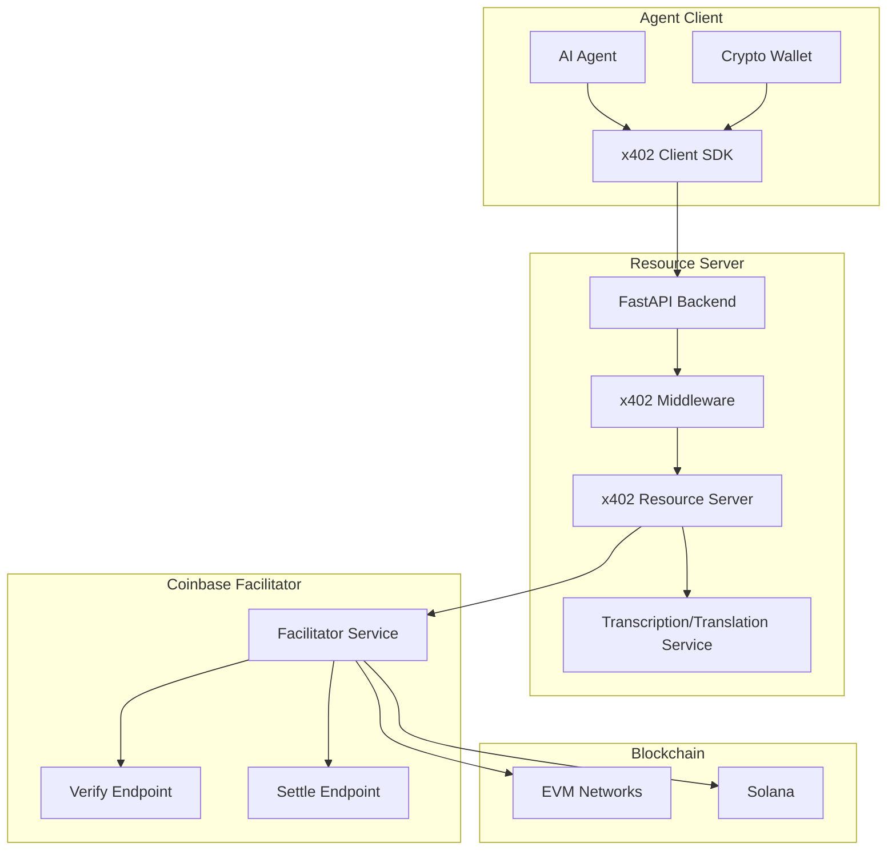
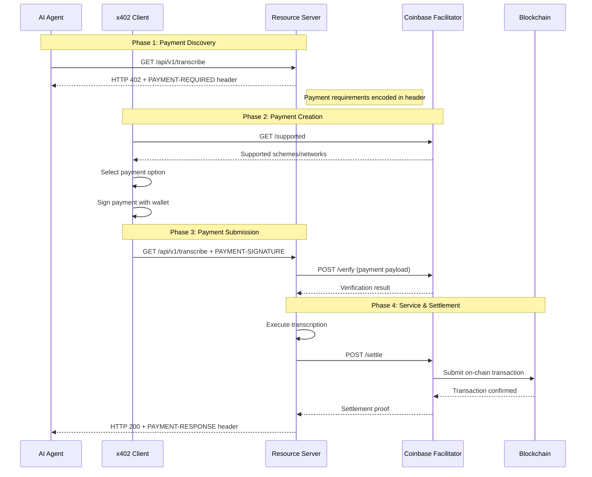

# x402 v2 Payment Specification for AI Agents

## HTTP-Native Payments Using Coinbase Facilitator

**Version:** 2.0.0  
**Date:** 2026-03-25  
**Protocol:** x402 v2 (HTTP 402 Payment Required)

---

## Overview

This specification defines an **x402 v2 payment system** for AI agents to pay for transcription and translation services using the **Coinbase facilitator**. The x402 protocol leverages the HTTP 402 Payment Required status code to enable seamless, automatic stablecoin payments directly over HTTP without accounts or complex authentication.

### Key Features

| Feature | Description |
|---------|-------------|
| **HTTP-Native** | Payments flow naturally through standard HTTP request/response cycles |
| **Wallet-Based Identity** | No accounts required - wallet address serves as identity |
| **Automatic Settlement** | Coinbase facilitator handles on-chain verification and settlement |
| **Multi-Chain Support** | EVM chains (Base, Ethereum, Polygon) and Solana via facilitator |
| **Micropayment Optimized** | Pay-per-request pricing with minimal friction |
| **Agent-Ready** | Built for AI agent-to-agent commerce (A2A) |

### Supported Payment Methods

| Method | Network | Asset | Use Case |
|--------|---------|-------|----------|
| EIP-3009 | Base, Ethereum, Polygon | USDC | Standard EVM payments |
| Permit2 | Base, Ethereum, Polygon | USDC | Gasless delegated execution |
| Solana Pay | Solana | USDC | Solana-native payments |

---

## Architecture

### High-Level System Architecture



### Payment Flow Sequence



---

## Protocol Specification

### x402 v2 HTTP Headers

The x402 v2 protocol uses three standardized HTTP headers:

| Header | Direction | Description |
|--------|-----------|-------------|
| `PAYMENT-REQUIRED` | Server → Client | Payment requirements (402 response) |
| `PAYMENT-SIGNATURE` | Client → Server | Signed payment payload (retry request) |
| `PAYMENT-RESPONSE` | Server → Client | Settlement confirmation (200 response) |

### PAYMENT-REQUIRED Header Format

```json
{
  "x402Version": 2,
  "accepts": [
    {
      "scheme": "exact",
      "network": "eip155:84532",
      "amount": "1000000",
      "asset": "0x833589fCD6eDb6E08f4c7C32D4f71b54bdA02913",
      "payTo": "0xYourPlatformWallet",
      "maxTimeoutSeconds": 300,
      "resource": "https://api.livetranscription.app/v1/transcribe",
      "description": "Transcription service - $0.01 USDC",
      "mimeType": "application/json"
    },
    {
      "scheme": "exact",
      "network": "solana:5eykt4UsFv8P8NJdTREpY1vzqKqZKvdp",
      "amount": "1000000",
      "asset": "EPjFWdd5AufqSSqeM2qN1xzybapC8G4wEGGkZwyTDt1v",
      "payTo": "YourSolanaWallet",
      "maxTimeoutSeconds": 300,
      "resource": "https://api.livetranscription.app/v1/transcribe",
      "description": "Transcription service - $0.01 USDC",
      "mimeType": "application/json"
    }
  ],
  "resource": {
    "url": "https://api.livetranscription.app/v1/transcribe",
    "description": "Audio/video transcription service",
    "mimeType": "application/json"
  }
}
```

### PAYMENT-SIGNATURE Header Format

```json
{
  "x402Version": 2,
  "resource": {
    "url": "https://api.livetranscription.app/v1/transcribe",
    "description": "Audio/video transcription service",
    "mimeType": "application/json"
  },
  "accepted": {
    "scheme": "exact",
    "network": "eip155:84532",
    "amount": "1000000",
    "asset": "0x833589fCD6eDb6E08f4c7C32D4f71b54bdA02913",
    "payTo": "0xYourPlatformWallet",
    "maxTimeoutSeconds": 300
  },
  "payload": {
    "signature": "0x...",
    "authorization": {
      "from": "0xAgentWallet",
      "to": "0xYourPlatformWallet",
      "value": "1000000",
      "nonce": "...",
      "deadline": 1740672154
    }
  }
}
```

### PAYMENT-RESPONSE Header Format

```json
{
  "x402Version": 2,
  "transaction": "0xtx_hash...",
  "network": "eip155:84532",
  "payer": "0xAgentWallet",
  "payee": "0xYourPlatformWallet",
  "amount": "1000000",
  "asset": "0x833589fCD6eDb6E08f4c7C32D4f71b54bdA02913",
  "success": true
}
```

---

## Server-Side Implementation

### FastAPI x402 Middleware

```python
# backend/x402_middleware.py
import json
import base64
from typing import Optional, Dict, Any
from fastapi import Request, Response, HTTPException
from fastapi.responses import JSONResponse
import httpx

class X402PaymentMiddleware:
    """x402 v2 payment middleware for FastAPI."""
    
    def __init__(
        self,
        facilitator_url: str,
        platform_wallet: str,
        default_price_usd: float = 0.01,
        supported_networks: Optional[list] = None
    ):
        self.facilitator_url = facilitator_url
        self.platform_wallet = platform_wallet
        self.default_price_usd = default_price_usd
        self.supported_networks = supported_networks or [
            {"chain_id": 84532, "name": "base-sepolia", "type": "evm"},
            {"chain_id": 8453, "name": "base", "type": "evm"},
            {"chain_id": 137, "name": "polygon", "type": "evm"},
        ]
        self._facilitator_client = httpx.AsyncClient(base_url=facilitator_url)
    
    async def _get_payment_requirements(
        self,
        request: Request,
        price_usd: Optional[float] = None
    ) -> Dict[str, Any]:
        """Generate payment requirements for a resource."""
        amount = int((price_usd or self.default_price_usd) * 1_000_000)  # USDC 6 decimals
        
        accepts = []
        for network in self.supported_networks:
            if network["type"] == "evm":
                accepts.append({
                    "scheme": "exact",
                    "network": f"eip155:{network['chain_id']}",
                    "amount": str(amount),
                    "asset": self._get_usdc_address(network["chain_id"]),
                    "payTo": self.platform_wallet,
                    "maxTimeoutSeconds": 300,
                    "resource": str(request.url),
                    "description": f"API access - ${amount / 1_000_000:.2f} USDC",
                    "mimeType": "application/json",
                })
        
        return {
            "x402Version": 2,
            "accepts": accepts,
            "resource": {
                "url": str(request.url),
                "description": "API resource access",
                "mimeType": "application/json",
            },
        }
    
    def _get_usdc_address(self, chain_id: int) -> str:
        """Get USDC token address for chain."""
        usdc_addresses = {
            84532: "0x036CbD53842c5426634e7929541eC2318f3dCF7e",  # Base Sepolia
            8453: "0x833589fCD6eDb6E08f4c7C32D4f71b54bdA02913",   # Base
            137: "0x3c499c542cEF5E3811e1192ce70d8cC03d5c3359",   # Polygon
            1: "0xA0b86991c6218b36c1d19D4a2e9Eb0cE3606eB48",    # Ethereum
        }
        return usdc_addresses.get(chain_id, usdc_addresses[84532])
    
    async def _verify_payment(
        self,
        payment_payload: Dict[str, Any],
        requirements: Dict[str, Any]
    ) -> tuple[bool, Optional[str]]:
        """Verify payment signature with facilitator."""
        try:
            response = await self._facilitator_client.post(
                "/verify",
                json={
                    "payload": payment_payload,
                    "requirements": requirements["accepts"][0],
                },
            )
            response.raise_for_status()
            result = response.json()
            return result.get("isValid", False), result.get("invalidReason")
        except Exception as e:
            return False, f"Verification error: {str(e)}"
    
    async def _settle_payment(
        self,
        payment_payload: Dict[str, Any],
        requirements: Dict[str, Any]
    ) -> Optional[Dict[str, Any]]:
        """Submit payment for settlement via facilitator."""
        try:
            response = await self._facilitator_client.post(
                "/settle",
                json={
                    "payload": payment_payload,
                    "requirements": requirements["accepts"][0],
                },
            )
            response.raise_for_status()
            return response.json()
        except Exception as e:
            return {"success": False, "errorReason": str(e)}
    
    async def __call__(
        self,
        request: Request,
        call_next,
        price_usd: Optional[float] = None
    ) -> Response:
        """Process request with x402 payment handling."""
        # Check for payment signature header
        payment_header = request.headers.get("PAYMENT-SIGNATURE")
        
        if not payment_header:
            # No payment provided - return 402 with requirements
            requirements = await self._get_payment_requirements(request, price_usd)
            encoded_requirements = base64.b64encode(
                json.dumps(requirements).encode()
            ).decode()
            
            return JSONResponse(
                status_code=402,
                content={"error": "Payment required", "requirements": requirements},
                headers={"PAYMENT-REQUIRED": encoded_requirements},
            )
        
        # Decode and verify payment
        try:
            payment_payload = json.loads(base64.b64decode(payment_header))
            requirements = await self._get_payment_requirements(request, price_usd)
            
            is_valid, invalid_reason = await self._verify_payment(
                payment_payload, requirements
            )
            
            if not is_valid:
                return JSONResponse(
                    status_code=402,
                    content={"error": "Payment verification failed", "reason": invalid_reason},
                )
            
            # Execute the actual request handler
            response = await call_next(request)
            
            # Settle payment after successful execution
            settlement = await self._settle_payment(payment_payload, requirements)
            
            # Add settlement info to response headers
            if settlement and settlement.get("success"):
                encoded_settlement = base64.b64encode(
                    json.dumps(settlement).encode()
                ).decode()
                response.headers["PAYMENT-RESPONSE"] = encoded_settlement
            
            return response
            
        except json.JSONDecodeError:
            return JSONResponse(
                status_code=400,
                content={"error": "Invalid payment signature format"},
            )
        except Exception as e:
            return JSONResponse(
                status_code=500,
                content={"error": f"Payment processing error: {str(e)}"},
            )
```

### FastAPI Integration

```python
# backend/main.py - Add x402 middleware
from fastapi import FastAPI, Request
from fastapi.responses import JSONResponse
from x402_middleware import X402PaymentMiddleware

app = FastAPI(title="Live Translation API")

# Initialize x402 middleware
x402_middleware = X402PaymentMiddleware(
    facilitator_url="https://x402.org/facilitator",  # Or self-hosted
    platform_wallet="0xYourPlatformWallet",
    default_price_usd=0.01,  # $0.01 per request
)

@app.post("/api/v1/transcribe")
async def transcribe(request: Request):
    """Transcribe audio/video - requires x402 payment."""
    # Middleware handles payment verification
    # This endpoint only executes if payment is valid
    body = await request.json()
    
    # Process transcription
    result = await process_transcription(body)
    
    return JSONResponse(content=result)

@app.post("/api/v1/translate")
async def translate(request: Request):
    """Translate text - requires x402 payment."""
    body = await request.json()
    result = await process_translation(body)
    return JSONResponse(content=result)

# Custom middleware wrapper for specific routes
@app.middleware("http")
async def x402_payment_middleware(request: Request, call_next):
    """Apply x402 payment to specific routes."""
    if request.url.path in ["/api/v1/transcribe", "/api/v1/translate"]:
        # Extract price from request or use default
        price_usd = request.headers.get("X-Price-USD")
        if price_usd:
            price_usd = float(price_usd)
        
        return await x402_middleware(request, call_next, price_usd)
    
    return await call_next(request)
```

### Self-Hosted Facilitator Setup

```python
# backend/facilitator_server.py
"""Self-hosted x402 facilitator using FastAPI."""
from fastapi import FastAPI, HTTPException
from pydantic import BaseModel
from typing import Optional, Dict, Any
import os
from eth_account import Account
from web3 import Web3

app = FastAPI(title="x402 Facilitator")

class FacilitatorConfig:
    def __init__(self):
        self.evm_private_key = os.getenv("EVM_PRIVATE_KEY")
        self.evm_rpc_url = os.getenv("EVM_RPC_URL", "https://sepolia.base.org")
        self.w3 = Web3(Web3.HTTPProvider(self.evm_rpc_url))
        self.account = Account.from_key(self.evm_private_key)
    
    def get_address(self) -> str:
        return self.account.address
    
    def get_chain_id(self) -> int:
        return self.w3.eth.chain_id

config = FacilitatorConfig()

class VerifyRequest(BaseModel):
    payload: Dict[str, Any]
    requirements: Dict[str, Any]

class SettleRequest(BaseModel):
    payload: Dict[str, Any]
    requirements: Dict[str, Any]

@app.get("/supported")
async def get_supported():
    """Return supported payment schemes and networks."""
    return {
        "x402Versions": [2],
        "schemes": [
            {
                "scheme": "exact",
                "networks": [
                    {"chainId": 84532, "name": "base-sepolia", "type": "evm"},
                    {"chainId": 8453, "name": "base", "type": "evm"},
                ],
                "assets": ["USDC"],
            }
        ],
    }

@app.post("/verify")
async def verify_payment(request: VerifyRequest):
    """Verify payment signature."""
    try:
        payload = request.payload
        requirements = request.requirements
        
        # Extract signature and authorization
        signature = payload.get("payload", {}).get("signature")
        authorization = payload.get("payload", {}).get("authorization", {})
        
        # Verify EIP-3009 signature
        from_address = authorization.get("from")
        to_address = authorization.get("to")
        value = int(authorization.get("value", 0))
        
        # Recover signer from signature
        message_hash = Web3.solidity_keccak(
            ["address", "address", "uint256", "uint256", "uint256"],
            [
                from_address,
                to_address,
                value,
                authorization.get("nonce", 0),
                authorization.get("deadline", 0),
            ]
        )
        
        recovered = Account.recover_hash(message_hash, signature=signature)
        
        is_valid = recovered.lower() == from_address.lower()
        
        return {
            "isValid": is_valid,
            "payer": from_address,
            "network": requirements.get("network"),
            "amount": requirements.get("amount"),
        }
    except Exception as e:
        raise HTTPException(status_code=400, detail=str(e))

@app.post("/settle")
async def settle_payment(request: SettleRequest):
    """Submit payment for on-chain settlement."""
    try:
        payload = request.payload
        requirements = request.requirements
        
        # In production, submit actual on-chain transaction
        # For demo, return mock settlement
        tx_hash = Web3.keccak(text=f"settle-{payload}").hex()
        
        return {
            "success": True,
            "transaction": tx_hash,
            "network": requirements.get("network"),
            "payer": payload.get("payload", {}).get("authorization", {}).get("from"),
            "payee": requirements.get("payTo"),
            "amount": requirements.get("amount"),
        }
    except Exception as e:
        return {"success": False, "errorReason": str(e)}
```

---

## Client-Side Implementation

### Python Agent SDK with x402

```python
# packages/agent-sdk/x402_client.py
import json
import base64
import aiohttp
from typing import Optional, Dict, Any, List
from eth_account import Account
from eth_account.messages import encode_typed_data
from web3 import Web3

class X402Client:
    """x402 v2 client for AI agents."""
    
    def __init__(
        self,
        private_key: str,
        facilitator_url: str = "https://x402.org/facilitator",
        base_url: str = "https://api.livetranscription.app",
    ):
        self.account = Account.from_key(private_key)
        self.facilitator_url = facilitator_url
        self.base_url = base_url
        self._session = aiohttp.ClientSession()
    
    async def _fetch_payment_requirements(
        self,
        url: str
    ) -> Optional[Dict[str, Any]]:
        """Fetch payment requirements from resource server."""
        async with self._session.get(url) as response:
            if response.status != 402:
                return None
            
            payment_required_header = response.headers.get("PAYMENT-REQUIRED")
            if not payment_required_header:
                return None
            
            return json.loads(base64.b64decode(payment_required_header))
    
    async def _create_payment_payload(
        self,
        requirements: Dict[str, Any],
        resource_url: str
    ) -> Dict[str, Any]:
        """Create signed payment payload."""
        # Select first payment option (can implement custom selection logic)
        accepted = requirements["accepts"][0]
        
        # Create EIP-3009 authorization
        nonce = Web3.keccak(text=f"{self.account.address}-{resource_url}").hex()
        deadline = int(Web3.eth.get_block("latest").timestamp) + 300
        
        authorization = {
            "from": self.account.address,
            "to": accepted["payTo"],
            "value": accepted["amount"],
            "nonce": nonce,
            "deadline": deadline,
        }
        
        # Sign authorization (EIP-3009)
        domain = {
            "name": "USD Coin",
            "version": "2",
            "chainId": int(accepted["network"].split(":")[1]),
        }
        
        types = {
            "ReceiveWithAuthorization": [
                {"name": "from", "type": "address"},
                {"name": "to", "type": "address"},
                {"name": "value", "type": "uint256"},
                {"name": "validFrom", "type": "uint256"},
                {"name": "validTo", "type": "uint256"},
                {"name": "nonce", "type": "bytes32"},
            ]
        }
        
        message = {
            "from": authorization["from"],
            "to": authorization["to"],
            "value": int(authorization["value"]),
            "validFrom": 0,
            "validTo": authorization["deadline"],
            "nonce": authorization["nonce"],
        }
        
        signed = Account.sign_typed_data(self.account.key, domain, types, message)
        
        return {
            "x402Version": 2,
            "resource": requirements["resource"],
            "accepted": accepted,
            "payload": {
                "signature": signed.signature.hex(),
                "authorization": authorization,
            },
        }
    
    async def request_with_payment(
        self,
        method: str,
        url: str,
        **kwargs
    ) -> aiohttp.ClientResponse:
        """Make HTTP request with automatic x402 payment."""
        full_url = f"{self.base_url}{url}" if not url.startswith("http") else url
        
        # Initial request without payment
        async with self._session.request(method, full_url, **kwargs) as response:
            if response.status != 402:
                return response
            
            # Get payment requirements
            requirements = await self._fetch_payment_requirements(full_url)
            if not requirements:
                raise ValueError("Server returned 402 but no payment requirements")
            
            # Create payment payload
            payment_payload = await self._create_payment_payload(
                requirements, full_url
            )
            
            # Encode payment signature header
            encoded_payment = base64.b64encode(
                json.dumps(payment_payload).encode()
            ).decode()
            
            # Retry with payment
            headers = kwargs.get("headers", {})
            headers["PAYMENT-SIGNATURE"] = encoded_payment
            
            async with self._session.request(
                method, full_url, headers=headers, **kwargs
            ) as paid_response:
                # Extract settlement info
                if paid_response.status == 200:
                    payment_response = paid_response.headers.get("PAYMENT-RESPONSE")
                    if payment_response:
                        settlement = json.loads(
                            base64.b64decode(payment_response)
                        )
                        print(f"Payment settled: {settlement.get('transaction')}")
                
                return paid_response
    
    async def transcribe(
        self,
        audio_url: str,
        language: str = "en",
        format: str = "json"
    ) -> Dict[str, Any]:
        """Transcribe audio with automatic payment."""
        response = await self.request_with_payment(
            "POST",
            "/api/v1/transcribe",
            json={"audio_url": audio_url, "language": language, "format": format},
        )
        response.raise_for_status()
        return await response.json()
    
    async def translate(
        self,
        text: str,
        source_language: str,
        target_language: str
    ) -> Dict[str, Any]:
        """Translate text with automatic payment."""
        response = await self.request_with_payment(
            "POST",
            "/api/v1/translate",
            json={
                "text": text,
                "source_language": source_language,
                "target_language": target_language,
            },
        )
        response.raise_for_status()
        return await response.json()
    
    async def close(self):
        """Close client session."""
        await self._session.close()
```

### TypeScript Agent SDK

```typescript
// packages/agent-sdk/src/x402-client.ts
import { Account, createWalletClient, http, parseEther } from 'viem';
import { privateKeyToAccount } from 'viem/accounts';
import { baseSepolia } from 'viem/chains';

interface PaymentRequirements {
  x402Version: number;
  accepts: Array<{
    scheme: string;
    network: string;
    amount: string;
    asset: string;
    payTo: string;
    maxTimeoutSeconds: number;
    resource: string;
    description: string;
    mimeType: string;
  }>;
  resource: {
    url: string;
    description: string;
    mimeType: string;
  };
}

interface PaymentPayload {
  x402Version: number;
  resource: PaymentRequirements['resource'];
  accepted: PaymentRequirements['accepts'][0];
  payload: {
    signature: string;
    authorization: {
      from: string;
      to: string;
      value: string;
      nonce: string;
      deadline: number;
    };
  };
}

export class X402Client {
  private walletClient: ReturnType<typeof createWalletClient>;
  private account: Account;
  private facilitatorUrl: string;
  private baseUrl: string;

  constructor(
    privateKey: string,
    options: {
      facilitatorUrl?: string;
      baseUrl?: string;
    } = {}
  ) {
    this.account = privateKeyToAccount(privateKey as `0x${string}`);
    this.facilitatorUrl = options.facilitatorUrl || 'https://x402.org/facilitator';
    this.baseUrl = options.baseUrl || 'https://api.livetranscription.app';

    this.walletClient = createWalletClient({
      account: this.account,
      chain: baseSepolia,
      transport: http(),
    });
  }

  private async fetchPaymentRequirements(url: string): Promise<PaymentRequirements | null> {
    const response = await fetch(url);
    if (response.status !== 402) return null;

    const paymentRequiredHeader = response.headers.get('PAYMENT-REQUIRED');
    if (!paymentRequiredHeader) return null;

    return JSON.parse(atob(paymentRequiredHeader));
  }

  private async createPaymentPayload(
    requirements: PaymentRequirements,
    resourceUrl: string
  ): Promise<PaymentPayload> {
    const accepted = requirements.accepts[0];
    
    // Generate nonce and deadline
    const nonce = `0x${Buffer.from(`${this.account.address}-${resourceUrl}`).toString('hex')}`;
    const deadline = Math.floor(Date.now() / 1000) + 300;

    const authorization = {
      from: this.account.address,
      to: accepted.payTo,
      value: accepted.amount,
      nonce,
      deadline,
    };

    // Sign EIP-3009 authorization
    const signature = await this.walletClient.signTypedData({
      account: this.account,
      domain: {
        name: 'USD Coin',
        version: '2',
        chainId: parseInt(accepted.network.split(':')[1]),
      },
      types: {
        ReceiveWithAuthorization: [
          { name: 'from', type: 'address' },
          { name: 'to', type: 'address' },
          { name: 'value', type: 'uint256' },
          { name: 'validFrom', type: 'uint256' },
          { name: 'validTo', type: 'uint256' },
          { name: 'nonce', type: 'bytes32' },
        ],
      },
      primaryType: 'ReceiveWithAuthorization',
      message: {
        from: authorization.from,
        to: authorization.to,
        value: BigInt(authorization.value),
        validFrom: 0,
        validTo: authorization.deadline,
        nonce: authorization.nonce as `0x${string}`,
      },
    });

    return {
      x402Version: 2,
      resource: requirements.resource,
      accepted,
      payload: {
        signature,
        authorization,
      },
    };
  }

  async requestWithPayment(
    method: string,
    url: string,
    options: RequestInit = {}
  ): Promise<Response> {
    const fullUrl = url.startsWith('http') ? url : `${this.baseUrl}${url}`;

    // Initial request without payment
    let response = await fetch(fullUrl, {
      method,
      ...options,
    });

    if (response.status !== 402) {
      return response;
    }

    // Get payment requirements
    const requirements = await this.fetchPaymentRequirements(fullUrl);
    if (!requirements) {
      throw new Error('Server returned 402 but no payment requirements');
    }

    // Create payment payload
    const paymentPayload = await this.createPaymentPayload(requirements, fullUrl);

    // Encode payment signature header
    const encodedPayment = btoa(JSON.stringify(paymentPayload));

    // Retry with payment
    response = await fetch(fullUrl, {
      method,
      ...options,
      headers: {
        ...options.headers,
        'PAYMENT-SIGNATURE': encodedPayment,
        'Content-Type': 'application/json',
      },
    });

    // Extract settlement info
    if (response.status === 200) {
      const paymentResponse = response.headers.get('PAYMENT-RESPONSE');
      if (paymentResponse) {
        const settlement = JSON.parse(atob(paymentResponse));
        console.log(`Payment settled: ${settlement.transaction}`);
      }
    }

    return response;
  }

  async transcribe(
    audioUrl: string,
    language: string = 'en',
    format: string = 'json'
  ): Promise<any> {
    const response = await this.requestWithPayment('POST', '/api/v1/transcribe', {
      body: JSON.stringify({ audio_url: audioUrl, language, format }),
    });
    
    if (!response.ok) {
      throw new Error(`Transcription failed: ${response.statusText}`);
    }
    
    return response.json();
  }

  async translate(
    text: string,
    sourceLanguage: string,
    targetLanguage: string
  ): Promise<any> {
    const response = await this.requestWithPayment('POST', '/api/v1/translate', {
      body: JSON.stringify({
        text,
        source_language: sourceLanguage,
        target_language: targetLanguage,
      }),
    });
    
    if (!response.ok) {
      throw new Error(`Translation failed: ${response.statusText}`);
    }
    
    return response.json();
  }
}
```

### Usage Example

```python
# Example: AI Agent using x402 for transcription
import asyncio
from x402_client import X402Client

async def main():
    # Initialize client with agent's wallet
    client = X402Client(
        private_key="0xYourAgentPrivateKey",
        facilitator_url="https://x402.org/facilitator",
        base_url="https://api.livetranscription.app",
    )
    
    try:
        # Transcribe audio - payment handled automatically
        result = await client.transcribe(
            audio_url="https://example.com/meeting.mp3",
            language="en",
            format="json",
        )
        print(f"Transcription: {result['text']}")
        print(f"Payment transaction: {result.get('payment_proof')}")
        
        # Translate text - payment handled automatically
        translation = await client.translate(
            text="Hello, world!",
            source_language="en",
            target_language="es",
        )
        print(f"Translation: {translation['translated_text']}")
        
    finally:
        await client.close()

asyncio.run(main())
```

---

## Database Schema

### x402 Payments Table

```sql
-- x402 payments table
CREATE TABLE x402_payments (
  id UUID PRIMARY KEY DEFAULT uuid_generate_v4(),
  agent_wallet TEXT NOT NULL,
  resource_url TEXT NOT NULL,
  amount NUMERIC NOT NULL,
  asset TEXT NOT NULL,
  network TEXT NOT NULL,
  scheme TEXT NOT NULL DEFAULT 'exact',
  transaction_hash TEXT,
  status TEXT NOT NULL DEFAULT 'pending' CHECK (status IN ('pending', 'verified', 'settled', 'failed')),
  payment_payload JSONB,
  verification_result JSONB,
  settlement_result JSONB,
  created_at TIMESTAMPTZ NOT NULL DEFAULT NOW(),
  verified_at TIMESTAMPTZ,
  settled_at TIMESTAMPTZ
);

-- Agent usage tracking
CREATE TABLE agent_usage (
  id UUID PRIMARY KEY DEFAULT uuid_generate_v4(),
  agent_wallet TEXT NOT NULL,
  endpoint TEXT NOT NULL,
  amount_paid NUMERIC NOT NULL,
  asset TEXT NOT NULL,
  transaction_hash TEXT,
  created_at TIMESTAMPTZ NOT NULL DEFAULT NOW()
);

-- Indexes
CREATE INDEX idx_x402_payments_agent_wallet ON x402_payments(agent_wallet);
CREATE INDEX idx_x402_payments_resource_url ON x402_payments(resource_url);
CREATE INDEX idx_x402_payments_transaction_hash ON x402_payments(transaction_hash);
CREATE INDEX idx_x402_payments_status ON x402_payments(status);
CREATE INDEX idx_agent_usage_agent_wallet ON agent_usage(agent_wallet);
CREATE INDEX idx_agent_usage_created_at ON agent_usage(created_at);

-- RLS Policies
ALTER TABLE x402_payments ENABLE ROW LEVEL SECURITY;
ALTER TABLE agent_usage ENABLE ROW LEVEL SECURITY;

-- Agents can view their own payments
CREATE POLICY "Agents can view own payments" ON x402_payments
  FOR SELECT USING (agent_wallet = auth.jwt()->>'wallet_address');

CREATE POLICY "Agents can view own usage" ON agent_usage
  FOR SELECT USING (agent_wallet = auth.jwt()->>'wallet_address');

-- Service role can manage all
CREATE POLICY "Service role can manage x402 payments" ON x402_payments
  FOR ALL USING (auth.jwt()->>'role' = 'service_role');

CREATE POLICY "Service role can manage agent usage" ON agent_usage
  FOR ALL USING (auth.jwt()->>'role' = 'service_role');
```

---

## Facilitator Configuration

### Coinbase Facilitator Setup

The Coinbase facilitator is available in two environments:

| Environment | Facilitator URL | Networks | Auth |
|-------------|-----------------|----------|------|
| **CDP (recommended)** | `https://api.cdp.coinbase.com/platform/v2/x402` | Base, Base Sepolia, Polygon, Solana, Solana Devnet | CDP API keys required |
| x402.org (testnet only) | `https://x402.org/facilitator` | Base Sepolia, Solana Devnet | None |

We recommend the CDP facilitator for both testnet and mainnet—it supports all networks with a generous free tier.

#### CDP Facilitator Setup (Recommended)

To use the CDP facilitator, you need a Coinbase Developer Platform account:

1. Sign up at [cdp.coinbase.com](https://cdp.coinbase.com)
2. Create a new project
3. Generate API credentials
4. Set environment variables:

```bash
# CDP API credentials
export CDP_API_KEY_ID="your-api-key-id"
export CDP_API_KEY_SECRET="your-api-key-secret"
```

```python
# Use CDP facilitator for production
from x402.http import FacilitatorConfig, HTTPFacilitatorClient

facilitator = HTTPFacilitatorClient(
    FacilitatorConfig(
        url="https://api.cdp.coinbase.com/platform/v2/x402",
        # CDP API key authentication is handled automatically
        # via CDP_API_KEY_ID and CDP_API_KEY_SECRET environment variables
    )
)

# Configuration
x402_middleware = X402PaymentMiddleware(
    facilitator=facilitator,
    platform_wallet="0xYourPlatformWallet",
    default_price_usd=0.01,
)
```

#### Testnet Facilitator (Quick Start)

For testing without signup, use the x402.org testnet facilitator:

```python
# Use x402.org testnet facilitator (no signup required)
FACILITATOR_URL = "https://x402.org/facilitator"

# Configuration
x402_middleware = X402PaymentMiddleware(
    facilitator_url=FACILITATOR_URL,
    platform_wallet="0xYourPlatformWallet",
    default_price_usd=0.01,
)
```

#### Self-Hosted Facilitator

For advanced use cases, you can self-host a facilitator:

```bash
# Environment variables for self-hosted facilitator
export EVM_PRIVATE_KEY="your_facilitator_private_key"
export EVM_RPC_URL="https://sepolia.base.org"
export SVM_PRIVATE_KEY="your_solana_private_key"  # Optional
export SVM_NETWORK="solana-devnet"  # Optional
export PORT=4022
```

```yaml
# docker-compose.yml - Facilitator service
services:
  facilitator:
    image: coinbase/x402-facilitator:latest
    environment:
      - EVM_PRIVATE_KEY=${EVM_PRIVATE_KEY}
      - EVM_RPC_URL=${EVM_RPC_URL}
      - SVM_PRIVATE_KEY=${SVM_PRIVATE_KEY}
      - SVM_NETWORK=${SVM_NETWORK}
      - PORT=4022
    ports:
      - "4022:4022"
    healthcheck:
      test: ["CMD", "curl", "-f", "http://localhost:4022/supported"]
      interval: 30s
      timeout: 10s
      retries: 3
```

### Supported Networks (CAIP-2 Format)

x402 v2 uses [CAIP-2](https://github.com/ChainAgnostic/CAIPs/blob/main/CAIPs/caip-2.md) format for network identifiers:

| Network | CAIP-2 Identifier | Type | USDC Address |
|---------|-------------------|------|--------------|
| Base Mainnet | `eip155:8453` | EVM | `0x833589fCD6eDb6E08f4c7C32D4f71b54bdA02913` |
| Base Sepolia | `eip155:84532` | EVM | `0x036CbD53842c5426634e7929541eC2318f3dCF7e` |
| Polygon | `eip155:137` | EVM | `0x3c499c542cEF5E3811e1192ce70d8cC03d5c3359` |
| Ethereum | `eip155:1` | EVM | `0xA0b86991c6218b36c1d19D4a2e9Eb0cE3606eB48` |
| Solana Mainnet | `solana:5eykt4UsFv8P8NJdTREpY1vzqKqZKvdp` | SVM | `EPjFWdd5AufqSSqeM2qN1xzybapC8G4wEGGkZwyTDt1v` |
| Solana Devnet | `solana:EtWTRABZaYq6iMfeYKouRu166VU2xqa1` | SVM | `EPjFWdd5AufqSSqeM2qN1xzybapC8G4wEGGkZwyTDt1v` |

#### Multi-Network Configuration

You can support multiple networks on the same endpoint:

```python
routes = {
    "POST /api/v1/transcribe": {
        "accepts": [
            {
                "scheme": "exact",
                "pay_to": "0xYourEvmAddress",
                "price": "$0.01",
                "network": "eip155:8453",  # Base mainnet
            },
            {
                "scheme": "exact",
                "pay_to": "YourSolanaAddress",
                "price": "$0.01",
                "network": "solana:5eykt4UsFv8P8NJdTREpY1vzqKqZKvdp",  # Solana mainnet
            },
        ],
        "description": "Transcription service",
        "mime_type": "application/json",
    },
}
```

---

## Pricing Configuration

### Per-Endpoint Pricing

```python
# Define pricing for different endpoints
PRICING = {
    "/api/v1/transcribe": {
        "base_price_usd": 0.01,  # $0.01 per request
        "per_minute_price_usd": 0.001,  # Additional $0.001 per minute
    },
    "/api/v1/transcribe/stream": {
        "base_price_usd": 0.05,  # $0.05 per request (GPU)
        "per_minute_price_usd": 0.01,  # Additional $0.01 per minute
    },
    "/api/v1/translate": {
        "base_price_usd": 0.001,  # $0.001 per request
        "per_char_price_usd": 0.00001,  # Additional $0.00001 per character
    },
}

# Dynamic pricing based on request
async def get_price_for_request(request: Request) -> float:
    """Calculate price based on endpoint and payload."""
    body = await request.json() if request.method == "POST" else {}
    
    if request.url.path == "/api/v1/transcribe":
        duration = body.get("duration_seconds", 60)
        return PRICING["/api/v1/transcribe"]["base_price_usd"] + \
               (duration / 60) * PRICING["/api/v1/transcribe"]["per_minute_price_usd"]
    
    elif request.url.path == "/api/v1/translate":
        char_count = len(body.get("text", ""))
        return PRICING["/api/v1/translate"]["base_price_usd"] + \
               char_count * PRICING["/api/v1/translate"]["per_char_price_usd"]
    
    return 0.01  # Default price
```

---

## Security Considerations

### 1. Signature Verification

- Always verify signatures with the facilitator before executing services
- Implement replay protection using nonces
- Validate payment deadlines (maxTimeoutSeconds)

### 2. Rate Limiting

```python
# Rate limiting per wallet
from slowapi import Limiter
from slowapi.util import get_remote_address

limiter = Limiter(key_func=get_remote_address)

@app.post("/api/v1/transcribe")
@limiter.limit("100/minute")
async def transcribe(request: Request):
    # Rate limit: 100 requests per minute per wallet
    ...
```

### 3. Payment Validation

```python
# Validate payment amount matches expected price
async def validate_payment_amount(
    payment_payload: Dict[str, Any],
    expected_price: float
) -> bool:
    """Ensure payment amount matches expected price."""
    accepted = payment_payload.get("accepted", {})
    amount = int(accepted.get("amount", 0))
    
    # Convert to USD (assuming USDC with 6 decimals)
    paid_usd = amount / 1_000_000
    
    # Allow 1% tolerance for rounding
    return abs(paid_usd - expected_price) / expected_price < 0.01
```

### 4. Settlement Timeout

```python
# Settlement must occur within timeout window
MAX_SETTLEMENT_TIMEOUT = 300  # 5 minutes

async def validate_settlement_timeout(
    payment_payload: Dict[str, Any]
) -> bool:
    """Ensure payment is within timeout window."""
    authorization = payment_payload.get("payload", {}).get("authorization", {})
    deadline = authorization.get("deadline", 0)
    
    current_time = int(time.time())
    return current_time <= deadline
```

---

## Testing

### Test Client

```python
# backend/tests/test_x402.py
import pytest
from x402_client import X402Client

@pytest.fixture
def test_client():
    return X402Client(
        private_key="0xTestPrivateKey",
        facilitator_url="http://localhost:4022",
        base_url="http://localhost:8000",
    )

@pytest.mark.asyncio
async def test_transcribe_with_payment(test_client):
    """Test transcription with x402 payment."""
    result = await test_client.transcribe(
        audio_url="https://example.com/test.mp3",
        language="en",
    )
    
    assert result["status"] == "completed"
    assert "text" in result
    assert "payment_proof" in result

@pytest.mark.asyncio
async def test_payment_required_response():
    """Test 402 response without payment."""
    async with aiohttp.ClientSession() as session:
        async with session.post(
            "http://localhost:8000/api/v1/transcribe",
            json={"audio_url": "https://example.com/test.mp3"},
        ) as response:
            assert response.status == 402
            assert "PAYMENT-REQUIRED" in response.headers
```

---

## Migration from Legacy System

### Comparison: Legacy vs x402

| Aspect | Legacy System | x402 v2 System |
|--------|--------------|----------------|
| Authentication | API Key + Wallet | Wallet-only |
| Payment Flow | Manual transfer + credit allocation | Automatic HTTP-native |
| Verification | Blockchain listener | Facilitator-mediated |
| Settlement | Manual database update | Automatic via facilitator |
| Credit System | Pre-paid credits | Pay-per-request |

### Migration Steps

1. **Deploy x402 middleware** alongside existing payment system
2. **Update agent SDK** to support x402 client
3. **Gradual rollout** - allow agents to choose payment method
4. **Deprecate legacy** - sunset credit-based system after migration

---

## References

- [x402 Protocol Specification](https://github.com/coinbase/x402)
- [CDP x402 Documentation](https://docs.cdp.coinbase.com/x402/docs/welcome)
- [x402 Quickstart for Sellers](https://docs.cdp.coinbase.com/x402/quickstart-for-sellers)
- [x402 Quickstart for Buyers](https://docs.cdp.coinbase.com/x402/quickstart-for-buyers)
- [x402 Bazaar Discovery Layer](https://docs.cdp.coinbase.com/x402/bazaar)
- [Network Support](https://docs.cdp.coinbase.com/x402/network-support)
- [EIP-3009: Transfer With Authorization](https://eips.ethereum.org/EIPS/eip-3009)
- [Permit2](https://github.com/Uniswap/permit2)
- [CAIP-2: Blockchain ID Reference](https://github.com/ChainAgnostic/CAIPs/blob/main/CAIPs/caip-2.md)
- [x402 Discord](https://discord.gg/cdp)

---

*Document Version: 2.0.0*
*Last Updated: 2026-03-25*
