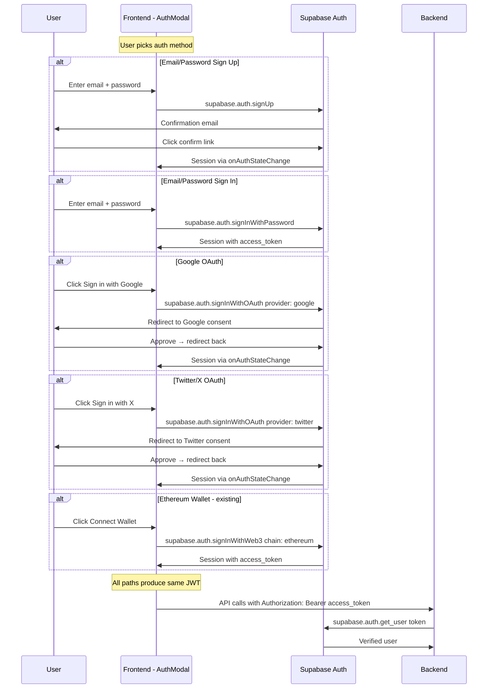

# Plan: Add Email/Password & Social Login (Google, Twitter/X)

## Current State

The app currently supports **two auth paths**:

1. **User auth** — SIWE (Sign-In with Ethereum) via Supabase Web3 auth
   - Frontend: [`WalletLogin.jsx`](frontend/src/components/WalletLogin.jsx) → [`signInWithEthereum()`](frontend/src/lib/supabase.js:46) → `supabase.auth.signInWithWeb3({ chain: 'ethereum' })`
   - Backend: [`verify_supabase_user()`](backend/auth.py:154) validates the JWT from `Authorization: Bearer` header
   - DB: [`sync_wallet_address()`](supabase/migrations/20260415_01_enable_web3_auth.sql:34) trigger syncs wallet from `auth.identities` → `public.users`

2. **Agent auth** — HMAC-SHA256 signed requests via API keys
   - Backend: [`verify_agent_request()`](backend/auth.py:59) validates `X-API-Key`, `X-Timestamp`, `X-Nonce`, `X-Signature` headers

**Key observation**: The backend is already provider-agnostic — [`verify_supabase_user()`](backend/auth.py:154) validates any Supabase JWT regardless of how the user authenticated. The [`@require_auth`](backend/auth.py:230) decorator accepts either auth method. **No backend auth logic changes are needed** for adding social providers — only the `/auth/me` endpoint needs minor updates to return social identity info.

---

## Target State

Users should be able to sign in via:

| Method | Supabase API | Flow |
|--------|-------------|------|
| 🦊 Ethereum Wallet | `signInWithWeb3` | Existing — no changes |
| 📧 Email + Password | `signUp` / `signInWithPassword` | New |
| 🔵 Google | `signInWithOAuth({ provider: 'google' })` | New — OAuth redirect |
| 🐦 Twitter/X | `signInWithOAuth({ provider: 'twitter' })` | New — OAuth redirect |

All methods produce the same Supabase JWT, so the backend validation layer works unchanged.

---

## Architecture



---

## Implementation Steps

### 1. Add auth functions to `frontend/src/lib/supabase.js`

Add the following new exports alongside the existing `signInWithEthereum`, `signOut`, `getSession`, `getUser`, `onAuthStateChange`:

```js
// Email/password sign up
export async function signUpWithEmail({ email, password, name }) { ... }

// Email/password sign in
export async function signInWithEmail({ email, password }) { ... }

// Google OAuth
export async function signInWithGoogle() { ... }

// Twitter/X OAuth
export async function signInWithTwitter() { ... }
```

Each function:
- Checks `if (!supabase)` and returns a consistent `{ user, session, error }` shape
- Calls the corresponding `supabase.auth.*` method
- For OAuth: uses `signInWithOAuth({ provider, options: { redirectTo } })` with `redirectTo` set to `window.location.origin` so the user returns to the app after the OAuth redirect

### 2. Create unified `AuthModal` component

Replace the current `WalletLogin.jsx` with a new `AuthModal.jsx` that presents all auth options in a single modal dialog.

**Component structure:**

```
AuthModal
├── If user is authenticated:
│   ├── Show user info (avatar, name/email, wallet address if web3)
│   └── Disconnect/Sign Out button
└── If user is NOT authenticated:
    ├── Modal overlay with auth card
    ├── App logo + title
    ├── Social login buttons (Google, Twitter/X)
    ├── Divider: "or continue with email"
    ├── Email + password form (sign in / sign up toggle)
    ├── Divider: "or connect wallet"
    └── Ethereum wallet button (existing SIWE flow)
```

**Props:**
- `user` — current Supabase user object (null if not signed in)
- `onAuth` — callback `({ user, session, error })` fired after any sign-in attempt
- `onLogout` — callback fired after sign-out
- `open` — boolean controlling modal visibility
- `onClose` — callback to close the modal

**Key behaviors:**
- The `onAuthStateChange` listener in `App.jsx` already handles session persistence, so the modal just needs to fire the sign-in and let the existing listener update state
- Error states are shown inline per-provider
- Loading states per-button to prevent double-clicks
- Sign up vs sign in toggle for email — sign up shows an optional name field and sends a confirmation email

### 3. Update `App.jsx`

- Replace `WalletLogin` import with `AuthModal`
- Add an `authModalOpen` state
- Replace the `WalletLogin` render with `AuthModal`, passing `authUser`, `onAuth`, `onLogout`, `open`, and `onClose`
- Add a header button that opens the auth modal when not authenticated, or shows user info when authenticated
- The existing `useEffect` with `getSession()` and `onAuthStateChange()` remains unchanged — it already handles all Supabase auth methods

### 4. Add CSS styles

Add styles to `App.css` for:
- `.auth-modal-overlay` — dark backdrop
- `.auth-modal` — centered card with the app's dark theme
- `.auth-modal-title` — heading
- `.auth-social-buttons` — flex column for Google/Twitter buttons
- `.auth-social-btn` — styled buttons with provider icons/colors
- `.auth-social-btn.google` — Google brand colors
- `.auth-social-btn.twitter` — Twitter/X brand colors
- `.auth-divider` — horizontal line with "or" text
- `.auth-email-form` — email/password input group
- `.auth-email-input`, `.auth-password-input` — styled inputs
- `.auth-email-btn` — submit button
- `.auth-toggle` — sign in / sign up switch link
- `.auth-wallet-section` — wallet connect area
- `.auth-error` — error message display
- `.auth-user-info` — authenticated user display

### 5. Create Supabase migration for social identity sync

Create a new migration `supabase/migrations/20260415_02_sync_social_identities.sql` that:

- Extends the existing `sync_wallet_address()` trigger to also sync social provider data
- Adds columns to `public.users` if needed: `avatar_url TEXT`, `full_name TEXT`, `provider TEXT`
- Updates the trigger function to extract identity data from `auth.identities` for providers `google` and `twitter`, populating `avatar_url` from `identity_data->>'avatar_url'`, `full_name` from `identity_data->>'full_name'`, and `provider` from the identity provider name
- Handles users with multiple identities (e.g., linked email + wallet)

### 6. Update backend `/auth/me` endpoint

In [`auth_me_handler()`](backend/auth.py:26), extend the response to include social provider info:

- Iterate over `user.identities` to find all providers (not just `web3`)
- Return a `providers` list with each provider name and relevant identity data
- Return `avatar_url` and `full_name` from the first available identity
- Keep backward compatibility — `wallet_address` still extracted for web3 users

### 7. Update `frontend/.env.template`

Add a comment noting that Google and Twitter OAuth providers must be enabled in the Supabase dashboard. No new frontend env vars are needed — the Supabase client already has the URL and anon key, and OAuth provider configuration is server-side.

### 8. Add provider configuration documentation

Create `docs/AUTH_SETUP.md` with step-by-step instructions for:

**Google OAuth setup:**
1. Go to Google Cloud Console → APIs & Services → Credentials
2. Create OAuth 2.0 Client ID (Web application)
3. Add authorized redirect URI: `https://<project-ref>.supabase.co/auth/v1/callback`
4. Add authorized JavaScript origins: app URL
5. Copy Client ID and Client Secret
6. In Supabase Dashboard → Authentication → Providers → Google: enable and paste credentials

**Twitter/X OAuth setup:**
1. Go to Twitter Developer Portal → Projects & Apps
2. Create app with OAuth 2.0 enabled
3. Set callback URL: `https://<project-ref>.supabase.co/auth/v1/callback`
4. Copy Client ID and Client Secret
5. In Supabase Dashboard → Authentication → Providers → Twitter: enable and paste credentials

**Email auth:**
- Enabled by default in Supabase — just confirm in Dashboard → Authentication → Providers → Email

### 9. Clean up stale `test_auth.py`

The file [`backend/tests/test_auth.py`](backend/tests/test_auth.py:1) imports functions that no longer exist in the current `auth.py`:
- `generate_nonce`, `create_siwe_message`, `verify_siwe_message`, `create_jwt_token`, `verify_jwt_token`, `authenticate_with_siwe`, `NonceStore`

These were from the old custom SIWE implementation that was replaced by Supabase Web3 auth. The tests need to be rewritten to test the current auth system:
- Test `verify_supabase_user()` with mock JWTs
- Test `verify_agent_request()` with mock HMAC signatures
- Test `require_auth`, `require_user_auth`, `require_agent_auth` decorators
- Test `auth_me_handler` response shape

---

## Files to Modify

| File | Change |
|------|--------|
| `frontend/src/lib/supabase.js` | Add `signUpWithEmail`, `signInWithEmail`, `signInWithGoogle`, `signInWithTwitter` |
| `frontend/src/components/WalletLogin.jsx` | Keep for backward compat, but create new `AuthModal.jsx` alongside |
| `frontend/src/components/AuthModal.jsx` | **New** — unified auth modal with all providers |
| `frontend/src/App.jsx` | Replace `WalletLogin` with `AuthModal`, add modal open/close state |
| `frontend/src/App.css` | Add auth modal and social button styles |
| `supabase/migrations/20260415_02_sync_social_identities.sql` | **New** — extend trigger for social provider data sync |
| `backend/auth.py` | Extend `auth_me_handler` to return social identity info |
| `frontend/.env.template` | Add comments about OAuth provider dashboard setup |
| `docs/AUTH_SETUP.md` | **New** — provider configuration guide |
| `backend/tests/test_auth.py` | Rewrite to test current auth system |

---

## Key Design Decisions

1. **OAuth uses implicit flow by default** — Supabase's `signInWithOAuth` for SPA (Vite/React) uses the implicit flow which redirects back to the app with tokens in the URL hash. No server-side callback route is needed since this is a pure SPA with no SSR.

2. **No new backend auth logic needed** — The backend's `verify_supabase_user()` already validates any Supabase JWT. Google, Twitter, and email auth all produce the same kind of JWT. The only backend change is enriching the `/auth/me` response.

3. **AuthModal vs inline** — A modal is preferred over an inline component because auth is a cross-cutting concern that can be triggered from anywhere (header, protected route, expired session). The existing `WalletLogin` can remain as a simpler inline option for contexts that only need wallet auth.

4. **Email confirmation** — Supabase email auth requires email confirmation by default. The sign-up flow will show a message asking the user to check their email. This can be disabled in the Supabase dashboard for development.

5. **Provider linking** — Supabase supports linking multiple providers to one account. The UI should eventually show linked accounts, but for the initial implementation we just add the sign-in options.