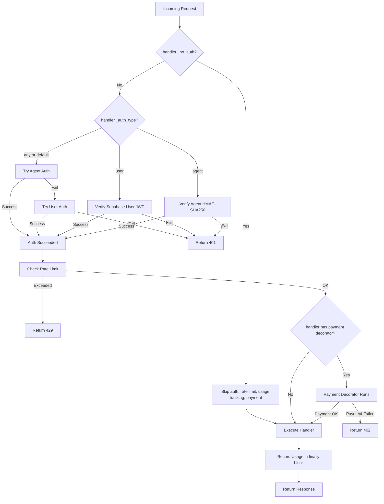

# Auth Refactor Plan: Default-On Authentication with @no_auth Opt-Out

## Overview

Refactor the routing decorator system so that **authentication is strictly enforced by default** on all endpoints via aiohttp middleware. Introduce a `@no_auth` marker decorator that explicitly opts routes out of authentication, rate limiting, usage tracking, and payment validation.

---

## Current Architecture Problems

1. **Auth is opt-in, not opt-out** — Endpoints without `@require_auth` are wide open. The `agents.py` module has **zero auth decorators** on any endpoint (security gap).
2. **Redundant decorator stacking** — Every endpoint must manually stack `@require_auth`, `@check_rate_limit`, `@track_usage`, and optionally `@x402_or_subscription`. Forgetting any decorator silently drops protection.
3. **`check_rate_limit` skips unauthenticated requests** — Line 302-303 of `auth.py` returns `await handler(request)` when no auth is present, making rate limiting trivially bypassable.
4. **`track_usage` records "anonymous" for unauthenticated requests** — Wasteful and misleading.
5. **`billing.py` has a duplicate `require_user_auth`** — Defined locally instead of importing from `auth.py`.
6. **No explicit public endpoint declaration** — Endpoints like `health_check`, `stripe_webhook`, and `agent_register` lack auth not by design but by omission. There is no `@no_auth` to make the intent explicit.

---

## Current Decorator Inventory

| File | Endpoint | Current Decorators |
|------|----------|-------------------|
| `main.py` | `index` | None |
| `main.py` | `static_file` | None |
| `main.py` | `websocket_handler` | None |
| `main.py` | `health_check` | None |
| `auth.py` | `auth_me_handler` | Calls `verify_supabase_user` directly |
| `transcribe.py` | `transcribe_file` | `@require_auth` `@x402_or_subscription` `@check_rate_limit` `@track_usage` |
| `transcribe.py` | `transcribe_url` | `@require_auth` `@x402_or_subscription` `@check_rate_limit` `@track_usage` |
| `transcribe.py` | `transcribe_stream` | `@require_auth` `@x402_or_subscription` `@check_rate_limit` `@track_usage` |
| `transcribe.py` | `whip_proxy` | `@require_auth` `@x402_or_subscription` `@check_rate_limit` `@track_usage` |
| `transcribe.py` | `list_transcriptions` | `@require_auth` `@check_rate_limit` `@track_usage` |
| `transcribe.py` | `get_transcription` | `@require_auth` `@check_rate_limit` `@track_usage` |
| `transcribe.py` | `delete_transcription` | `@require_auth` `@check_rate_limit` `@track_usage` |
| `transcribe.py` | `transcribe_health_check` | `@require_auth` `@check_rate_limit` `@track_usage` |
| `translate.py` | `translate_text` | `@require_auth` `@x402_or_subscription` `@check_rate_limit` `@track_usage` |
| `translate.py` | `translate_transcription` | `@require_auth` `@x402_or_subscription` `@check_rate_limit` `@track_usage` |
| `sessions.py` | `create_session` | `@require_auth` `@check_rate_limit` `@track_usage` |
| `sessions.py` | `get_session` | `@require_auth` `@check_rate_limit` `@track_usage` |
| `sessions.py` | `get_user_transcriptions` | `@require_auth` `@check_rate_limit` `@track_usage` |
| `sessions.py` | `create_transcription_session` | `@require_auth` `@check_rate_limit` `@track_usage` |
| `sessions.py` | `update_transcription_result` | `@require_auth` `@check_rate_limit` `@track_usage` |
| `sessions.py` | `create_stream_session` | `@require_auth` `@x402_or_subscription` `@check_rate_limit` `@track_usage` |
| `sessions.py` | `update_stream_session` | `@require_auth` `@check_rate_limit` `@track_usage` |
| `sessions.py` | `close_stream_session` | `@require_auth` `@check_rate_limit` `@track_usage` |
| `sessions.py` | `stop_stream_session` | `@require_auth` `@check_rate_limit` `@track_usage` |
| `languages.py` | `get_languages` | `@require_auth` `@check_rate_limit` `@track_usage` |
| `billing.py` | `create_checkout_session` | `@require_user_auth` (local) |
| `billing.py` | `get_subscription` | `@require_user_auth` (local) |
| `billing.py` | `cancel_subscription` | `@require_user_auth` (local) |
| `billing.py` | `update_subscription` | `@require_user_auth` (local) |
| `billing.py` | `get_usage` | `@require_user_auth` (local) |
| `billing.py` | `stripe_webhook` | None (verifies Stripe signatures) |
| `agents.py` | `agent_register` | None (intentionally public) |
| `agents.py` | `agent_get_usage` | **None (SECURITY GAP)** |
| `agents.py` | `agent_list_keys` | **None (SECURITY GAP)** |
| `agents.py` | `agent_create_key` | **None (SECURITY GAP)** |
| `agents.py` | `agent_revoke_key` | **None (SECURITY GAP)** |
| `agents.py` | `agent_get_subscription` | **None (SECURITY GAP)** |
| `agents.py` | `agent_create_subscription` | **None (SECURITY GAP)** |
| `agents.py` | `agent_delete_subscription` | **None (SECURITY GAP)** |
| `agents.py` | `agent_reactivate_subscription` | **None (SECURITY GAP)** |

---

## New Architecture

### Core Principle

**Authentication, rate limiting, and usage tracking are enforced by default via middleware.** Endpoints opt out with `@no_auth`. Payment decorators check for the opt-out flag and skip validation accordingly.

### Request Flow Diagram



### Component Design

#### 1. `@no_auth` Marker Decorator

Sets `_no_auth = True` on the handler function. Does **not** wrap the handler.

```python
def no_auth(handler):
    """Mark a route as not requiring authentication.
    When applied, authentication, rate limiting, usage tracking,
    and payment validation are all skipped."""
    handler._no_auth = True
    return handler
```

**Must be the innermost decorator** so that `functools.wraps` in outer decorators propagates the attribute:

```python
@x402_or_subscription(service_type='transcribe_cpu')  # outer - sees _no_auth via functools.wraps
@no_auth  # innermost - sets _no_auth on the raw function
async def handler(request):
    ...
```

#### 2. `@require_user_auth` Marker Decorator

Sets `_auth_type = 'user'` on the handler function. The middleware reads this to enforce user-only auth.

```python
def require_user_auth(handler):
    """Marker: require Supabase user authentication for this endpoint."""
    handler._auth_type = 'user'
    return handler
```

#### 3. `@require_agent_auth` Marker Decorator

Sets `_auth_type = 'agent'` on the handler function. The middleware reads this to enforce agent-only auth.

```python
def require_agent_auth(handler):
    """Marker: require agent HMAC-SHA256 authentication for this endpoint."""
    handler._auth_type = 'agent'
    return handler
```

#### 4. `auth_middleware` — aiohttp Middleware

Registered via `app.middlewares.append(auth_middleware)`. Runs on every request.

```python
@web.middleware
async def auth_middleware(request, handler):
    # 1. Check @no_auth flag
    if getattr(handler, '_no_auth', False):
        return await handler(request)

    # 2. Determine auth type from marker decorator
    auth_type = getattr(handler, '_auth_type', 'any')

    # 3. Perform authentication
    if auth_type == 'user':
        verified, result = verify_supabase_user(request)
    elif auth_type == 'agent':
        verified, result = verify_agent_request(request)
    else:  # 'any' - default
        verified, result = verify_agent_request(request)
        if not verified:
            verified, result = verify_supabase_user(request)

    if not verified:
        return result  # 401 response

    # 4. Rate limiting
    if not _check_rate_limit(request):
        return web.json_response({"error": "Rate limit exceeded"}, status=429)

    # 5. Execute handler (payment decorators run here if present)
    try:
        response = await handler(request)
    except Exception:
        raise

    # 6. Usage tracking
    _record_usage(request, response)

    return response
```

Key behaviors:
- **`@no_auth` routes**: Skip steps 2-6 entirely. No auth, no rate limit, no usage tracking, no payment checks.
- **Default routes**: Try agent auth, then user auth. Apply rate limit. Track usage.
- **`@require_user_auth` routes**: Only accept Supabase JWT. Apply rate limit. Track usage.
- **`@require_agent_auth` routes**: Only accept HMAC-SHA256. Apply rate limit. Track usage.
- **Payment decorators** (`@x402_or_subscription`, etc.) run as part of the handler call in step 5. They check `_no_auth` on the wrapped function and skip if set.

#### 5. Payment Decorator Updates

Add `functools.wraps` to propagate `_no_auth` and `_auth_type`. Check `_no_auth` at the start:

```python
def x402_or_subscription(service_type='transcribe_cpu', subscription_tier='starter'):
    def decorator(handler):
        # If handler is marked @no_auth, skip payment validation entirely
        if getattr(handler, '_no_auth', False):
            return handler

        @functools.wraps(handler)  # Propagates _no_auth, _auth_type, etc.
        async def wrapper(request):
            # ... existing payment logic ...
            return await handler(request)
        return wrapper
    return decorator
```

Same pattern for `payment_required`, `subscription_only`, and `x402_only`.

#### 6. Removed Decorators

| Decorator | Status | Replacement |
|-----------|--------|-------------|
| `@require_auth` | **Removed** | Default middleware behavior |
| `@check_rate_limit` | **Removed** | Middleware step 4 |
| `@track_usage` | **Removed** | Middleware step 6 |
| `billing.py` local `@require_user_auth` | **Removed** | Marker from `auth.py` |

The functions `verify_supabase_user`, `verify_agent_request` remain as utility functions used by the middleware.

---

## Target Endpoint Decorator Mapping

| File | Endpoint | New Decorators | Auth Type |
|------|----------|---------------|-----------|
| `main.py` | `index` | `@no_auth` | None (static files) |
| `main.py` | `static_file` | `@no_auth` | None (static files) |
| `main.py` | `websocket_handler` | `@no_auth` | None (WS auth at message level) |
| `main.py` | `health_check` | `@no_auth` | None (health check) |
| `auth.py` | `auth_me_handler` | `@require_user_auth` | User JWT |
| `transcribe.py` | `transcribe_file` | `@x402_or_subscription(service_type='transcribe_cpu')` | Any (default) |
| `transcribe.py` | `transcribe_url` | `@x402_or_subscription(service_type='transcribe_cpu')` | Any (default) |
| `transcribe.py` | `transcribe_stream` | `@x402_or_subscription(service_type='transcribe_gpu')` | Any (default) |
| `transcribe.py` | `whip_proxy` | `@x402_or_subscription(service_type='transcribe_gpu')` | Any (default) |
| `transcribe.py` | `list_transcriptions` | *(none needed)* | Any (default) |
| `transcribe.py` | `get_transcription` | *(none needed)* | Any (default) |
| `transcribe.py` | `delete_transcription` | *(none needed)* | Any (default) |
| `transcribe.py` | `transcribe_health_check` | `@no_auth` | None (health check) |
| `translate.py` | `translate_text` | `@x402_or_subscription(service_type='translate')` | Any (default) |
| `translate.py` | `translate_transcription` | `@x402_or_subscription(service_type='translate')` | Any (default) |
| `sessions.py` | `create_session` | *(none needed)* | Any (default) |
| `sessions.py` | `get_session` | *(none needed)* | Any (default) |
| `sessions.py` | `get_user_transcriptions` | *(none needed)* | Any (default) |
| `sessions.py` | `create_transcription_session` | *(none needed)* | Any (default) |
| `sessions.py` | `update_transcription_result` | *(none needed)* | Any (default) |
| `sessions.py` | `create_stream_session` | `@x402_or_subscription(service_type='transcribe_gpu')` | Any (default) |
| `sessions.py` | `update_stream_session` | *(none needed)* | Any (default) |
| `sessions.py` | `close_stream_session` | *(none needed)* | Any (default) |
| `sessions.py` | `stop_stream_session` | *(none needed)* | Any (default) |
| `languages.py` | `get_languages` | `@no_auth` | None (public reference data) |
| `billing.py` | `create_checkout_session` | `@require_user_auth` | User JWT |
| `billing.py` | `get_subscription` | `@require_user_auth` | User JWT |
| `billing.py` | `cancel_subscription` | `@require_user_auth` | User JWT |
| `billing.py` | `update_subscription` | `@require_user_auth` | User JWT |
| `billing.py` | `get_usage` | `@require_user_auth` | User JWT |
| `billing.py` | `stripe_webhook` | `@no_auth` | None (Stripe signature verification) |
| `agents.py` | `agent_register` | `@no_auth` | None (public registration) |
| `agents.py` | `agent_get_usage` | `@require_agent_auth` | Agent HMAC |
| `agents.py` | `agent_list_keys` | `@require_agent_auth` | Agent HMAC |
| `agents.py` | `agent_create_key` | `@require_agent_auth` | Agent HMAC |
| `agents.py` | `agent_revoke_key` | `@require_agent_auth` | Agent HMAC |
| `agents.py` | `agent_get_subscription` | `@require_agent_auth` | Agent HMAC |
| `agents.py` | `agent_create_subscription` | `@require_agent_auth` | Agent HMAC |
| `agents.py` | `agent_delete_subscription` | `@require_agent_auth` | Agent HMAC |
| `agents.py` | `agent_reactivate_subscription` | `@require_agent_auth` | Agent HMAC |

---

## Implementation Steps

### Step 1: Create new marker decorators and middleware in `backend/auth.py`

- Add `no_auth(handler)` marker — sets `handler._no_auth = True`, returns handler unchanged
- Add `require_user_auth(handler)` marker — sets `handler._auth_type = 'user'`, returns handler unchanged
- Add `require_agent_auth(handler)` marker — sets `handler._auth_type = 'agent'`, returns handler unchanged
- Add `auth_middleware(request, handler)` — aiohttp `@web.middleware` that implements the flow above
- Move rate limiting logic from `check_rate_limit` into a helper `_check_rate_limit(request) -> bool`
- Move usage tracking logic from `track_usage` into a helper `_record_usage(request, response) -> None`
- Keep `verify_supabase_user` and `verify_agent_request` as utility functions
- Remove old `require_auth` decorator (the combined agent-or-user wrapper)
- Remove old `check_rate_limit` decorator
- Remove old `track_usage` decorator
- Keep old `require_user_auth` and `require_agent_auth` function names but change them to markers

### Step 2: Update payment decorators in `backend/payments/payment_strategy.py`

- Add `import functools` 
- Add `functools.wraps(handler)` to all decorator wrappers
- Add early-return check: if `getattr(handler, '_no_auth', False)`, return handler unchanged
- Apply same changes to `x402_or_subscription`, `payment_required`, `subscription_only`, `x402_only`

### Step 3: Register middleware in `backend/main.py`

- Import `auth_middleware` from `auth`
- Add `app.middlewares.append(auth_middleware)` in `init_app()` before route registration

### Step 4: Update `backend/main.py` endpoints

- Add `@no_auth` to `index`, `static_file`, `websocket_handler`, `health_check`
- Import `no_auth` from `auth`

### Step 5: Update `backend/auth.py` `auth_me_handler`

- Add `@require_user_auth` marker
- Remove manual `verify_supabase_user` call — rely on middleware to set `request['user']`
- Keep a safety check: `user = request.get('user'); if not user: return 401`

### Step 6: Update `backend/billing.py`

- Remove local `require_user_auth` decorator definition
- Import `require_user_auth` from `auth`
- Replace `@require_user_auth` (old wrapper) with `@require_user_auth` (new marker) on all billing endpoints
- Add `@no_auth` to `stripe_webhook`
- Remove manual `if not user: return 401` checks in handlers (middleware guarantees auth)

### Step 7: Update `backend/agents.py`

- Import `no_auth`, `require_agent_auth` from `auth`
- Add `@no_auth` to `agent_register`
- Add `@require_agent_auth` to all other agent endpoints

### Step 8: Update `backend/transcribe.py`

- Remove all `@require_auth`, `@check_rate_limit`, `@track_usage` decorators
- Keep `@x402_or_subscription` decorators where present
- Add `@no_auth` to `transcribe_health_check`
- Remove `from auth import require_auth, check_rate_limit, track_usage` — update imports

### Step 9: Update `backend/translate.py`

- Remove all `@require_auth`, `@check_rate_limit`, `@track_usage` decorators
- Keep `@x402_or_subscription` decorators
- Update imports

### Step 10: Update `backend/sessions.py`

- Remove all `@require_auth`, `@check_rate_limit`, `@track_usage` decorators
- Keep `@x402_or_subscription` on `create_stream_session`
- Update imports

### Step 11: Update `backend/languages.py`

- Remove `@require_auth`, `@check_rate_limit`, `@track_usage`
- Add `@no_auth` (languages are public reference data)
- Update imports

### Step 12: Update tests in `backend/tests/test_auth.py`

- Add tests for `auth_middleware` behavior:
  - Default enforcement: unauthenticated request → 401
  - `@no_auth`: unauthenticated request → passes through
  - `@require_user_auth`: agent token → 401, user token → 200
  - `@require_agent_auth`: user token → 401, agent token → 200
  - Rate limiting applied for authenticated routes
  - Rate limiting skipped for `@no_auth` routes
  - Usage tracking recorded for authenticated routes
  - Usage tracking skipped for `@no_auth` routes
- Update existing decorator tests to test marker behavior
- Add tests for payment decorator `_no_auth` bypass

### Step 13: Add integration tests

- Test that `@no_auth` + `@x402_or_subscription` skips payment validation
- Test that `@require_agent_auth` endpoints reject user JWTs
- Test that `@require_user_auth` endpoints reject agent HMAC
- Test middleware + payment decorator interaction

---

## Key Design Decisions

1. **Marker decorators, not wrappers** — `@no_auth`, `@require_user_auth`, `@require_agent_auth` set attributes on the handler function rather than wrapping it. This keeps the decorator stack flat and avoids nested wrapper issues.

2. **`functools.wraps` propagation** — Payment decorators use `functools.wraps` which copies `__dict__`, ensuring `_no_auth` and `_auth_type` attributes propagate through the decorator chain.

3. **`@no_auth` as innermost decorator** — Must be placed closest to the function definition so that outer decorators (like `@x402_or_subscription`) can see the `_no_auth` attribute on the handler they receive and skip payment logic.

4. **Middleware handles auth, rate limiting, and usage tracking** — These three concerns are always applied together. Moving them into middleware eliminates the risk of forgetting one.

5. **Payment decorators remain as decorators** — They are service-type-specific and only apply to certain endpoints. They check `_no_auth` and skip if set.

6. **Agent endpoints now require agent auth** — This fixes the existing security gap where `agents.py` endpoints had no authentication.

7. **`transcribe_health_check` and `get_languages` become public** — Health checks and language lists are reference data that should be accessible without auth. Marked with `@no_auth`.

8. **WebSocket handler is `@no_auth`** — WebSocket auth is handled at the message level inside `websocket_handler`, not at the connection level.

---

## Files Modified

| File | Changes |
|------|---------|
| `backend/auth.py` | Add `no_auth`, rewrite `require_user_auth`/`require_agent_auth` as markers, add `auth_middleware`, add `_check_rate_limit`/`_record_usage` helpers, remove old `require_auth`/`check_rate_limit`/`track_usage` decorators |
| `backend/main.py` | Register `auth_middleware`, add `@no_auth` to static/health/ws endpoints |
| `backend/billing.py` | Remove local `require_user_auth`, import from `auth`, add `@no_auth` to `stripe_webhook`, remove redundant auth checks |
| `backend/agents.py` | Add `@no_auth` to `agent_register`, add `@require_agent_auth` to all other endpoints |
| `backend/transcribe.py` | Remove `@require_auth`/`@check_rate_limit`/`@track_usage`, add `@no_auth` to health check, update imports |
| `backend/translate.py` | Remove `@require_auth`/`@check_rate_limit`/`@track_usage`, update imports |
| `backend/sessions.py` | Remove `@require_auth`/`@check_rate_limit`/`@track_usage`, update imports |
| `backend/languages.py` | Replace decorators with `@no_auth`, update imports |
| `backend/payments/payment_strategy.py` | Add `functools.wraps`, add `_no_auth` early-return check |
| `backend/tests/test_auth.py` | Update decorator tests, add middleware tests, add `@no_auth` tests |