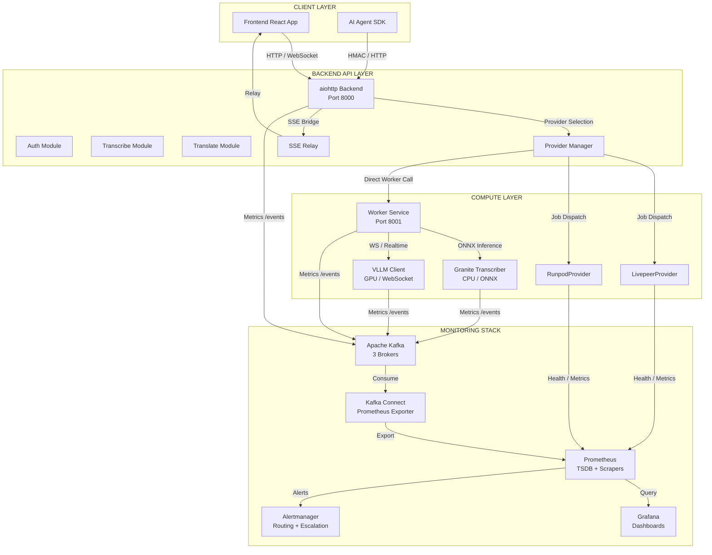
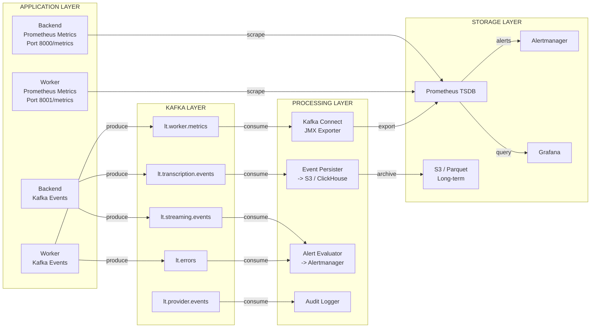

# Comprehensive Monitoring Architecture Plan
## Live Transcription & Translation Platform

**Version:** 1.0.0  
**Date:** 2026-04-22  
**Scope:** Prometheus metrics, Kafka event streams, worker instrumentation, SLOs, alerting, dashboards  

---

## 1. Executive Summary

This plan establishes a unified observability layer across the Live Transcription & Translation Platform using **Prometheus** for time-series metrics and **Apache Kafka** for discrete event streaming. The architecture ensures every critical path — from API request ingestion through compute provider job execution to WebRTC stream delivery — is instrumented with appropriate metric types, structured events, and contextual trace propagation.

### Key Deliverables
- Separate `docker-compose.monitoring.yml` provisioning Kafka, Prometheus, Grafana, Kafka Connect, and Alertmanager
- Prometheus metric instrumentation across `backend/`, `worker/`, and `compute_providers/`
- Kafka topic topology with partitioning strategy for scalable event ingestion
- Unified event schema correlating time-series metrics with discrete event payloads
- `send_monitoring_event` async function in the worker with retry semantics and context propagation
- Service-Level Objectives (SLOs) with defined Service-Level Indicators (SLIs)
- Alert routing rules with severity-based escalation
- Dashboard design principles and recommended Grafana panels

---

## 2. System Architecture Overview



---

## 3. Critical Path Analysis

### 3.1 Identified Critical Paths

| # | Critical Path | Components | Failure Impact |
|---|---------------|------------|----------------|
| 1 | **File Upload Transcription** | Frontend → Backend `/transcribe/file` → Provider Manager → Livepeer/Runpod/Worker → Granite | User cannot transcribe uploaded audio |
| 2 | **URL Transcription** | Frontend → Backend `/transcribe/url` → Provider Manager → Provider → Result | Batch jobs fail silently |
| 3 | **Streaming Transcription** | Frontend → Backend `/transcribe/stream` → WHIP Proxy → Provider → SSE Relay → WebSocket → Frontend | Real-time feature completely broken |
| 4 | **Translation** | Frontend → Backend `/translate/text` → Provider Manager → Worker/Provider | Post-transcription workflow fails |
| 5 | **Agent API Authentication** | Agent → HMAC-SHA256 → Backend → Quota Check → Job Execution | Revenue-critical API access blocked |
| 6 | **Payment Processing** | Frontend → Backend `/billing/*` → Stripe/x402 → Quota Update | Billing failures, revenue loss |
| 7 | **WebRTC/WHIP Connection** | Frontend → Backend WHIP Proxy → Provider WHIP → VLLM | Streaming cannot establish media path |
| 8 | **VLLM Real-time Inference** | WebRTC → VLLM WebSocket → Voxtral Model → SSE Output | GPU inference pipeline failure |
| 9 | **Provider Health & Selection** | Provider Manager → Health Checks → Scoring → Selection | All compute jobs fail if no healthy provider |
| 10 | **Session Management** | Backend → SessionStore → Supabase DB → Write-through Cache | Stream state corruption |

### 3.2 Monitoring Coverage Matrix

| Path | Prometheus Metrics | Kafka Events | SLO Target |
|------|-------------------|--------------|------------|
| File Upload | Counter, Histogram | `job_submitted`, `job_completed`, `job_failed` | 99.5% success, <5s p99 |
| URL Transcription | Counter, Histogram | `job_submitted`, `job_completed` | 99.0% success, <30s p99 |
| Streaming | Gauge, Counter, Histogram | `stream_started`, `stream_ended`, `stream_error` | 99.9% stream uptime |
| Translation | Counter, Histogram | `translation_request`, `translation_completed` | 99.5% success, <2s p99 |
| Agent Auth | Counter, Histogram | `auth_attempt`, `auth_failure` | 99.99% auth availability |
| Payments | Counter, Gauge | `payment_processed`, `payment_failed` | 99.9% success |
| WHIP/WebRTC | Gauge, Counter | `whip_negotiation`, `ice_connected` | 95% connection success |
| VLLM Inference | Gauge, Histogram, Counter | `inference_request`, `inference_latency` | 99.5% success, <500ms p99 |
| Provider Health | Gauge, Counter | `provider_health_check`, `provider_failover` | 100% provider availability |
| Sessions | Gauge, Counter | `session_created`, `session_expired` | 99.99% session consistency |

---

## 4. Prometheus Metric Instrumentation Strategy

### 4.1 Metric Naming Convention

All metrics follow the pattern: `{namespace}_{subsystem}_{metric_name}_{unit/suffix}`

- **Namespace:** `live_translation`
- **Subsystems:** `backend`, `worker`, `provider`, `webrtc`, `billing`, `auth`
- **Suffixes:** `_total` (counters), `_seconds` (histograms), `_bytes` (gauges), `_count` (gauges)

### 4.2 Backend Metrics (`backend/`)

```python
# backend/metrics.py
from prometheus_client import Counter, Histogram, Gauge, Info, CollectorRegistry

# Request metrics
http_requests_total = Counter(
    'live_translation_backend_http_requests_total',
    'Total HTTP requests by method, endpoint, status',
    ['method', 'endpoint', 'status_code', 'auth_type']
)

http_request_duration_seconds = Histogram(
    'live_translation_backend_http_request_duration_seconds',
    'HTTP request latency by endpoint',
    ['method', 'endpoint'],
    buckets=[0.005, 0.01, 0.025, 0.05, 0.1, 0.25, 0.5, 1.0, 2.5, 5.0, 10.0, 30.0]
)

# Active connections
active_websocket_connections = Gauge(
    'live_translation_backend_active_websocket_connections',
    'Number of active WebSocket frontend connections'
)

active_sse_relays = Gauge(
    'live_translation_backend_active_sse_relays',
    'Number of active SSE relay instances'
)

# Transcription job metrics
transcription_jobs_total = Counter(
    'live_translation_backend_transcription_jobs_total',
    'Total transcription jobs by source type and status',
    ['source_type', 'status', 'provider']
)

transcription_job_duration_seconds = Histogram(
    'live_translation_backend_transcription_job_duration_seconds',
    'Transcription job duration by source type and provider',
    ['source_type', 'provider'],
    buckets=[0.1, 0.5, 1.0, 2.5, 5.0, 10.0, 30.0, 60.0, 120.0, 300.0]
)

# Provider metrics
provider_health_status = Gauge(
    'live_translation_provider_health_status',
    'Provider health status (1=healthy, 0=unhealthy)',
    ['provider_name']
)

provider_selection_total = Counter(
    'live_translation_provider_selection_total',
    'Total provider selections by job type and provider',
    ['job_type', 'provider_name', 'selection_reason']
)

provider_failover_total = Counter(
    'live_translation_provider_failover_total',
    'Total provider failovers by from_provider and to_provider',
    ['from_provider', 'to_provider', 'reason']
)

# Auth metrics
auth_attempts_total = Counter(
    'live_translation_backend_auth_attempts_total',
    'Total authentication attempts by type and result',
    ['auth_type', 'result']
)

auth_duration_seconds = Histogram(
    'live_translation_backend_auth_duration_seconds',
    'Authentication check duration',
    ['auth_type']
)

# Billing metrics
payment_requests_total = Counter(
    'live_translation_backend_payment_requests_total',
    'Total payment requests by processor and status',
    ['processor', 'status', 'service_type']
)

quota_checks_total = Counter(
    'live_translation_backend_quota_checks_total',
    'Total quota checks by result',
    ['result']
)

# Session metrics
sessions_active = Gauge(
    'live_translation_backend_sessions_active',
    'Number of active stream sessions',
    ['status']
)

session_operations_total = Counter(
    'live_translation_backend_session_operations_total',
    'Total session operations by type and result',
    ['operation', 'result']
)

# SSE Relay metrics
sse_relay_events_total = Counter(
    'live_translation_backend_sse_relay_events_total',
    'Total SSE events relayed by type',
    ['event_type', 'stream_id']
)

sse_relay_reconnects_total = Counter(
    'live_translation_backend_sse_relay_reconnects_total',
    'Total SSE relay reconnections by stream',
    ['stream_id', 'reason']
)

# Application info
app_info = Info(
    'live_translation_backend_app_info',
    'Application version and build information'
)
```

### 4.3 Worker Metrics (`worker/`)

```python
# worker/metrics.py
from prometheus_client import Counter, Histogram, Gauge, Info

# Model inference metrics
inference_requests_total = Counter(
    'live_translation_worker_inference_requests_total',
    'Total inference requests by model and status',
    ['model', 'hardware', 'status', 'language']
)

inference_duration_seconds = Histogram(
    'live_translation_worker_inference_duration_seconds',
    'Inference duration by model and hardware',
    ['model', 'hardware', 'task_type'],
    buckets=[0.01, 0.05, 0.1, 0.25, 0.5, 1.0, 2.5, 5.0, 10.0, 30.0, 60.0]
)

inference_real_time_factor = Histogram(
    'live_translation_worker_inference_real_time_factor',
    'Real-time factor for audio processing',
    ['model', 'hardware'],
    buckets=[0.1, 0.25, 0.5, 0.75, 1.0, 1.5, 2.0, 5.0, 10.0]
)

# Audio processing metrics
audio_chunks_processed_total = Counter(
    'live_translation_worker_audio_chunks_processed_total',
    'Total audio chunks processed by source',
    ['source_type', 'codec']
)

audio_duration_processed_seconds = Counter(
    'live_translation_worker_audio_duration_processed_seconds_total',
    'Total audio duration processed in seconds',
    ['model', 'language']
)

# VLLM-specific metrics
vllm_connection_status = Gauge(
    'live_translation_worker_vllm_connection_status',
    'VLLM WebSocket connection status (1=connected, 0=disconnected)'
)

vllm_audio_frames_total = Counter(
    'live_translation_worker_vllm_audio_frames_total',
    'Total audio frames sent to VLLM'
)

vllm_latency_seconds = Histogram(
    'live_translation_worker_vllm_latency_seconds',
    'VLLM response latency from commit to transcription',
    buckets=[0.05, 0.1, 0.25, 0.5, 1.0, 2.5, 5.0]
)

# Resource metrics
model_memory_bytes = Gauge(
    'live_translation_worker_model_memory_bytes',
    'Current model memory usage in bytes',
    ['model']
)

active_transcription_sessions = Gauge(
    'live_translation_worker_active_transcription_sessions',
    'Number of active transcription sessions'
)

# Translation metrics
translation_requests_total = Counter(
    'live_translation_worker_translation_requests_total',
    'Total translation requests by language pair and status',
    ['source_lang', 'target_lang', 'status']
)

translation_duration_seconds = Histogram(
    'live_translation_worker_translation_duration_seconds',
    'Translation request duration',
    ['source_lang', 'target_lang'],
    buckets=[0.01, 0.05, 0.1, 0.25, 0.5, 1.0, 2.5, 5.0]
)

# Worker health
worker_health_status = Gauge(
    'live_translation_worker_health_status',
    'Worker health status (1=healthy, 0=unhealthy)',
    ['component']
)

app_info = Info(
    'live_translation_worker_app_info',
    'Worker application version and build information'
)
```

### 4.4 Compute Provider Metrics

```python
# backend/compute_providers/metrics.py
from prometheus_client import Counter, Histogram, Gauge

# Provider job metrics
provider_jobs_total = Counter(
    'live_translation_provider_jobs_total',
    'Total jobs by provider, type, and status',
    ['provider_name', 'job_type', 'status']
)

provider_job_duration_seconds = Histogram(
    'live_translation_provider_job_duration_seconds',
    'Job duration by provider and type',
    ['provider_name', 'job_type'],
    buckets=[0.1, 0.5, 1.0, 2.5, 5.0, 10.0, 30.0, 60.0, 120.0, 300.0]
)

provider_http_requests_total = Counter(
    'live_translation_provider_http_requests_total',
    'Total HTTP requests to provider by endpoint and status',
    ['provider_name', 'endpoint', 'status_code']
)

provider_http_duration_seconds = Histogram(
    'live_translation_provider_http_duration_seconds',
    'HTTP request duration to provider',
    ['provider_name', 'endpoint'],
    buckets=[0.01, 0.05, 0.1, 0.25, 0.5, 1.0, 2.5, 5.0, 10.0]
)

# WHIP/WebRTC metrics
whip_negotiations_total = Counter(
    'live_translation_provider_whip_negotiations_total',
    'Total WHIP negotiations by provider and result',
    ['provider_name', 'result']
)

webrtc_ice_connections = Gauge(
    'live_translation_provider_webrtc_ice_connections',
    'Active WebRTC ICE connections by provider',
    ['provider_name', 'ice_state']
)
```

### 4.5 Metric Endpoint Exposure

Each service exposes metrics via an HTTP endpoint:

| Service | Endpoint | Port | Path |
|---------|----------|------|------|
| Backend | `/metrics` | 8000 | `http://backend:8000/metrics` |
| Worker | `/metrics` | 8001 | `http://worker:8001/metrics` |

Prometheus scrapes these endpoints every 15 seconds.

---

## 5. Kafka Topic Topology & Partitioning Strategy

### 5.1 Topic Design Principles

1. **Domain-oriented topics:** Each major domain gets its own topic
2. **Event-type suffixing:** Use `.events` for discrete events, `.metrics` for metric streams
3. **Partition by entity ID:** Ensure ordered processing per stream/session
4. **Retention:** 7 days for events, 1 day for high-frequency metrics

### 5.2 Topic Catalog

| Topic Name | Partitions | Replication | Retention | Key Strategy | Description |
|------------|-----------|-------------|-----------|--------------|-------------|
| `lt.transcription.events` | 12 | 3 | 7 days | `stream_id` / `job_id` | Transcription lifecycle events |
| `lt.translation.events` | 6 | 3 | 7 days | `job_id` | Translation request/completion |
| `lt.streaming.events` | 12 | 3 | 7 days | `stream_id` | WebRTC/SSE stream events |
| `lt.provider.events` | 6 | 3 | 7 days | `provider_name` | Provider health, failover |
| `lt.auth.events` | 6 | 3 | 30 days | `user_id` / `api_key_id` | Authentication attempts |
| `lt.billing.events` | 6 | 3 | 90 days | `user_id` | Payment, quota, subscription |
| `lt.worker.metrics` | 6 | 3 | 1 day | `worker_id` | High-frequency worker metrics |
| `lt.backend.metrics` | 6 | 3 | 1 day | `instance_id` | High-frequency backend metrics |
| `lt.errors` | 12 | 3 | 14 days | `service_name` | Structured error events |
| `lt.audit` | 6 | 3 | 90 days | `user_id` | Security audit trail |

### 5.3 Partitioning Strategy

```python
# Kafka producer configuration
KAFKA_PRODUCER_CONFIG = {
    'bootstrap.servers': 'kafka-1:9092,kafka-2:9092,kafka-3:9092',
    'client.id': 'live-translation-worker',
    'compression.type': 'lz4',
    'batch.size': 16384,
    'linger.ms': 10,
    'retries': 5,
    'retry.backoff.ms': 1000,
    'max.in.flight.requests.per.connection': 5,
    'enable.idempotence': True,
    'acks': 'all',
}

# Partition key selection logic
def get_partition_key(event_type: str, event_data: dict) -> str:
    """Determine Kafka partition key for event ordering guarantees."""
    key_mapping = {
        'transcription': event_data.get('stream_id') or event_data.get('job_id', 'default'),
        'translation': event_data.get('job_id', 'default'),
        'streaming': event_data.get('stream_id', 'default'),
        'provider': event_data.get('provider_name', 'default'),
        'auth': event_data.get('user_id') or event_data.get('api_key_id', 'default'),
        'billing': event_data.get('user_id', 'default'),
        'error': event_data.get('service_name', 'default'),
        'audit': event_data.get('user_id', 'default'),
    }
    return key_mapping.get(event_type, 'default')
```

### 5.4 Consumer Groups

| Consumer Group | Topics | Purpose | Instances |
|----------------|--------|---------|-----------|
| `metrics-exporter` | `lt.*.metrics` | Export to Prometheus via Kafka Connect | 2 |
| `event-persister` | `lt.*.events` | Persist to long-term storage (S3/ClickHouse) | 3 |
| `alert-evaluator` | `lt.errors`, `lt.provider.events` | Real-time alert triggering | 2 |
| `audit-logger` | `lt.audit` | Security audit trail processing | 2 |
| `billing-aggregator` | `lt.billing.events` | Usage aggregation and invoicing | 2 |

---

## 6. Unified Monitoring Event Schema

### 6.1 Base Event Schema (All Events)

```json
{
  "$schema": "http://json-schema.org/draft-07/schema#",
  "title": "LiveTranslationBaseEvent",
  "type": "object",
  "required": ["event_id", "event_type", "event_version", "timestamp", "service", "environment"],
  "properties": {
    "event_id": { "type": "string", "format": "uuid", "description": "Unique event identifier" },
    "event_type": { "type": "string", "description": "Event type discriminator" },
    "event_version": { "type": "string", "pattern": "^\\d+\\.\\d+\\.\\d+$", "description": "Schema version" },
    "timestamp": { "type": "string", "format": "date-time", "description": "ISO 8601 UTC timestamp" },
    "service": { "type": "string", "enum": ["backend", "worker", "provider", "frontend"], "description": "Emitting service" },
    "service_version": { "type": "string", "description": "Service version (git sha or semver)" },
    "environment": { "type": "string", "enum": ["development", "staging", "production"], "description": "Deployment environment" },
    "host": { "type": "string", "description": "Hostname or container ID" },
    "trace_id": { "type": "string", "description": "Distributed trace ID (OpenTelemetry compatible)" },
    "span_id": { "type": "string", "description": "Span ID within the trace" },
    "parent_span_id": { "type": "string", "description": "Parent span ID for nested operations" },
    "correlation_id": { "type": "string", "description": "User-facing request correlation ID" },
    "payload": { "type": "object", "description": "Event-specific payload" },
    "metadata": {
      "type": "object",
      "properties": {
        "source_ip": { "type": "string" },
        "user_agent": { "type": "string" },
        "region": { "type": "string" },
        "datacenter": { "type": "string" }
      }
    }
  }
}
```

### 6.2 Event Type-Specific Payloads

#### Transcription Event (`transcription_started`, `transcription_completed`, `transcription_failed`)

```json
{
  "payload": {
    "job_id": "uuid",
    "stream_id": "uuid | null",
    "user_id": "string | null",
    "api_key_id": "string | null",
    "source_type": "file | url | stream | whip",
    "language": "en",
    "provider_name": "livepeer | runpod | worker",
    "model": "granite-4.0-1b | voxtral-mini-4b",
    "hardware": "cpu | gpu",
    "audio_duration_seconds": 120.5,
    "processing_time_seconds": 45.2,
    "real_time_factor": 0.375,
    "word_count": 342,
    "segment_count": 12,
    "error_code": "string | null",
    "error_message": "string | null",
    "retry_count": 0,
    "quota_consumed": { "cpu_seconds": 45.2, "gpu_seconds": 0 }
  }
}
```

#### Streaming Event (`stream_started`, `stream_ended`, `stream_error`, `stream_reconnected`)

```json
{
  "payload": {
    "stream_id": "uuid",
    "session_id": "uuid",
    "user_id": "string",
    "provider_name": "livepeer | runpod",
    "whip_url": "string",
    "data_url": "string",
    "duration_seconds": 3600.0,
    "events_relayed": 15420,
    "reconnect_count": 2,
    "error_code": "string | null",
    "client_count": 1,
    "ice_state": "connected | failed | disconnected"
  }
}
```

#### Provider Event (`provider_health_changed`, `provider_selected`, `provider_failover`)

```json
{
  "payload": {
    "provider_name": "livepeer | runpod",
    "previous_status": "healthy | degraded | unhealthy",
    "current_status": "healthy | degraded | unhealthy",
    "health_score": 85.5,
    "latency_ms": 245,
    "job_type": "transcribe_batch | transcribe_stream | translate",
    "selection_reason": "health | capability | fallback",
    "from_provider": "string | null",
    "to_provider": "string | null",
    "failover_reason": "health_check_failed | timeout | error_rate"
  }
}
```

#### Error Event (`error_occurred`)

```json
{
  "payload": {
    "error_id": "uuid",
    "severity": "warning | error | critical",
    "service": "backend | worker | provider",
    "component": "transcribe | translate | auth | billing | sse_relay | vllm",
    "error_type": "timeout | connection_error | inference_error | quota_exceeded | auth_failure",
    "error_code": "ERR_TRANSCRIBE_TIMEOUT",
    "error_message": "Transcription job exceeded 300s timeout",
    "stack_trace": "string | null",
    "context": {
      "job_id": "uuid",
      "stream_id": "uuid",
      "user_id": "string",
      "request_path": "/api/v1/transcribe/file"
    }
  }
}
```

### 6.3 Metric-Event Correlation

Every Prometheus metric sample can be correlated with Kafka events via shared labels:

| Prometheus Label | Kafka Event Field | Purpose |
|------------------|-------------------|---------|
| `job_id` | `payload.job_id` | Link histogram bucket to completion event |
| `stream_id` | `payload.stream_id` | Link gauge to stream lifecycle |
| `provider_name` | `payload.provider_name` | Link provider metrics to selection events |
| `user_id` | `payload.user_id` | Link usage metrics to billing events |
| `trace_id` | `trace_id` | Full distributed trace correlation |

---

## 7. Worker `send_monitoring_event` Specification

### 7.1 Function Signature

```python
# worker/monitoring.py
import asyncio
import json
import logging
import time
import uuid
from typing import Optional, Dict, Any, Callable
from dataclasses import dataclass, asdict
from enum import Enum

from confluent_kafka import KafkaException, Producer
from prometheus_client import Counter, Histogram, Gauge

logger = logging.getLogger(__name__)

# Prometheus metrics for the monitoring system itself
monitoring_events_total = Counter(
    'live_translation_worker_monitoring_events_total',
    'Total monitoring events emitted by type and status',
    ['event_type', 'status']
)

monitoring_event_duration_seconds = Histogram(
    'live_translation_worker_monitoring_event_duration_seconds',
    'Time spent emitting monitoring events',
    ['event_type'],
    buckets=[0.001, 0.005, 0.01, 0.025, 0.05, 0.1, 0.25, 0.5]
)

monitoring_kafka_errors_total = Counter(
    'live_translation_worker_monitoring_kafka_errors_total',
    'Total Kafka errors by error type',
    ['error_type', 'topic']
)

monitoring_buffer_size = Gauge(
    'live_translation_worker_monitoring_buffer_size',
    'Current number of events in retry buffer'
)


class EventType(str, Enum):
    TRANSCRIPTION_STARTED = "transcription_started"
    TRANSCRIPTION_COMPLETED = "transcription_completed"
    TRANSCRIPTION_FAILED = "transcription_failed"
    TRANSCRIPTION_PROGRESS = "transcription_progress"
    STREAM_STARTED = "stream_started"
    STREAM_ENDED = "stream_ended"
    STREAM_ERROR = "stream_error"
    STREAM_RECONNECTED = "stream_reconnected"
    TRANSLATION_STARTED = "translation_started"
    TRANSLATION_COMPLETED = "translation_completed"
    TRANSLATION_FAILED = "translation_failed"
    INFERENCE_STARTED = "inference_started"
    INFERENCE_COMPLETED = "inference_completed"
    INFERENCE_FAILED = "inference_failed"
    PROVIDER_HEALTH = "provider_health"
    ERROR_OCCURRED = "error_occurred"
    RESOURCE_USAGE = "resource_usage"


class MonitoringContext:
    """Context manager for propagating trace and correlation IDs across async boundaries."""
    
    def __init__(
        self,
        trace_id: Optional[str] = None,
        span_id: Optional[str] = None,
        parent_span_id: Optional[str] = None,
        correlation_id: Optional[str] = None,
        user_id: Optional[str] = None,
        api_key_id: Optional[str] = None,
        stream_id: Optional[str] = None,
        job_id: Optional[str] = None
    ):
        self.trace_id = trace_id or str(uuid.uuid4())
        self.span_id = span_id or str(uuid.uuid4())
        self.parent_span_id = parent_span_id
        self.correlation_id = correlation_id or self.trace_id[:8]
        self.user_id = user_id
        self.api_key_id = api_key_id
        self.stream_id = stream_id
        self.job_id = job_id
        self._previous_context = None
    
    def to_dict(self) -> Dict[str, Any]:
        return {
            k: v for k, v in {
                'trace_id': self.trace_id,
                'span_id': self.span_id,
                'parent_span_id': self.parent_span_id,
                'correlation_id': self.correlation_id,
                'user_id': self.user_id,
                'api_key_id': self.api_key_id,
                'stream_id': self.stream_id,
                'job_id': self.job_id,
            }.items() if v is not None
        }
    
    def child(self, **overrides) -> 'MonitoringContext':
        """Create a child context with a new span_id, preserving trace_id."""
        return MonitoringContext(
            trace_id=self.trace_id,
            parent_span_id=self.span_id,
            correlation_id=self.correlation_id,
            **{k: v for k, v in {
                'user_id': self.user_id,
                'api_key_id': self.api_key_id,
                'stream_id': self.stream_id,
                'job_id': self.job_id,
            }.items() if v is not None},
            **overrides
        )


# Async-local context storage
_context_var: asyncio.local = asyncio.local()


def get_current_context() -> Optional[MonitoringContext]:
    """Get the current monitoring context from async-local storage."""
    return getattr(_context_var, 'context', None)


def set_current_context(ctx: MonitoringContext) -> None:
    """Set the current monitoring context in async-local storage."""
    _context_var.context = ctx


class MonitoringEventProducer:
    """
    Async Kafka producer for monitoring events with retry semantics,
    circuit breaker pattern, and graceful degradation.
    """
    
    def __init__(
        self,
        bootstrap_servers: str = 'kafka-1:9092,kafka-2:9092,kafka-3:9092',
        client_id: str = 'live-translation-worker',
        max_retries: int = 5,
        base_retry_delay: float = 1.0,
        max_retry_delay: float = 60.0,
        circuit_breaker_threshold: int = 10,
        circuit_breaker_timeout: float = 30.0,
        buffer_max_size: int = 10000,
        enable_async: bool = True
    ):
        self.bootstrap_servers = bootstrap_servers
        self.client_id = client_id
        self.max_retries = max_retries
        self.base_retry_delay = base_retry_delay
        self.max_retry_delay = max_retry_delay
        self.circuit_breaker_threshold = circuit_breaker_threshold
        self.circuit_breaker_timeout = circuit_breaker_timeout
        self.buffer_max_size = buffer_max_size
        self.enable_async = enable_async
        
        # Kafka producer (lazy initialization)
        self._producer: Optional[Producer] = None
        self._producer_lock = asyncio.Lock()
        
        # Retry buffer for failed events
        self._retry_buffer: asyncio.Queue = asyncio.Queue(maxsize=buffer_max_size)
        self._retry_task: Optional[asyncio.Task] = None
        
        # Circuit breaker state
        self._failure_count = 0
        self._circuit_open = False
        self._circuit_opened_at: Optional[float] = None
        self._circuit_lock = asyncio.Lock()
        
        # Graceful shutdown flag
        self._shutdown = False
        
        # Topic mapping
        self._topic_map = {
            EventType.TRANSCRIPTION_STARTED: 'lt.transcription.events',
            EventType.TRANSCRIPTION_COMPLETED: 'lt.transcription.events',
            EventType.TRANSCRIPTION_FAILED: 'lt.transcription.events',
            EventType.TRANSCRIPTION_PROGRESS: 'lt.transcription.events',
            EventType.STREAM_STARTED: 'lt.streaming.events',
            EventType.STREAM_ENDED: 'lt.streaming.events',
            EventType.STREAM_ERROR: 'lt.streaming.events',
            EventType.STREAM_RECONNECTED: 'lt.streaming.events',
            EventType.TRANSLATION_STARTED: 'lt.translation.events',
            EventType.TRANSLATION_COMPLETED: 'lt.translation.events',
            EventType.TRANSLATION_FAILED: 'lt.translation.events',
            EventType.INFERENCE_STARTED: 'lt.worker.metrics',
            EventType.INFERENCE_COMPLETED: 'lt.worker.metrics',
            EventType.INFERENCE_FAILED: 'lt.worker.metrics',
            EventType.PROVIDER_HEALTH: 'lt.provider.events',
            EventType.ERROR_OCCURRED: 'lt.errors',
            EventType.RESOURCE_USAGE: 'lt.worker.metrics',
        }
    
    async def _get_producer(self) -> Producer:
        """Lazy-initialize the Kafka producer with async lock."""
        if self._producer is not None:
            return self._producer
        
        async with self._producer_lock:
            if self._producer is not None:
                return self._producer
            
            conf = {
                'bootstrap.servers': self.bootstrap_servers,
                'client.id': self.client_id,
                'compression.type': 'lz4',
                'batch.size': 16384,
                'linger.ms': 10,
                'retries': 3,
                'retry.backoff.ms': 1000,
                'max.in.flight.requests.per.connection': 5,
                'enable.idempotence': True,
                'acks': 'all',
                'message.timeout.ms': 30000,
            }
            
            self._producer = Producer(conf)
            logger.info(f"Kafka producer initialized: {self.client_id}")
            return self._producer
    
    async def start(self):
        """Start the monitoring producer, including retry processor."""
        self._shutdown = False
        self._retry_task = asyncio.create_task(
            self._retry_processor(),
            name='monitoring-retry-processor'
        )
        logger.info("Monitoring event producer started")
    
    async def stop(self):
        """Gracefully shutdown the monitoring producer."""
        self._shutdown = True
        
        if self._retry_task:
            self._retry_task.cancel()
            try:
                await self._retry_task
            except asyncio.CancelledError:
                pass
        
        if self._producer:
            # Flush remaining messages with timeout
            remaining = self._producer.flush(timeout=10)
            if remaining > 0:
                logger.warning(f"{remaining} messages not flushed before shutdown")
            self._producer = None
        
        logger.info("Monitoring event producer stopped")
    
    async def _check_circuit_breaker(self) -> bool:
        """Check if circuit breaker allows requests."""
        async with self._circuit_lock:
            if not self._circuit_open:
                return True
            
            # Check if circuit breaker timeout has elapsed
            if self._circuit_opened_at and (time.time() - self._circuit_opened_at) > self.circuit_breaker_timeout:
                logger.info("Circuit breaker timeout elapsed, closing circuit")
                self._circuit_open = False
                self._failure_count = 0
                return True
            
            return False
    
    async def _record_failure(self):
        """Record a failure and potentially open the circuit breaker."""
        async with self._circuit_lock:
            self._failure_count += 1
            if self._failure_count >= self.circuit_breaker_threshold:
                logger.error(f"Circuit breaker opened after {self._failure_count} failures")
                self._circuit_open = True
                self._circuit_opened_at = time.time()
    
    async def _record_success(self):
        """Record a success and reset failure count."""
        async with self._circuit_lock:
            if self._failure_count > 0:
                self._failure_count = 0
                logger.info("Failure count reset after successful operation")
    
    def _delivery_callback(self, err, msg, event_type: str, future: asyncio.Future):
        """Kafka delivery callback that resolves the async future."""
        if err:
            monitoring_kafka_errors_total.labels(
                error_type=type(err).__name__,
                topic=msg.topic() if msg else 'unknown'
            ).inc()
            if not future.done():
                future.set_exception(KafkaException(err))
        else:
            monitoring_events_total.labels(
                event_type=event_type,
                status='delivered'
            ).inc()
            if not future.done():
                future.set_result(msg)
    
    async def send_event(
        self,
        event_type: EventType,
        payload: Dict[str, Any],
        context: Optional[MonitoringContext] = None,
        timestamp: Optional[float] = None
    ) -> bool:
        """
        Asynchronously emit a structured monitoring event to Kafka.
        
        Args:
            event_type: Type of monitoring event
            payload: Event-specific payload dictionary
            context: Monitoring context (auto-fetched from async-local if None)
            timestamp: Optional Unix timestamp (defaults to now)
        
        Returns:
            True if event was successfully queued/delivered, False on failure
        """
        if self._shutdown:
            logger.debug("Monitoring producer is shutdown, dropping event")
            return False
        
        # Auto-fetch context from async-local storage
        if context is None:
            context = get_current_context()
        
        # Build the event envelope
        event = self._build_event(event_type, payload, context, timestamp)
        topic = self._topic_map.get(event_type, 'lt.errors')
        partition_key = self._get_partition_key(event_type, payload)
        
        # Check circuit breaker
        if not await self._check_circuit_breaker():
            logger.warning(f"Circuit breaker open, buffering event: {event_type}")
            await self._buffer_event(event, topic, partition_key)
            return False
        
        # Attempt to send with retry logic
        for attempt in range(self.max_retries + 1):
            try:
                with monitoring_event_duration_seconds.labels(event_type=event_type).time():
                    success = await self._send_to_kafka(event, topic, partition_key)
                
                if success:
                    await self._record_success()
                    return True
                
            except Exception as e:
                monitoring_kafka_errors_total.labels(
                    error_type=type(e).__name__,
                    topic=topic
                ).inc()
                
                if attempt < self.max_retries:
                    delay = min(
                        self.base_retry_delay * (2 ** attempt),
                        self.max_retry_delay
                    )
                    logger.warning(
                        f"Event send failed (attempt {attempt + 1}/{self.max_retries + 1}): {e}. "
                        f"Retrying in {delay}s..."
                    )
                    await asyncio.sleep(delay)
                else:
                    logger.error(f"Event send failed after {self.max_retries + 1} attempts: {e}")
                    await self._record_failure()
                    await self._buffer_event(event, topic, partition_key)
                    return False
        
        return False
    
    async def _send_to_kafka(
        self,
        event: Dict[str, Any],
        topic: str,
        partition_key: str
    ) -> bool:
        """Send a single event to Kafka asynchronously."""
        producer = await self._get_producer()
        
        event_json = json.dumps(event, default=str)
        future = asyncio.get_event_loop().create_future()
        
        try:
            producer.produce(
                topic=topic,
                key=partition_key.encode('utf-8') if partition_key else None,
                value=event_json.encode('utf-8'),
                callback=lambda err, msg: self._delivery_callback(err, msg, event['event_type'], future)
            )
            
            # Poll for delivery confirmation with timeout
            # Use asyncio.wait_for to make it cancellable
            await asyncio.wait_for(future, timeout=10.0)
            return True
            
        except asyncio.TimeoutError:
            logger.warning(f"Kafka delivery timeout for topic {topic}")
            return False
        except KafkaException as e:
            logger.error(f"Kafka error producing to {topic}: {e}")
            return False
    
    async def _buffer_event(
        self,
        event: Dict[str, Any],
        topic: str,
        partition_key: str
    ):
        """Buffer an event for later retry."""
        try:
            self._retry_buffer.put_nowait({
                'event': event,
                'topic': topic,
                'partition_key': partition_key,
                'attempts': 0,
                'last_attempt': time.time()
            })
            monitoring_buffer_size.set(self._retry_buffer.qsize())
            monitoring_events_total.labels(
                event_type=event['event_type'],
                status='buffered'
            ).inc()
        except asyncio.QueueFull:
            logger.error("Retry buffer full, dropping event")
            monitoring_events_total.labels(
                event_type=event['event_type'],
                status='dropped'
            ).inc()
    
    async def _retry_processor(self):
        """Background task to process buffered events."""
        while not self._shutdown:
            try:
                # Wait for items with timeout to allow shutdown checks
                item = await asyncio.wait_for(
                    self._retry_buffer.get(),
                    timeout=5.0
                )
                
                # Check if enough time has passed since last attempt
                elapsed = time.time() - item['last_attempt']
                min_delay = min(
                    self.base_retry_delay * (2 ** item['attempts']),
                    self.max_retry_delay
                )
                
                if elapsed < min_delay:
                    await asyncio.sleep(min_delay - elapsed)
                
                # Attempt to resend
                success = await self._send_to_kafka(
                    item['event'],
                    item['topic'],
                    item['partition_key']
                )
                
                if success:
                    monitoring_buffer_size.set(self._retry_buffer.qsize())
                else:
                    # Re-buffer if retries remain
                    item['attempts'] += 1
                    item['last_attempt'] = time.time()
                    
                    if item['attempts'] < self.max_retries:
                        await self._buffer_event(
                            item['event'],
                            item['topic'],
                            item['partition_key']
                        )
                    else:
                        logger.error(
                            f"Event permanently dropped after {item['attempts']} retries"
                        )
                        monitoring_events_total.labels(
                            event_type=item['event']['event_type'],
                            status='permanently_dropped'
                        ).inc()
                
            except asyncio.TimeoutError:
                continue
            except asyncio.CancelledError:
                break
            except Exception as e:
                logger.error(f"Retry processor error: {e}")
                await asyncio.sleep(1)
    
    def _build_event(
        self,
        event_type: EventType,
        payload: Dict[str, Any],
        context: Optional[MonitoringContext],
        timestamp: Optional[float]
    ) -> Dict[str, Any]:
        """Build the standardized event envelope."""
        ts = timestamp or time.time()
        ctx_dict = context.to_dict() if context else {}
        
        return {
            'event_id': str(uuid.uuid4()),
            'event_type': event_type.value,
            'event_version': '1.0.0',
            'timestamp': datetime.utcfromtimestamp(ts).isoformat() + 'Z',
            'service': 'worker',
            'service_version': os.environ.get('SERVICE_VERSION', 'unknown'),
            'environment': os.environ.get('ENVIRONMENT', 'development'),
            'host': os.environ.get('HOSTNAME', 'unknown'),
            'trace_id': ctx_dict.get('trace_id'),
            'span_id': ctx_dict.get('span_id'),
            'parent_span_id': ctx_dict.get('parent_span_id'),
            'correlation_id': ctx_dict.get('correlation_id'),
            'payload': payload,
            'metadata': {
                'source_ip': payload.get('source_ip'),
                'user_agent': payload.get('user_agent'),
            }
        }
    
    def _get_partition_key(self, event_type: EventType, payload: Dict[str, Any]) -> str:
        """Determine partition key for event ordering."""
        key_fields = {
            EventType.TRANSCRIPTION_STARTED: ['stream_id', 'job_id'],
            EventType.TRANSCRIPTION_COMPLETED: ['stream_id', 'job_id'],
            EventType.TRANSCRIPTION_FAILED: ['stream_id', 'job_id'],
            EventType.STREAM_STARTED: ['stream_id'],
            EventType.STREAM_ENDED: ['stream_id'],
            EventType.STREAM_ERROR: ['stream_id'],
            EventType.TRANSLATION_STARTED: ['job_id'],
            EventType.TRANSLATION_COMPLETED: ['job_id'],
            EventType.INFERENCE_STARTED: ['job_id'],
            EventType.INFERENCE_COMPLETED: ['job_id'],
        }
        
        fields = key_fields.get(event_type, [])
        for field in fields:
            if field in payload and payload[field]:
                return str(payload[field])
        
        return 'default'


# Global producer instance
_monitoring_producer: Optional[MonitoringEventProducer] = None


async def init_monitoring(
    bootstrap_servers: str = 'kafka-1:9092,kafka-2:9092,kafka-3:9092'
) -> MonitoringEventProducer:
    """Initialize the global monitoring producer."""
    global _monitoring_producer
    _monitoring_producer = MonitoringEventProducer(bootstrap_servers=bootstrap_servers)
    await _monitoring_producer.start()
    return _monitoring_producer


async def shutdown_monitoring():
    """Shutdown the global monitoring producer."""
    global _monitoring_producer
    if _monitoring_producer:
        await _monitoring_producer.stop()
        _monitoring_producer = None


async def send_monitoring_event(
    event_type: EventType,
    payload: Dict[str, Any],
    context: Optional[MonitoringContext] = None,
    timestamp: Optional[float] = None
) -> bool:
    """
    Convenience function to send a monitoring event using the global producer.
    
    This is the primary API for emitting monitoring events from the worker.
    Automatically handles context propagation, retries, and error handling.
    
    Usage:
        # With explicit context
        ctx = MonitoringContext(user_id="user-123", job_id="job-456")
        await send_monitoring_event(
            EventType.TRANSCRIPTION_STARTED,
            {"language": "en", "model": "granite-4.0-1b"},
            context=ctx
        )
        
        # With async-local context (set earlier in call chain)
        set_current_context(MonitoringContext(user_id="user-123"))
        await send_monitoring_event(
            EventType.TRANSCRIPTION_COMPLETED,
            {"processing_time": 45.2, "word_count": 342}
        )
    """
    if _monitoring_producer is None:
        logger.warning("Monitoring producer not initialized, event dropped")
        return False
    
    return await _monitoring_producer.send_event(
        event_type=event_type,
        payload=payload,
        context=context,
        timestamp=timestamp
    )
```

### 7.2 Decorator for Automatic Instrumentation

```python
# worker/monitoring.py (continued)

from functools import wraps
from typing import TypeVar, Callable

F = TypeVar('F', bound=Callable[..., Any])

def monitored(
    event_type: EventType,
    extract_payload: Optional[Callable[..., Dict[str, Any]]] = None,
    on_error: Optional[Callable[[Exception], Dict[str, Any]]] = None
):
    """
    Decorator to automatically emit monitoring events for function calls.
    
    Emits a `_STARTED` event before execution and a `_COMPLETED` or `_FAILED`
    event after execution.
    
    Args:
        event_type: Base event type (e.g., TRANSCRIPTION -> emits transcription_started, etc.)
        extract_payload: Optional function to extract payload from (*args, **kwargs, result)
        on_error: Optional function to extract error payload from exception
    """
    def decorator(func: F) -> F:
        @wraps(func)
        async def async_wrapper(*args, **kwargs):
            ctx = get_current_context() or MonitoringContext()
            
            # Emit started event
            start_payload = {'function': func.__name__}
            if extract_payload:
                start_payload.update(extract_payload(*args, **kwargs, result=None))
            
            await send_monitoring_event(
                EventType(f"{event_type.value}_started"),
                start_payload,
                context=ctx
            )
            
            start_time = time.time()
            try:
                result = await func(*args, **kwargs)
                
                # Emit completed event
                completed_payload = {
                    'function': func.__name__,
                    'duration_seconds': time.time() - start_time,
                }
                if extract_payload:
                    completed_payload.update(extract_payload(*args, **kwargs, result=result))
                
                await send_monitoring_event(
                    EventType(f"{event_type.value}_completed"),
                    completed_payload,
                    context=ctx
                )
                
                return result
                
            except Exception as e:
                # Emit failed event
                failed_payload = {
                    'function': func.__name__,
                    'duration_seconds': time.time() - start_time,
                    'error_type': type(e).__name__,
                    'error_message': str(e),
                }
                if on_error:
                    failed_payload.update(on_error(e))
                
                await send_monitoring_event(
                    EventType(f"{event_type.value}_failed"),
                    failed_payload,
                    context=ctx
                )
                raise
        
        @wraps(func)
        def sync_wrapper(*args, **kwargs):
            # For sync functions, emit events in a fire-and-forget manner
            ctx = get_current_context() or MonitoringContext()
            
            start_payload = {'function': func.__name__}
            if extract_payload:
                start_payload.update(extract_payload(*args, **kwargs, result=None))
            
            # Fire started event (don't await in sync context)
            asyncio.create_task(send_monitoring_event(
                EventType(f"{event_type.value}_started"),
                start_payload,
                context=ctx
            ))
            
            start_time = time.time()
            try:
                result = func(*args, **kwargs)
                
                completed_payload = {
                    'function': func.__name__,
                    'duration_seconds': time.time() - start_time,
                }
                if extract_payload:
                    completed_payload.update(extract_payload(*args, **kwargs, result=result))
                
                asyncio.create_task(send_monitoring_event(
                    EventType(f"{event_type.value}_completed"),
                    completed_payload,
                    context=ctx
                ))
                
                return result
                
            except Exception as e:
                failed_payload = {
                    'function': func.__name__,
                    'duration_seconds': time.time() - start_time,
                    'error_type': type(e).__name__,
                    'error_message': str(e),
                }
                if on_error:
                    failed_payload.update(on_error(e))
                
                asyncio.create_task(send_monitoring_event(
                    EventType(f"{event_type.value}_failed"),
                    failed_payload,
                    context=ctx
                ))
                raise
        
        return async_wrapper if asyncio.iscoroutinefunction(func) else sync_wrapper
    return decorator
```

### 7.3 Integration Points in Worker Code

```python
# Example integration in worker/app.py

from monitoring import (
    init_monitoring, shutdown_monitoring, send_monitoring_event,
    MonitoringContext, set_current_context, EventType, monitored
)

@app.on_event("startup")
async def startup_event():
    """Initialize components on startup including monitoring."""
    logger.info("Starting Live Translation Worker API")
    
    # Initialize monitoring producer
    await init_monitoring(bootstrap_servers=os.environ.get('KAFKA_BOOTSTRAP_SERVERS'))
    
    # Initialize VLLM client connection
    try:
        await vllm_client.connect()
        logger.info("VLLM client connected successfully")
        await send_monitoring_event(
            EventType.PROVIDER_HEALTH,
            {"provider_name": "vllm", "status": "connected", "component": "vllm_client"}
        )
    except Exception as e:
        logger.warning(f"Could not connect to VLLM on startup: {e}")
        await send_monitoring_event(
            EventType.PROVIDER_HEALTH,
            {"provider_name": "vllm", "status": "disconnected", "error": str(e)}
        )

@app.on_event("shutdown")
async def shutdown_event():
    """Cleanup on shutdown."""
    logger.info("Shutting down Live Translation Worker API")
    await shutdown_monitoring()
    await vllm_client.close()


@app.post("/api/v1/transcribe/file")
async def transcribe_file(file: UploadFile = File(...), language: str = Form("en")):
    """Handle file upload for transcription with full monitoring."""
    
    # Create monitoring context for this request
    ctx = MonitoringContext(
        job_id=str(uuid.uuid4()),
        correlation_id=request.headers.get('x-correlation-id')
    )
    set_current_context(ctx)
    
    await send_monitoring_event(
        EventType.TRANSCRIPTION_STARTED,
        {
            "job_id": ctx.job_id,
            "source_type": "file",
            "language": language,
            "filename": file.filename,
            "content_type": file.content_type
        }
    )
    
    start_time = time.time()
    try:
        # ... existing transcription logic ...
        result = granite_transcriber.transcribe(temp_path, language)
        processing_time = time.time() - start_time
        
        await send_monitoring_event(
            EventType.TRANSCRIPTION_COMPLETED,
            {
                "job_id": ctx.job_id,
                "source_type": "file",
                "language": language,
                "processing_time_seconds": processing_time,
                "audio_duration_seconds": result.get("duration", 0),
                "real_time_factor": result.get("real_time_factor", 0),
                "word_count": len(result.get("text", "").split()),
                "segment_count": len(result.get("segments", [])),
                "model": result.get("model", "unknown"),
                "hardware": result.get("hardware", "cpu")
            }
        )
        
        return JSONResponse(content={...})
        
    except Exception as e:
        await send_monitoring_event(
            EventType.TRANSCRIPTION_FAILED,
            {
                "job_id": ctx.job_id,
                "source_type": "file",
                "language": language,
                "error_type": type(e).__name__,
                "error_message": str(e),
                "processing_time_seconds": time.time() - start_time
            }
        )
        raise
```

---

## 8. Service-Level Objectives (SLOs)

### 8.1 SLO Definitions

| SLO ID | Service | Objective | SLI | Measurement Window | Error Budget |
|--------|---------|-----------|-----|-------------------|--------------|
| SLO-001 | Transcription API | 99.5% of requests succeed | `1 - (failed_requests / total_requests)` | 30 days | 0.5% |
| SLO-002 | Transcription Latency | 99% of requests complete in <5s | `histogram_quantile(0.99, transcription_duration)` | 30 days | 1% |
| SLO-003 | Streaming Uptime | 99.9% stream availability | `1 - (stream_downtime / total_stream_time)` | 30 days | 0.1% |
| SLO-004 | Translation API | 99.5% of requests succeed | `1 - (failed_requests / total_requests)` | 30 days | 0.5% |
| SLO-005 | Translation Latency | 99% of requests complete in <2s | `histogram_quantile(0.99, translation_duration)` | 30 days | 1% |
| SLO-006 | Agent Auth | 99.99% auth availability | `1 - (auth_failures / total_auth_attempts)` | 30 days | 0.01% |
| SLO-007 | Payment Processing | 99.9% payment success | `1 - (failed_payments / total_payments)` | 30 days | 0.1% |
| SLO-008 | WHIP Connection | 95% successful connections | `successful_whip / total_whip_attempts` | 7 days | 5% |
| SLO-009 | VLLM Inference | 99.5% inference success | `1 - (failed_inferences / total_inferences)` | 7 days | 0.5% |
| SLO-010 | VLLM Latency | 99% of inferences <500ms | `histogram_quantile(0.99, vllm_latency)` | 7 days | 1% |
| SLO-011 | Provider Availability | 100% when at least 1 provider healthy | `min_provider_health > 0` | 1 day | 0% |
| SLO-012 | Event Delivery | 99.9% of monitoring events delivered | `1 - (dropped_events / total_events)` | 1 day | 0.1% |

### 8.2 Error Budget Policy

```yaml
# Error budget burn rate alerting
error_budget_policies:
  - name: fast_burn
    burn_rate: 14.4  # 2% budget in 1 hour
    severity: critical
    action: page_oncall_immediately
    
  - name: medium_burn
    burn_rate: 6    # 5% budget in 6 hours
    severity: warning
    action: notify_team_channel
    
  - name: slow_burn
    burn_rate: 2    # 10% budget in 3 days
    severity: info
    action: weekly_review_agenda
```

---

## 9. Alert Routing Rules

### 9.1 Alertmanager Configuration

```yaml
# monitoring/alertmanager/alertmanager.yml
global:
  smtp_smarthost: 'smtp.example.com:587'
  smtp_from: 'alerts@live-translation.io'
  slack_api_url: '${SLACK_WEBHOOK_URL}'
  pagerduty_url: 'https://events.pagerduty.com/v2/enqueue'
  resolve_timeout: 5m

route:
  receiver: 'default'
  group_by: ['alertname', 'severity', 'service']
  group_wait: 30s
  group_interval: 5m
  repeat_interval: 4h
  routes:
    # Critical alerts -> PagerDuty + Slack + Email
    - match:
        severity: critical
      receiver: 'pagerduty-critical'
      group_wait: 0s
      repeat_interval: 15m
      continue: true
      
    # Warning alerts -> Slack + Email
    - match:
        severity: warning
      receiver: 'slack-warning'
      repeat_interval: 1h
      continue: true
      
    # Info alerts -> Slack only
    - match:
        severity: info
      receiver: 'slack-info'
      repeat_interval: 4h
      
    # Service-specific routing
    - match_re:
        service: backend|worker
      routes:
        - match:
            alertname: 'HighErrorRate'
          receiver: 'backend-oncall'
          
    - match_re:
        service: provider
      routes:
        - match:
            alertname: 'ProviderUnhealthy'
          receiver: 'infrastructure-oncall'

inhibit_rules:
  # Inhibit warning if critical is firing for same service
  - source_match:
      severity: critical
    target_match:
      severity: warning
    equal: ['service', 'instance']

receivers:
  - name: 'default'
    slack_configs:
      - channel: '#alerts'
        title: '{{ .GroupLabels.alertname }}'
        text: '{{ range .Alerts }}{{ .Annotations.summary }}{{ end }}'

  - name: 'pagerduty-critical'
    pagerduty_configs:
      - service_key: '${PAGERDUTY_SERVICE_KEY}'
        severity: critical
        description: '{{ .GroupLabels.alertname }}'
        details:
          summary: '{{ .CommonAnnotations.summary }}'
          runbook: '{{ .CommonAnnotations.runbook_url }}'

  - name: 'slack-warning'
    slack_configs:
      - channel: '#warnings'
        title: '⚠️ {{ .GroupLabels.alertname }}'
        text: '{{ range .Alerts }}{{ .Annotations.description }}{{ end }}'

  - name: 'slack-info'
    slack_configs:
      - channel: '#info'
        title: 'ℹ️ {{ .GroupLabels.alertname }}'
        text: '{{ range .Alerts }}{{ .Annotations.description }}{{ end }}'

  - name: 'backend-oncall'
    slack_configs:
      - channel: '#backend-oncall'
        title: '🚨 Backend Alert: {{ .GroupLabels.alertname }}'
        text: '{{ range .Alerts }}{{ .Annotations.summary }}{{ end }}'
    email_configs:
      - to: 'backend-oncall@live-translation.io'
        subject: 'Backend Alert: {{ .GroupLabels.alertname }}'

  - name: 'infrastructure-oncall'
    slack_configs:
      - channel: '#infra-oncall'
        title: '🏗️ Infra Alert: {{ .GroupLabels.alertname }}'
    pagerduty_configs:
      - service_key: '${PAGERDUTY_INFRA_KEY}'
```

### 9.2 Prometheus Alert Rules

```yaml
# monitoring/prometheus/alerts.yml
groups:
  - name: transcription_alerts
    rules:
      - alert: HighTranscriptionErrorRate
        expr: |
          (
            sum(rate(live_translation_backend_transcription_jobs_total{status="failed"}[5m]))
            /
            sum(rate(live_translation_backend_transcription_jobs_total[5m]))
          ) > 0.01
        for: 2m
        labels:
          severity: warning
          service: backend
        annotations:
          summary: "High transcription error rate"
          description: "Transcription error rate is {{ $value | humanizePercentage }} over last 5m"
          runbook_url: "https://wiki.internal/runbooks/transcription-error-rate"

      - alert: CriticalTranscriptionErrorRate
        expr: |
          (
            sum(rate(live_translation_backend_transcription_jobs_total{status="failed"}[5m]))
            /
            sum(rate(live_translation_backend_transcription_jobs_total[5m]))
          ) > 0.05
        for: 1m
        labels:
          severity: critical
          service: backend
        annotations:
          summary: "CRITICAL: Transcription error rate exceeds 5%"
          description: "Error rate is {{ $value | humanizePercentage }} — immediate attention required"

      - alert: TranscriptionLatencyP99High
        expr: |
          histogram_quantile(0.99,
            sum(rate(live_translation_backend_transcription_job_duration_seconds_bucket[5m])) by (le)
          ) > 10
        for: 5m
        labels:
          severity: warning
          service: backend
        annotations:
          summary: "Transcription P99 latency > 10s"
          description: "P99 latency is {{ $value }}s"

  - name: streaming_alerts
    rules:
      - alert: StreamConnectionFailure
        expr: |
          sum(rate(live_translation_backend_sse_relay_reconnects_total[5m])) by (stream_id) > 3
        for: 2m
        labels:
          severity: warning
          service: backend
        annotations:
          summary: "Excessive stream reconnections"
          description: "Stream {{ $labels.stream_id }} has reconnected >3 times in 5m"

      - alert: NoHealthyProviders
        expr: |
          sum(live_translation_provider_health_status) == 0
        for: 1m
        labels:
          severity: critical
          service: provider
        annotations:
          summary: "NO healthy compute providers"
          description: "All compute providers are unhealthy — platform cannot process jobs"

  - name: worker_alerts
    rules:
      - alert: WorkerVLLMDisconnected
        expr: |
          live_translation_worker_vllm_connection_status == 0
        for: 2m
        labels:
          severity: critical
          service: worker
        annotations:
          summary: "VLLM WebSocket disconnected"
          description: "Worker cannot connect to VLLM for real-time inference"

      - alert: WorkerHighInferenceLatency
        expr: |
          histogram_quantile(0.99,
            sum(rate(live_translation_worker_inference_duration_seconds_bucket[5m])) by (le)
          ) > 30
        for: 5m
        labels:
          severity: warning
          service: worker
        annotations:
          summary: "Worker inference P99 latency > 30s"

      - alert: MonitoringEventDropRate
        expr: |
          (
            sum(rate(live_translation_worker_monitoring_events_total{status="dropped"}[5m]))
            /
            sum(rate(live_translation_worker_monitoring_events_total[5m]))
          ) > 0.01
        for: 5m
        labels:
          severity: warning
          service: worker
        annotations:
          summary: "Monitoring events being dropped"
          description: "{{ $value | humanizePercentage }} of monitoring events are being dropped"

  - name: billing_alerts
    rules:
      - alert: PaymentProcessingFailure
        expr: |
          (
            sum(rate(live_translation_backend_payment_requests_total{status="failed"}[5m]))
            /
            sum(rate(live_translation_backend_payment_requests_total[5m]))
          ) > 0.05
        for: 2m
        labels:
          severity: critical
          service: billing
        annotations:
          summary: "High payment failure rate"
          description: "{{ $value | humanizePercentage }} of payments are failing"

  - name: slo_alerts
    rules:
      - alert: SLOErrorBudgetBurnFast
        expr: |
          (
            sum(rate(live_translation_backend_transcription_jobs_total{status="failed"}[1h]))
            /
            sum(rate(live_translation_backend_transcription_jobs_total[1h]))
          ) > 0.02
        for: 5m
        labels:
          severity: critical
          service: backend
          slo: transcription-availability
        annotations:
          summary: "Fast error budget burn for transcription SLO"
          description: "Burn rate indicates 2% budget consumed in 1 hour"
```

---

## 10. Dashboard Design Principles

### 10.1 Dashboard Hierarchy

| Dashboard | Audience | Refresh | Key Panels |
|-----------|----------|---------|------------|
| **Platform Overview** | Executives, SRE | 30s | SLO compliance, revenue-impacting metrics, top-level health |
| **Backend Service** | Backend Engineers | 10s | Request rates, latencies, error rates, provider health |
| **Worker Performance** | ML Engineers | 10s | Inference throughput, RTF distribution, model memory, VLLM health |
| **Streaming Real-time** | SRE, Support | 5s | Active streams, SSE relay health, WebRTC connections, reconnects |
| **Provider Health** | Infrastructure | 10s | Per-provider health scores, latency, failover events, capacity |
| **Billing & Usage** | Product, Finance | 1m | Revenue, quota utilization, payment success, subscription counts |
| **Error Analysis** | All Engineers | 10s | Error rates by service, top error types, correlated traces |
| **Kafka Monitoring** | Platform | 10s | Consumer lag, throughput, partition distribution, broker health |

### 10.2 Key Panel Specifications

#### Platform Overview Dashboard

```
Row 1: SLO Compliance (Singlestat panels)
  - Transcription Availability: 99.5% target, current value, 30d trend
  - Streaming Uptime: 99.9% target, current value, 7d trend
  - Translation Availability: 99.5% target
  - Auth Availability: 99.99% target
  - Payment Success: 99.9% target

Row 2: Traffic & Health
  - Request Rate (req/s) by endpoint — Graph
  - Error Rate (%) by service — Graph
  - P99 Latency by endpoint — Graph
  - Active Users / Sessions — Singlestat

Row 3: Revenue Impact
  - Successful Payments / Hour — Graph
  - Failed Payments by Processor — Bar chart
  - Quota Utilization by Tier — Gauge
```

#### Backend Service Dashboard

```
Row 1: HTTP Request Analysis
  - Requests/sec by endpoint (stacked area)
  - P50/P95/P99 latency by endpoint
  - Error rate by status code (heatmap)
  - Top 5 slowest endpoints (table)

Row 2: Transcription Pipeline
  - Jobs/min by source type and status
  - Job duration distribution (heatmap)
  - Real-time factor distribution
  - Provider selection frequency (pie)

Row 3: Provider Health
  - Health status timeline (0/1 per provider)
  - Provider latency comparison
  - Failover events (annotations on graph)
  - Provider score over time

Row 4: WebSocket / SSE
  - Active WebSocket connections
  - Active SSE relays
  - Events relayed/sec
  - Reconnect rate
```

#### Worker Performance Dashboard

```
Row 1: Inference Throughput
  - Inferences/sec by model
  - Audio duration processed / min
  - Active transcription sessions
  - Queue depth (if applicable)

Row 2: Latency & Quality
  - Inference duration P50/P95/P99 by model
  - Real-time factor distribution (histogram)
  - VLLM latency from commit to response
  - Processing time vs audio duration (scatter)

Row 3: Resource Utilization
  - Model memory usage (GB)
  - CPU utilization %
  - GPU memory utilization % (if applicable)
  - Disk I/O for model loading

Row 4: VLLM Specific
  - WebSocket connection status
  - Audio frames sent/sec
  - VLLM response latency
  - Connection retry count
```

#### Streaming Real-time Dashboard

```
Row 1: Live Streams
  - Active streams count (large number)
  - Streams started/ended in last hour
  - Average stream duration
  - Concurrent peak (24h)

Row 2: Stream Health
  - SSE relay events/sec
  - Reconnect events (alert annotations)
  - Client count per stream (top 10)
  - Stream error rate

Row 3: WebRTC Quality
  - WHIP negotiation success rate
  - ICE connection state distribution
  - Average time to connected
  - Failed connections by reason
```

### 10.3 Grafana Dashboard Provisioning

```yaml
# monitoring/grafana/dashboards/dashboard.yml
apiVersion: 1
providers:
  - name: 'live-translation-dashboards'
    orgId: 1
    folder: 'Live Translation'
    type: file
    disableDeletion: false
    updateIntervalSeconds: 30
    allowUiUpdates: true
    options:
      path: /var/lib/grafana/dashboards
```

---

## 11. Observability Stack Integration Points

### 11.1 Data Flow Architecture



### 11.2 Integration Points Summary

| Source | Target | Mechanism | Frequency | Data |
|--------|--------|-----------|-----------|------|
| Backend | Prometheus | HTTP scrape | 15s | Counters, histograms, gauges |
| Worker | Prometheus | HTTP scrape | 15s | Counters, histograms, gauges |
| Backend | Kafka | Async producer | Real-time | Structured events |
| Worker | Kafka | Async producer | Real-time | Structured events |
| Kafka | Kafka Connect | Consumer | Real-time | Metric events -> Prometheus |
| Kafka | Event Persister | Consumer | Batch | Events -> S3/ClickHouse |
| Kafka | Alert Evaluator | Consumer | Real-time | Errors -> Alertmanager |
| Prometheus | Alertmanager | Rule evaluation | 1m | Alert triggers |
| Prometheus | Grafana | Query | On-demand | Dashboard visualization |

### 11.3 Context Propagation Across Boundaries

```python
# Context propagation from backend -> worker -> provider

# 1. Backend receives request with trace headers
#    X-Trace-ID: abc-123
#    X-Correlation-ID: user-req-456

# 2. Backend creates context and propagates to worker
async def call_worker_transcribe(audio_data, context: MonitoringContext):
    headers = {
        'X-Trace-ID': context.trace_id,
        'X-Span-ID': context.span_id,
        'X-Correlation-ID': context.correlation_id,
    }
    async with aiohttp.ClientSession() as session:
        async with session.post(
            'http://worker:8001/api/v1/transcribe/file',
            data=audio_data,
            headers=headers
        ) as resp:
            return await resp.json()

# 3. Worker extracts context from incoming request
@app.post("/api/v1/transcribe/file")
async def transcribe_file(request: Request):
    trace_id = request.headers.get('X-Trace-ID', str(uuid.uuid4()))
    parent_span_id = request.headers.get('X-Span-ID')
    correlation_id = request.headers.get('X-Correlation-ID', trace_id[:8])
    
    ctx = MonitoringContext(
        trace_id=trace_id,
        parent_span_id=parent_span_id,
        correlation_id=correlation_id,
        job_id=str(uuid.uuid4())
    )
    set_current_context(ctx)
    
    # ... process and emit events with propagated context
```

---

## 12. Monitoring Stack Docker Compose

```yaml
# docker-compose.monitoring.yml
version: '3.8'

services:
  # ==========================================
  # Apache Kafka Cluster (3 brokers)
  # ==========================================
  zookeeper:
    image: confluentinc/cp-zookeeper:7.6.0
    container_name: lt-zookeeper
    environment:
      ZOOKEEPER_CLIENT_PORT: 2181
      ZOOKEEPER_TICK_TIME: 2000
    volumes:
      - zookeeper_data:/var/lib/zookeeper/data
      - zookeeper_log:/var/lib/zookeeper/log
    networks:
      - monitoring

  kafka-1:
    image: confluentinc/cp-kafka:7.6.0
    container_name: lt-kafka-1
    depends_on:
      - zookeeper
    ports:
      - "9092:9092"
      - "29092:29092"
    environment:
      KAFKA_BROKER_ID: 1
      KAFKA_ZOOKEEPER_CONNECT: zookeeper:2181
      KAFKA_LISTENER_SECURITY_PROTOCOL_MAP: PLAINTEXT:PLAINTEXT,PLAINTEXT_HOST:PLAINTEXT
      KAFKA_ADVERTISED_LISTENERS: PLAINTEXT://kafka-1:29092,PLAINTEXT_HOST://localhost:9092
      KAFKA_OFFSETS_TOPIC_REPLICATION_FACTOR: 3
      KAFKA_DEFAULT_REPLICATION_FACTOR: 3
      KAFKA_MIN_INSYNC_REPLICAS: 2
      KAFKA_NUM_PARTITIONS: 6
      KAFKA_AUTO_CREATE_TOPICS_ENABLE: "false"
      KAFKA_JMX_PORT: 9997
    volumes:
      - kafka_1_data:/var/lib/kafka/data
    networks:
      - monitoring

  kafka-2:
    image: confluentinc/cp-kafka:7.6.0
    container_name: lt-kafka-2
    depends_on:
      - zookeeper
    ports:
      - "9093:9093"
      - "29093:29093"
    environment:
      KAFKA_BROKER_ID: 2
      KAFKA_ZOOKEEPER_CONNECT: zookeeper:2181
      KAFKA_LISTENER_SECURITY_PROTOCOL_MAP: PLAINTEXT:PLAINTEXT,PLAINTEXT_HOST:PLAINTEXT
      KAFKA_ADVERTISED_LISTENERS: PLAINTEXT://kafka-2:29093,PLAINTEXT_HOST://localhost:9093
      KAFKA_OFFSETS_TOPIC_REPLICATION_FACTOR: 3
      KAFKA_DEFAULT_REPLICATION_FACTOR: 3
      KAFKA_MIN_INSYNC_REPLICAS: 2
      KAFKA_NUM_PARTITIONS: 6
      KAFKA_AUTO_CREATE_TOPICS_ENABLE: "false"
      KAFKA_JMX_PORT: 9997
    volumes:
      - kafka_2_data:/var/lib/kafka/data
    networks:
      - monitoring

  kafka-3:
    image: confluentinc/cp-kafka:7.6.0
    container_name: lt-kafka-3
    depends_on:
      - zookeeper
    ports:
      - "9094:9094"
      - "29094:29094"
    environment:
      KAFKA_BROKER_ID: 3
      KAFKA_ZOOKEEPER_CONNECT: zookeeper:2181
      KAFKA_LISTENER_SECURITY_PROTOCOL_MAP: PLAINTEXT:PLAINTEXT,PLAINTEXT_HOST:PLAINTEXT
      KAFKA_ADVERTISED_LISTENERS: PLAINTEXT://kafka-3:29094,PLAINTEXT_HOST://localhost:9094
      KAFKA_OFFSETS_TOPIC_REPLICATION_FACTOR: 3
      KAFKA_DEFAULT_REPLICATION_FACTOR: 3
      KAFKA_MIN_INSYNC_REPLICAS: 2
      KAFKA_NUM_PARTITIONS: 6
      KAFKA_AUTO_CREATE_TOPICS_ENABLE: "false"
      KAFKA_JMX_PORT: 9997
    volumes:
      - kafka_3_data:/var/lib/kafka/data
    networks:
      - monitoring

  kafka-init:
    image: confluentinc/cp-kafka:7.6.0
    container_name: lt-kafka-init
    depends_on:
      - kafka-1
      - kafka-2
      - kafka-3
    entrypoint: ["/bin/sh", "-c"]
    command: |
      "
      echo 'Waiting for Kafka brokers...'
      sleep 10
      
      kafka-topics --bootstrap-server kafka-1:29092 --create --if-not-exists \
        --topic lt.transcription.events --partitions 12 --replication-factor 3
      kafka-topics --bootstrap-server kafka-1:29092 --create --if-not-exists \
        --topic lt.translation.events --partitions 6 --replication-factor 3
      kafka-topics --bootstrap-server kafka-1:29092 --create --if-not-exists \
        --topic lt.streaming.events --partitions 12 --replication-factor 3
      kafka-topics --bootstrap-server kafka-1:29092 --create --if-not-exists \
        --topic lt.provider.events --partitions 6 --replication-factor 3
      kafka-topics --bootstrap-server kafka-1:29092 --create --if-not-exists \
        --topic lt.auth.events --partitions 6 --replication-factor 3
      kafka-topics --bootstrap-server kafka-1:29092 --create --if-not-exists \
        --topic lt.billing.events --partitions 6 --replication-factor 3
      kafka-topics --bootstrap-server kafka-1:29092 --create --if-not-exists \
        --topic lt.worker.metrics --partitions 6 --replication-factor 3
      kafka-topics --bootstrap-server kafka-1:29092 --create --if-not-exists \
        --topic lt.backend.metrics --partitions 6 --replication-factor 3
      kafka-topics --bootstrap-server kafka-1:29092 --create --if-not-exists \
        --topic lt.errors --partitions 12 --replication-factor 3
      kafka-topics --bootstrap-server kafka-1:29092 --create --if-not-exists \
        --topic lt.audit --partitions 6 --replication-factor 3
      
      echo 'Topics created successfully'
      
      # Set retention policies
      kafka-configs --bootstrap-server kafka-1:29092 --entity-type topics \
        --entity-name lt.worker.metrics --alter --add-config retention.ms=86400000
      kafka-configs --bootstrap-server kafka-1:29092 --entity-type topics \
        --entity-name lt.backend.metrics --alter --add-config retention.ms=86400000
      kafka-configs --bootstrap-server kafka-1:29092 --entity-type topics \
        --entity-name lt.errors --alter --add-config retention.ms=1209600000
      kafka-configs --bootstrap-server kafka-1:29092 --entity-type topics \
        --entity-name lt.audit --alter --add-config retention.ms=7776000000
      
      echo 'Retention policies configured'
      "
    networks:
      - monitoring

  # ==========================================
  # Prometheus
  # ==========================================
  prometheus:
    image: prom/prometheus:v2.50.0
    container_name: lt-prometheus
    ports:
      - "9090:9090"
    volumes:
      - ./monitoring/prometheus/prometheus.yml:/etc/prometheus/prometheus.yml:ro
      - ./monitoring/prometheus/alerts.yml:/etc/prometheus/alerts.yml:ro
      - ./monitoring/prometheus/recording_rules.yml:/etc/prometheus/recording_rules.yml:ro
      - prometheus_data:/prometheus
    command:
      - '--config.file=/etc/prometheus/prometheus.yml'
      - '--storage.tsdb.path=/prometheus'
      - '--storage.tsdb.retention.time=30d'
      - '--web.enable-lifecycle'
      - '--web.enable-admin-api'
    networks:
      - monitoring
      - app

  # ==========================================
  # Grafana
  # ==========================================
  grafana:
    image: grafana/grafana:10.3.1
    container_name: lt-grafana
    ports:
      - "3000:3000"
    environment:
      GF_SECURITY_ADMIN_USER: admin
      GF_SECURITY_ADMIN_PASSWORD: ${GRAFANA_ADMIN_PASSWORD:-admin}
      GF_USERS_ALLOW_SIGN_UP: "false"
      GF_INSTALL_PLUGINS: grafana-clock-panel,grafana-simple-json-datasource
    volumes:
      - ./monitoring/grafana/dashboards:/var/lib/grafana/dashboards:ro
      - ./monitoring/grafana/provisioning:/etc/grafana/provisioning:ro
      - grafana_data:/var/lib/grafana
    networks:
      - monitoring

  # ==========================================
  # Alertmanager
  # ==========================================
  alertmanager:
    image: prom/alertmanager:v0.27.0
    container_name: lt-alertmanager
    ports:
      - "9093:9093"
    volumes:
      - ./monitoring/alertmanager/alertmanager.yml:/etc/alertmanager/alertmanager.yml:ro
      - alertmanager_data:/alertmanager
    command:
      - '--config.file=/etc/alertmanager/alertmanager.yml'
      - '--storage.path=/alertmanager'
    networks:
      - monitoring

  # ==========================================
  # Kafka Connect (for metrics export)
  # ==========================================
  kafka-connect:
    image: confluentinc/cp-kafka-connect:7.6.0
    container_name: lt-kafka-connect
    depends_on:
      - kafka-1
      - kafka-2
      - kafka-3
    ports:
      - "8083:8083"
    environment:
      CONNECT_BOOTSTRAP_SERVERS: kafka-1:29092,kafka-2:29093,kafka-3:29094
      CONNECT_REST_ADVERTISED_HOST_NAME: kafka-connect
      CONNECT_GROUP_ID: kafka-connect-group
      CONNECT_CONFIG_STORAGE_TOPIC: lt.connect.configs
      CONNECT_OFFSET_STORAGE_TOPIC: lt.connect.offsets
      CONNECT_STATUS_STORAGE_TOPIC: lt.connect.status
      CONNECT_CONFIG_STORAGE_REPLICATION_FACTOR: 3
      CONNECT_OFFSET_STORAGE_REPLICATION_FACTOR: 3
      CONNECT_STATUS_STORAGE_REPLICATION_FACTOR: 3
      CONNECT_KEY_CONVERTER: org.apache.kafka.connect.storage.StringConverter
      CONNECT_VALUE_CONVERTER: org.apache.kafka.connect.json.JsonConverter
      CONNECT_VALUE_CONVERTER_SCHEMAS_ENABLE: "false"
      CONNECT_PLUGIN_PATH: /usr/share/java
    networks:
      - monitoring

  # ==========================================
  # Kafka UI (for development/debugging)
  # ==========================================
  kafka-ui:
    image: provectuslabs/kafka-ui:v0.7.2
    container_name: lt-kafka-ui
    depends_on:
      - kafka-1
      - kafka-2
      - kafka-3
    ports:
      - "8080:8080"
    environment:
      KAFKA_CLUSTERS_0_NAME: live-translation
      KAFKA_CLUSTERS_0_BOOTSTRAPSERVERS: kafka-1:29092,kafka-2:29093,kafka-3:29094
      KAFKA_CLUSTERS_0_ZOOKEEPER: zookeeper:2181
    networks:
      - monitoring

volumes:
  zookeeper_data:
  zookeeper_log:
  kafka_1_data:
  kafka_2_data:
  kafka_3_data:
  prometheus_data:
  grafana_data:
  alertmanager_data:

networks:
  monitoring:
    driver: bridge
  app:
    external: true  # Connects to existing app network
```

### 12.1 Prometheus Configuration

```yaml
# monitoring/prometheus/prometheus.yml
global:
  scrape_interval: 15s
  evaluation_interval: 15s
  external_labels:
    cluster: live-translation
    replica: '{{.ExternalURL}}'

alerting:
  alertmanagers:
    - static_configs:
        - targets: ['alertmanager:9093']

rule_files:
  - 'alerts.yml'
  - 'recording_rules.yml'

scrape_configs:
  - job_name: 'prometheus'
    static_configs:
      - targets: ['localhost:9090']

  - job_name: 'backend'
    static_configs:
      - targets: ['backend:8000']
    metrics_path: '/metrics'
    scrape_interval: 15s

  - job_name: 'worker'
    static_configs:
      - targets: ['worker:8001']
    metrics_path: '/metrics'
    scrape_interval: 15s

  - job_name: 'kafka-brokers'
    static_configs:
      - targets: ['kafka-1:9997', 'kafka-2:9997', 'kafka-3:9997']

  - job_name: 'kafka-connect'
    static_configs:
      - targets: ['kafka-connect:8083']

  - job_name: 'cadvisor'
    static_configs:
      - targets: ['cadvisor:8080']

  - job_name: 'node-exporter'
    static_configs:
      - targets: ['node-exporter:9100']
```

---

## 13. Implementation Roadmap

### Phase 1: Foundation (Week 1)
- [ ] Create `docker-compose.monitoring.yml` with Kafka, Prometheus, Grafana, Alertmanager
- [ ] Add `prometheus-client` to `backend/requirements.txt` and `worker/requirements.txt`
- [ ] Add `confluent-kafka` to `worker/requirements.txt`
- [ ] Create `backend/metrics.py` with core metric definitions
- [ ] Create `worker/metrics.py` with worker metric definitions
- [ ] Expose `/metrics` endpoints on backend (port 8000) and worker (port 8001)
- [ ] Verify Prometheus scraping and basic metric visibility in Grafana

### Phase 2: Worker Event Emission (Week 2)
- [ ] Implement `worker/monitoring.py` with `MonitoringEventProducer`
- [ ] Implement `MonitoringContext` with async-local storage
- [ ] Implement `send_monitoring_event()` convenience function
- [ ] Implement `@monitored` decorator for automatic instrumentation
- [ ] Integrate event emission into `worker/app.py` endpoints
- [ ] Integrate event emission into `worker/granite_transcriber.py`
- [ ] Integrate event emission into `worker/vllm_client.py`
- [ ] Add context propagation from backend -> worker via HTTP headers
- [ ] Test retry semantics and circuit breaker behavior

### Phase 3: Backend Instrumentation (Week 2-3)
- [ ] Instrument `backend/main.py` WebSocket handlers
- [ ] Instrument `backend/transcribe.py` endpoints
- [ ] Instrument `backend/translate.py` endpoints
- [ ] Instrument `backend/sse_relay.py` with relay metrics
- [ ] Instrument `backend/compute_providers/` with provider metrics
- [ ] Instrument `backend/auth.py` with auth metrics
- [ ] Instrument `backend/billing.py` with payment metrics
- [ ] Instrument `backend/sessions.py` with session metrics
- [ ] Add middleware for automatic HTTP request metrics

### Phase 4: Kafka Topic Setup & Consumers (Week 3)
- [ ] Create all Kafka topics with proper partitioning and retention
- [ ] Deploy Kafka Connect with Prometheus exporter
- [ ] Deploy event persister consumer (S3/ClickHouse)
- [ ] Deploy alert evaluator consumer
- [ ] Verify end-to-end event flow: Worker -> Kafka -> Connect -> Prometheus

### Phase 5: Alerting & SLOs (Week 4)
- [ ] Configure Alertmanager with routing rules
- [ ] Define all Prometheus alert rules
- [ ] Define recording rules for SLO calculations
- [ ] Configure PagerDuty/Slack integrations
- [ ] Test alert firing and routing
- [ ] Document runbooks for each alert

### Phase 6: Dashboards (Week 4)
- [ ] Create Platform Overview dashboard
- [ ] Create Backend Service dashboard
- [ ] Create Worker Performance dashboard
- [ ] Create Streaming Real-time dashboard
- [ ] Create Provider Health dashboard
- [ ] Create Billing & Usage dashboard
- [ ] Create Error Analysis dashboard
- [ ] Create Kafka Monitoring dashboard
- [ ] Provision dashboards via Grafana config

### Phase 7: Validation & Hardening (Week 5)
- [ ] Load test monitoring stack under expected traffic
- [ ] Verify circuit breaker opens under Kafka failure
- [ ] Verify retry buffer doesn't OOM under sustained failure
- [ ] Tune Kafka partition counts based on throughput
- [ ] Tune Prometheus scrape intervals and retention
