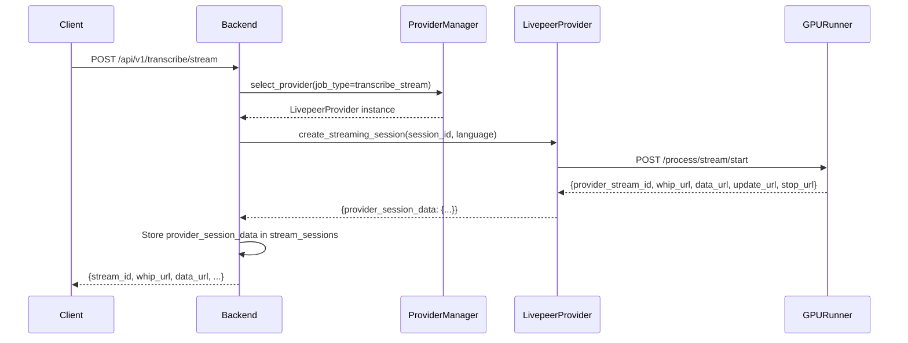

# Provider Mechanics Redesign Plan

## Overview

This document outlines the redesign of the compute provider mechanics for streaming sessions. The key change is that `create_streaming_session` should negotiate with the compute provider to establish a stream session, and the provider's response (including management URLs) should be stored for ongoing stream management.

## Current Architecture

### Flow
```
┌─────────────┐     ┌──────────────────┐     ┌─────────────────┐
│   Client    │────▶│  Backend API     │────▶│ Compute Provider│
│             │     │  (transcribe.py) │     │  (Livepeer)     │
└─────────────┘     └──────────────────┘     └─────────────────┘
                           │
                           ▼
                    ┌──────────────────┐
                    │  Session Store   │
                    │  (sessions.py)   │
                    └──────────────────┘
```

### Current `create_streaming_session` Implementation

The current implementation in [`LivepeerComputeProvider.create_streaming_session()`](backend/compute_providers/livepeer/livepeer.py:145) returns:
- `livepeer_header`: Base64-encoded header for BYOC AI Stream API
- `start_request`: Request body with stream_id and params
- `provider`: Provider name

The backend [`transcribe_stream()`](backend/transcribe.py:213) endpoint returns these to the client, but **does not actually initiate the stream session with the provider**.

## Proposed Architecture

### New Flow


### Key Changes

1. **Provider Negotiation**: The `create_streaming_session` method will actively negotiate with the compute provider by making an HTTP POST request to establish the session.

2. **Response Storage**: The full provider response containing management URLs will be stored in the session store for later use.

3. **Stream Management**: New endpoints/methods will use the stored URLs to manage the stream (send updates, stop stream).

## Implementation Details

### 1. Update BaseComputeProvider Interface

Modify [`BaseComputeProvider.create_streaming_session()`](backend/compute_providers/base_provider.py:101) to return a standardized structure:

```python
class StreamSessionData(TypedDict):
    provider_stream_id: str      # Provider's internal stream ID
    whip_url: str                # WHIP ingestion URL for client
    data_url: str                # SSE connection URL for real-time data
    update_url: str              # URL to send stream updates
    stop_url: str                # URL to stop the stream
    metadata: Dict[str, Any]     # Additional provider-specific data

async def create_streaming_session(
    self,
    session_id: str,
    language: str = "en",
    **kwargs
) -> StreamSessionData:
    """
    Create a streaming session by negotiating with the compute provider.
    
    Returns:
        StreamSessionData containing all URLs and session information
    """
```

### 2. Modify LivepeerComputeProvider.create_streaming_session()

Update [`LivepeerComputeProvider.create_streaming_session()`](backend/compute_providers/livepeer/livepeer.py:145) to:

```python
async def create_streaming_session(
    self,
    session_id: str,
    language: str = "en",
    **kwargs
) -> Dict[str, Any]:
    """
    Create a streaming session by POSTing to GPU_RUNNER_URL/process/stream/start.
    
    The GPU runner returns:
    {
        "provider_stream_id": "...",
        "whip_url": "...",
        "data_url": "...",  # SSE connection
        "update_url": "...",
        "stop_url": "..."
    }
    """
    async with aiohttp.ClientSession() as http_session:
        async with http_session.post(
            f"{self.GPU_RUNNER_URL}/process/stream/start",
            json={
                "stream_id": session_id,
                "params": {
                    "language": language,
                    "model": kwargs.get("model", "voxtral-realtime")
                }
            }
        ) as response:
            response.raise_for_status()
            provider_data = await response.json()
            
            # Return the full provider response for storage
            return {
                "provider": "livepeer",
                "provider_stream_id": provider_data.get("provider_stream_id"),
                "whip_url": provider_data.get("whip_url"),
                "data_url": provider_data.get("data_url"),
                "update_url": provider_data.get("update_url"),
                "stop_url": provider_data.get("stop_url"),
                "metadata": provider_data  # Store entire response
            }
```

### 3. Update Session Store

Modify [`SessionStore`](backend/sessions.py:16) to store provider session data:

```python
class SessionStore:
    def __init__(self):
        self.sessions = {}
        self.transcriptions = {}
        self.stream_sessions = {}  # stream_id -> stream_session_data
    
    def create_stream_session(
        self, 
        session_id: str, 
        language: str,
        provider_session_data: Dict[str, Any]
    ) -> str:
        """Create a new stream session with provider data."""
        stream_id = str(uuid.uuid4())
        self.stream_sessions[stream_id] = {
            "id": stream_id,
            "session_id": session_id,
            "language": language,
            "status": "active",
            "created_at": time.time(),
            "updated_at": time.time(),
            "provider_session": provider_session_data,  # NEW: Store provider data
            "total_audio_bytes": 0,
            "transcription_segments": []
        }
        return stream_id
    
    def get_stream_session(self, stream_id: str) -> Optional[Dict[str, Any]]:
        """Get stream session by ID."""
        return self.stream_sessions.get(stream_id)
    
    def get_provider_urls(self, stream_id: str) -> Optional[Dict[str, str]]:
        """Get provider management URLs for a stream session."""
        session = self.stream_sessions.get(stream_id)
        if session:
            provider_session = session.get("provider_session", {})
            return {
                "update_url": provider_session.get("update_url"),
                "stop_url": provider_session.get("stop_url"),
                "data_url": provider_session.get("data_url"),
                "provider_stream_id": provider_session.get("provider_stream_id")
            }
        return None
```

### 4. Update create_stream_session Endpoint

Modify [`create_stream_session()`](backend/sessions.py:194) to accept and store provider session data:

```python
async def create_stream_session(request):
    """Create a streaming session with provider negotiation."""
    try:
        data = await request.json()
        session_id = data.get('session_id')
        language = data.get('language', 'en')
        
        if not session_id:
            return web.json_response({"error": "Session ID required"}, status=400)
        
        # Get compute provider and negotiate session
        provider = compute_provider_manager.select_provider(
            job_type="transcribe_stream",
            requirements={"language": language}
        )
        
        if not provider:
            return web.json_response(
                {"error": "No compute provider available"}, 
                status=503
            )
        
        # Negotiate with provider to create stream session
        provider_session_data = await provider.create_streaming_session(
            session_id=session_id,
            language=language
        )
        
        # Store in session store with provider data
        stream_id = session_store.create_stream_session(
            session_id=session_id,
            language=language,
            provider_session_data=provider_session_data
        )
        
        # Link to user session
        session_store.add_stream_to_session(session_id, stream_id)
        
        # Return URLs to client
        return web.json_response({
            "stream_id": stream_id,
            "status": "active",
            "whip_url": provider_session_data.get("whip_url"),
            "data_url": provider_session_data.get("data_url"),
            "provider_stream_id": provider_session_data.get("provider_stream_id")
        })
    except Exception as e:
        logger.error(f"Error creating stream session: {e}")
        return web.json_response({"error": str(e)}, status=500)
```

### 5. Add Stream Management Endpoints

Add new endpoints to use the stored URLs:

```python
async def send_stream_update(request):
    """Send update to active stream via provider's update_url."""
    try:
        data = await request.json()
        stream_id = data.get('stream_id')
        update_data = data.get('data', {})
        
        if not stream_id:
            return web.json_response({"error": "Stream ID required"}, status=400)
        
        # Get provider URLs
        provider_urls = session_store.get_provider_urls(stream_id)
        if not provider_urls or not provider_urls.get("update_url"):
            return web.json_response(
                {"error": "Stream session not found or no update URL"}, 
                status=404
            )
        
        # Send update to provider
        async with aiohttp.ClientSession() as http_session:
            async with http_session.post(
                provider_urls["update_url"],
                json=update_data
            ) as response:
                result = await response.json()
                
        # Update local session
        session_store.update_stream_session(stream_id, update_data)
        
        return web.json_response({
            "stream_id": stream_id,
            "status": "updated",
            "provider_response": result
        })
    except Exception as e:
        logger.error(f"Error sending stream update: {e}")
        return web.json_response({"error": str(e)}, status=500)

async def stop_stream_session(request):
    """Stop stream session via provider's stop_url."""
    try:
        data = await request.json()
        stream_id = data.get('stream_id')
        
        if not stream_id:
            return web.json_response({"error": "Stream ID required"}, status=400)
        
        # Get provider URLs
        provider_urls = session_store.get_provider_urls(stream_id)
        if not provider_urls or not provider_urls.get("stop_url"):
            return web.json_response(
                {"error": "Stream session not found or no stop URL"}, 
                status=404
            )
        
        # Call provider's stop URL
        async with aiohttp.ClientSession() as http_session:
            async with http_session.post(provider_urls["stop_url"]) as response:
                result = await response.json()
        
        # Update local session
        session_store.close_stream_session(stream_id)
        
        return web.json_response({
            "stream_id": stream_id,
            "status": "stopped",
            "provider_response": result
        })
    except Exception as e:
        logger.error(f"Error stopping stream session: {e}")
        return web.json_response({"error": str(e)}, status=500)
```

### 6. Update transcribe_stream Endpoint

Modify [`transcribe_stream()`](backend/transcribe.py:213) to use the new session creation flow:

```python
@require_auth
@check_rate_limit
@track_usage
async def transcribe_stream(request):
    """Handle real-time transcription streaming."""
    logger.info("Received transcription stream request")
    
    try:
        data = await request.json()
        session_id = data.get('session_id')
        language = data.get('language', 'en')
        
        if not session_id:
            import uuid
            session_id = str(uuid.uuid4())
        
        # Select compute provider
        provider = compute_provider_manager.select_provider(
            job_type="transcribe_stream",
            requirements={"language": language}
        )
        
        if not provider:
            return web.json_response(
                {"error": "No compute provider available"}, 
                status=503
            )
        
        # Create streaming session with provider negotiation
        session_result = await provider.create_streaming_session(
            session_id=session_id,
            language=language
        )
        
        # Store session in session store
        stream_id = session_store.create_stream_session(
            session_id=session_id,
            language=language,
            provider_session_data=session_result
        )
        
        return web.json_response({
            "session_id": session_id,
            "stream_id": stream_id,
            "status": "active",
            "whip_url": session_result.get("whip_url"),
            "data_url": session_result.get("data_url"),
            "update_url": session_result.get("update_url"),
            "stop_url": session_result.get("stop_url"),
            "provider_stream_id": session_result.get("provider_stream_id")
        })
        
    except Exception as e:
        logger.error(f"Error in transcribe_stream: {e}")
        return web.json_response({
            "error": str(e),
            "status": "error"
        }, status=500)
```

## Database Schema Considerations

If persisting stream sessions to Supabase, add a `stream_sessions` table:

```sql
CREATE TABLE stream_sessions (
  id UUID PRIMARY KEY DEFAULT uuid_generate_v4(),
  session_id UUID NOT NULL REFERENCES sessions(id) ON DELETE CASCADE,
  provider_stream_id TEXT,
  provider_name TEXT NOT NULL,
  whip_url TEXT,
  data_url TEXT,
  update_url TEXT,
  stop_url TEXT,
  provider_metadata JSONB,
  status TEXT NOT NULL DEFAULT 'active',
  total_audio_bytes INTEGER DEFAULT 0,
  created_at TIMESTAMPTZ NOT NULL DEFAULT NOW(),
  updated_at TIMESTAMPTZ NOT NULL DEFAULT NOW(),
  stopped_at TIMESTAMPTZ
);

CREATE INDEX idx_stream_sessions_session_id ON stream_sessions(session_id);
CREATE INDEX idx_stream_sessions_status ON stream_sessions(status);
```

## Testing Considerations

1. **Unit Tests**: Test each provider's `create_streaming_session` implementation
2. **Integration Tests**: Test the full flow from session creation to stream management
3. **Mock GPU Runner**: Create a mock GPU runner for testing without actual infrastructure

## Migration Path

1. Update base provider interface
2. Implement Livepeer provider changes
3. Update session store
4. Update endpoints
5. Add new management endpoints
6. Add tests
7. Update documentation
