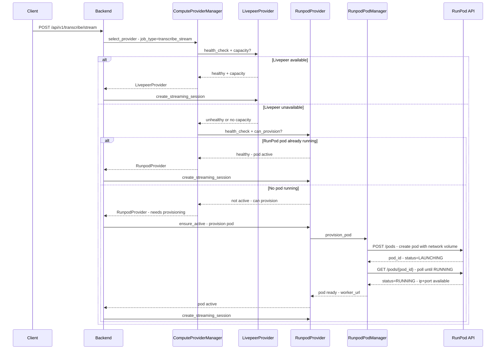
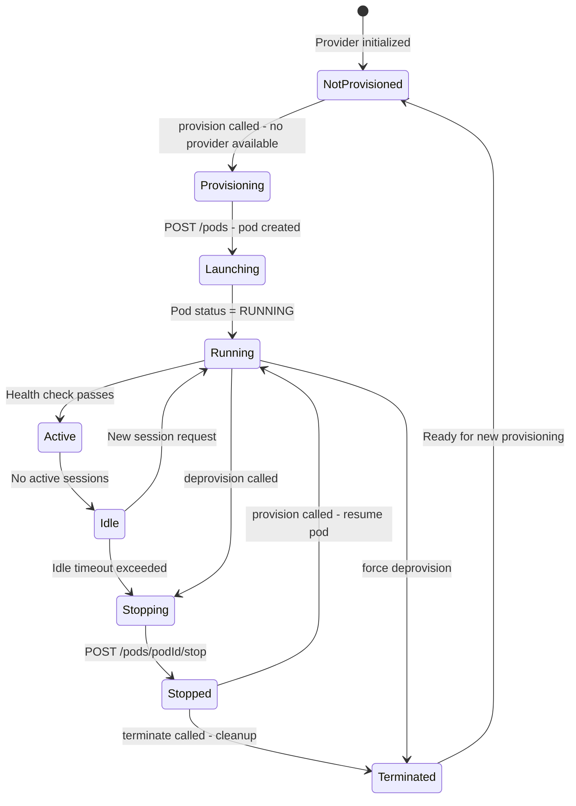

# RunPod Dynamic Pod Provisioning Plan

## Overview

Redesign the `RunpodComputeProvider` to dynamically spin up and down RunPod GPU pods on demand, using shared network storage for model persistence. Pods are launched **only as a fallback** when no other GPU providers (e.g., Livepeer) are available or have capacity.

### Key Design Decisions
1. **Fallback-only provisioning** — RunPod pods are only spun up when all other GPU providers are unavailable or unhealthy
2. **Multi-GPU type support** — Uses `gpuTypeIds` array with `gpuTypePriority: "availability"` so RunPod picks the first available GPU from a prioritized list
3. **Shared network storage** — A RunPod Network Volume stores models and worker code, mounted at `/workspace` on every pod, so new pods don't need to re-download
4. **Idle timeout** — Pods auto-stop after a configurable idle period to control costs

---

## Current State

### What Exists
- [`RunpodComputeProvider`](backend/compute_providers/runpod/runpod.py) — currently a **serverless endpoint** client only. It sends requests to a pre-existing `RUNPOD_ENDPOINT_ID` via the RunPod serverless API (`https://api.runpod.ai/v2`). It does **not** manage pod lifecycle.
- [`BaseComputeProvider`](backend/compute_providers/base_provider.py) — abstract interface with methods: `get_whip_url`, `get_websocket_url`, `create_transcription_job`, `create_translation_job`, `create_streaming_session`, `health_check`.
- [`ComputeProviderManager`](backend/compute_providers/provider_manager.py) — registers providers from definitions, selects providers via `select_provider(job_type, requirements)` with scoring.
- [`provider_definitions.py`](backend/compute_providers/provider_definitions.py) — configures `runpod-main` as default with `api_key` and `endpoint_id`.
- [`LivepeerComputeProvider`](backend/compute_providers/livepeer/livepeer.py) — actively negotiates with a GPU runner via HTTP POST to `/process/stream/start`.

### Key Gap
The current RunPod provider is passive — it assumes a serverless endpoint is already running. There is no concept of:
- Spinning up a pod when demand arrives
- Attaching shared network storage
- Stopping/terminating pods when idle
- Fallback logic when other providers are unavailable

---

## Architecture

### High-Level Flow



### Component Design

#### 1. `RunpodPodManager` — New Class

Manages the full pod lifecycle via the RunPod REST API. Lives in [`backend/compute_providers/runpod/pod_manager.py`](backend/compute_providers/runpod/pod_manager.py).

**Responsibilities:**
- Create pods with network volume attached and worker image
- Poll pod status until RUNNING
- Get pod connection info - IP, port
- Stop pods - release GPU but keep volume
- Terminate pods - full deletion
- List pods by name/tag for tracking
- Ensure network volume exists in the correct data center
- Idle timeout monitoring

**Key Methods:**

```python
class RunpodPodManager:
    def __init__(self, api_key: str, config: dict)
    
    async def ensure_network_volume(self, name: str, size_gb: int, data_center_id: str) -> str
        # Check if network volume exists; create if not. Returns volume ID.
    
    async def provision_pod(self, pod_name: str, image_name: str,
                            gpu_type_ids: list[str], gpu_type_priority: str,
                            network_volume_id: str, env: dict, ports: list,
                            data_center_ids: list[str] = None,
                            data_center_priority: str = "availability",
                            cloud_type: str = "SECURE",
                            container_disk_in_gb: int = 20,
                            gpu_count: int = 1,
                            min_ram_per_gpu: int = 16,
                            min_vcpu_per_gpu: int = 4) -> dict
        # Create a pod with network volume attached and multiple GPU type options.
        # gpu_type_ids: ordered list like ["NVIDIA RTX A5000", "NVIDIA RTX 4090", "NVIDIA A100"]
        # gpu_type_priority: "availability" (pick first available) or "custom" (try in order)
        # Poll until RUNNING. Return pod info including worker URL.
    
    async def get_pod_status(self, pod_id: str) -> str
        # Get current pod status: LAUNCHING, RUNNING, STOPPED, etc.
    
    async def get_pod_connection(self, pod_id: str) -> dict
        # Get pod IP and exposed ports for connecting the worker.
    
    async def stop_pod(self, pod_id: str) -> bool
        # Stop pod - releases GPU, keeps volume data.
    
    async def terminate_pod(self, pod_id: str) -> bool
        # Terminate pod - full deletion.
    
    async def list_pods(self, name_filter: str = None) -> list
        # List pods, optionally filtered by name.
    
    async def wait_for_pod_ready(self, pod_id: str, timeout: int = 300, interval: int = 10) -> dict
        # Poll pod status until RUNNING or timeout. Returns connection info.
```

**API Endpoints Used:**

| Action | Method | Endpoint |
|--------|--------|----------|
| Create pod | POST | `https://rest.runpod.io/v1/pods` |
| Get pod status | GET | `https://rest.runpod.io/v1/pods/{podId}` |
| List pods | GET | `https://rest.runpod.io/v1/pods` |
| Stop pod | POST | `https://rest.runpod.io/v1/pods/{podId}/stop` |
| Terminate pod | POST | `https://rest.runpod.io/v1/pods/{podId}/terminate` |
| Create network volume | POST | `https://rest.runpod.io/v1/networkvolumes` |
| List network volumes | GET | `https://rest.runpod.io/v1/networkvolumes` |

#### 2. `RunpodComputeProvider` — Rewritten

Enhanced to support both **serverless endpoint** mode (existing) and **dynamic pod** mode (new). Lives in [`backend/compute_providers/runpod/runpod.py`](backend/compute_providers/runpod/runpod.py).

**New Configuration:**

```python
{
    "name": "runpod-dynamic",
    "class_path": "compute_providers.runpod.runpod.RunpodComputeProvider",
    "config": {
        "name": "runpod-dynamic",
        "api_key": "${RUNPOD_API_KEY}",
        "mode": "dynamic",                          # "endpoint" or "dynamic"
        # Dynamic pod settings
        "gpu_type_ids": "${RUNPOD_GPU_TYPE_IDS}",    # Comma-separated list, e.g. "NVIDIA RTX A5000,NVIDIA RTX 4090,NVIDIA A100"
        "gpu_type_priority": "${RUNPOD_GPU_PRIORITY}", # "availability" or "custom"
        "gpu_count": 1,                              # GPUs per pod
        "image_name": "${RUNPOD_WORKER_IMAGE}",       # e.g. "your-registry/worker:latest"
        "network_volume_id": "${RUNPOD_NETWORK_VOLUME_ID}",  # optional, auto-create if not set
        "network_volume_name": "live-translation-models",
        "network_volume_size_gb": 100,
        "network_volume_mount_path": "/workspace",
        "data_center_ids": "${RUNPOD_DATA_CENTER_IDS}", # Comma-separated, e.g. "US-TX-3,US-IL-1,CA-MTL-1"
        "data_center_priority": "${RUNPOD_DC_PRIORITY}", # "availability" or "custom"
        "cloud_type": "SECURE",                      # "SECURE" or "COMMUNITY"
        "container_disk_in_gb": 20,
        "min_ram_per_gpu": 16,                       # Minimum RAM per GPU in GB
        "min_vcpu_per_gpu": 4,                       # Minimum vCPUs per GPU
        "pod_name_prefix": "lt-worker",              # prefix for created pods
        "ports": ["8001/http"],                       # worker API port
        "env": {},                                    # additional env vars for pod
        # Idle timeout
        "idle_timeout_seconds": 300,                  # 5 min idle → stop pod
        # Fallback priority
        "enabled": True,
        "is_default": False                           # NOT default - fallback only
    },
    "tags": ["runpod", "gpu", "dynamic", "fallback"]
}
```

**Multi-GPU Type Strategy:**

The RunPod API accepts `gpuTypeIds` as an **array** of GPU type strings. Combined with `gpuTypePriority`, this enables flexible GPU selection:

| `gpuTypePriority` | Behavior |
|-------------------|----------|
| `"availability"` | RunPod picks the **first available** GPU from the list, regardless of order. Best for minimizing wait times. |
| `"custom"` | RunPod tries GPUs **in the order specified**, falling back to the next if the preferred type is unavailable. Best for cost control (put cheaper GPUs first). |

Example configuration for a cost-optimized setup:
```
RUNPOD_GPU_TYPE_IDS=NVIDIA RTX A5000,NVIDIA RTX 4090,NVIDIA A100
RUNPOD_GPU_PRIORITY=custom
```
This tries A5000 first (cheapest adequate GPU), then 4090, then A100 (most expensive fallback).

Example for availability-optimized setup:
```
RUNPOD_GPU_TYPE_IDS=NVIDIA RTX A5000,NVIDIA RTX 4090,NVIDIA A100
RUNPOD_GPU_PRIORITY=availability
```
This picks whichever GPU is available first, minimizing provisioning wait time.

Similarly, `dataCenterIds` with `dataCenterPriority` controls data center selection:
- `"availability"` — pick any data center with available capacity
- `"custom"` — try data centers in the specified order

**Important:** The network volume must be in the **same data center** as the pod. When `dataCenterPriority` is `"availability"`, the `RunpodPodManager` must ensure the network volume exists in the data center where the pod is actually placed, or use a single data center to avoid this complexity.

**New Methods on `RunpodComputeProvider`:**

```python
class RunpodComputeProvider(BaseComputeProvider):
    # Existing methods enhanced + new provisioning methods
    
    @property
    def is_active(self) -> bool
        # Returns True if a pod is currently RUNNING and healthy.
    
    async def ensure_active(self) -> dict
        # Ensure a pod is running. If not, provision one.
        # Returns connection info (worker_url).
    
    async def deactivate(self) -> bool
        # Stop or terminate the active pod.
    
    async def can_provision(self) -> bool
        # Check if we have capacity to provision (API key valid, quota available).
    
    async def get_worker_url(self) -> str
        # Get the URL of the running worker pod.
    
    # Override BaseComputeProvider methods
    async def create_streaming_session(self, session_id, language, **kwargs) -> StreamSessionData
        # If dynamic mode: ensure_active() first, then POST to worker pod.
        # If endpoint mode: use existing serverless endpoint logic.
    
    async def health_check(self) -> Dict[str, Any]
        # If dynamic mode: check if pod is RUNNING.
        # If endpoint mode: check serverless endpoint health.
```

#### 3. `BaseComputeProvider` — Extended with Provisioning Interface

Add optional provisioning methods that providers can implement. Not all providers need provisioning — Livepeer, for example, is always-on.

```python
class BaseComputeProvider(ABC):
    # ... existing methods ...
    
    # New optional provisioning methods
    @property
    def needs_provisioning(self) -> bool:
        """Whether this provider requires dynamic provisioning before use."""
        return False
    
    @property
    def is_provisioned(self) -> bool:
        """Whether this provider currently has active compute resources."""
        return True  # Default: always provisioned (always-on providers)
    
    async def provision(self) -> Dict[str, Any]:
        """Provision compute resources. Only called if needs_provisioning=True."""
        return {"status": "already_provisioned"}
    
    async def deprovision(self, force: bool = False) -> Dict[str, Any]:
        """Deprovision compute resources. Only called if needs_provisioning=True."""
        return {"status": "deprovisioned"}
    
    async def get_provisioning_status(self) -> Dict[str, Any]:
        """Get current provisioning status and details."""
        return {"status": "active", "details": {}}
```

#### 4. `ComputeProviderManager` — Enhanced Selection Logic

Update [`provider_manager.py`](backend/compute_providers/provider_manager.py) to handle fallback provisioning:

```python
async def select_provider(self, job_type: str, requirements: Dict[str, Any] = None) -> BaseComputeProvider:
    """
    Select the best provider. Fallback logic:
    1. Prefer always-on, healthy providers (e.g., Livepeer)
    2. If none available, check if a dynamic provider is already provisioned
    3. If not, provision a dynamic provider and use it
    """
    requirements = requirements or {}
    
    # Step 1: Try always-on providers first
    for name, provider in self._scored_providers(job_type, requirements):
        if not provider.needs_provisioning and provider.enabled and self.is_healthy(name):
            return provider
    
    # Step 2: Try already-provisioned dynamic providers
    for name, provider in self._scored_providers(job_type, requirements):
        if provider.needs_provisioning and provider.is_provisioned and provider.enabled:
            return provider
    
    # Step 3: Provision a dynamic provider (fallback)
    for name, provider in self._scored_providers(job_type, requirements):
        if provider.needs_provisioning and provider.enabled and await provider.can_provision():
            logger.info(f"Provisioning fallback provider: {name}")
            result = await provider.provision()
            if result.get("status") == "provisioned":
                return provider
    
    raise Exception("No compute providers available - all healthy and fallback providers exhausted")
```

#### 5. Idle Timeout Monitor — Background Task

A background asyncio task that monitors dynamic providers and deprovisions idle pods.

```python
class IdleTimeoutMonitor:
    """Background task that stops idle RunPod pods after a timeout."""
    
    def __init__(self, provider_manager: ComputeProviderManager, check_interval: int = 60):
        self.provider_manager = provider_manager
        self.check_interval = check_interval  # seconds between checks
        self._task: Optional[asyncio.Task] = None
    
    async def start(self):
        self._task = asyncio.create_task(self._monitor_loop())
    
    async def stop(self):
        if self._task:
            self._task.cancel()
    
    async def _monitor_loop(self):
        while True:
            await asyncio.sleep(self.check_interval)
            for name, provider in self.provider_manager.providers.items():
                if provider.needs_provisioning and provider.is_provisioned:
                    idle_time = provider.get_idle_time()
                    if idle_time > provider.idle_timeout_seconds:
                        logger.info(f"Deprovisioning idle provider: {name} - idle for {idle_time}s")
                        await provider.deprovision()
```

---

### Network Volume Strategy

Shared network storage is critical for fast pod startup — models and worker code are stored on the volume so new pods don't need to download them.

```mermaid
graph TD
    A[RunPod Network Volume] -->|mounted at /workspace| B[GPU Pod 1 - lt-worker-abc]
    A -->|mounted at /workspace| C[GPU Pod 2 - lt-worker-xyz]
    B --> D[/workspace/models/ - Voxtral + Granite ONNX]
    B --> E[/workspace/worker/ - Worker application code]
    C --> D
    C --> E
    A --> F[Created once in RUNPOD_DATA_CENTER_IDS region]
    F --> G[Persisted across pod stop/start/terminate]
```

**Volume Setup:**
1. On first provisioning, `RunpodPodManager.ensure_network_volume()` checks if the configured network volume exists
2. If not, creates it with the specified name, size, and data center
3. Each pod created attaches this volume at `/workspace`
4. The worker Docker image should expect models at `/workspace/models/` and code at `/workspace/worker/`
5. An init script or Docker entrypoint can sync models to the volume on first run

**Data Center + Volume Constraint:**
RunPod network volumes are **data center specific** — a volume created in `US-TX-3` can only be attached to pods in `US-TX-3`. This means:
- If using `dataCenterPriority: "availability"`, the `RunpodPodManager` must create volumes in **each** data center that might be used, or fall back to `dataCenterPriority: "custom"` with a single data center
- **Recommended approach:** Use `dataCenterPriority: "custom"` with a single primary data center for the network volume, and only add additional data centers if volumes are pre-created in each one
- The `ensure_network_volume()` method should accept a `data_center_id` parameter and create the volume in the same data center where the pod will be placed

**Worker Image Considerations:**
- The worker Docker image (from [`worker/Dockerfile`](worker/Dockerfile)) needs to be pushed to a container registry accessible by RunPod
- Models should be downloaded to `/workspace/models/` on first pod start if not already present
- The worker FastAPI app runs on port 8001 (exposed as `8001/http`)
- The Docker entrypoint should check `/workspace/models/` for existing models before downloading

---

### Pod Lifecycle States



---

### Configuration Updates

#### New Environment Variables

```bash
# RunPod Dynamic Pod Provisioning
RUNPOD_API_KEY=your_runpod_api_key
RUNPOD_GPU_TYPE_IDS=NVIDIA RTX A5000,NVIDIA RTX 4090,NVIDIA A100  # Comma-separated GPU types (tried in order)
RUNPOD_GPU_PRIORITY=custom               # "availability" (first available) or "custom" (try in order)
RUNPOD_WORKER_IMAGE=your-registry/live-translation-worker:latest
RUNPOD_NETWORK_VOLUME_ID=                 # Optional - auto-create if empty
RUNPOD_NETWORK_VOLUME_NAME=live-translation-models
RUNPOD_NETWORK_VOLUME_SIZE_GB=100
RUNPOD_DATA_CENTER_IDS=US-TX-3            # Comma-separated data center IDs (must match network volume location)
RUNPOD_DC_PRIORITY=custom                 # "availability" or "custom" - recommend "custom" with single DC for volume compatibility
RUNPOD_CLOUD_TYPE=SECURE                  # "SECURE" or "COMMUNITY"
RUNPOD_POD_NAME_PREFIX=lt-worker
RUNPOD_IDLE_TIMEOUT_SECONDS=300           # 5 minutes
RUNPOD_MODE=dynamic                       # "dynamic" or "endpoint"
```

#### Updated `provider_definitions.py`

```python
PROVIDER_DEFINITIONS = [
    {
        "name": "livepeer-primary",
        "class_path": "compute_providers.livepeer.livepeer.LivepeerComputeProvider",
        "config": {
            "name": "livepeer-primary",
            "gpu_runner_url": "${LIVEPEER_GATEWAY_URL}",
            "api_key": "${LIVEPEER_API_KEY}",
            "enabled": True
        },
        "is_default": True,   # Livepeer is now the default
        "tags": ["livepeer", "gpu"]
    },
    {
        "name": "runpod-dynamic",
        "class_path": "compute_providers.runpod.runpod.RunpodComputeProvider",
        "config": {
            "name": "runpod-dynamic",
            "api_key": "${RUNPOD_API_KEY}",
            "mode": "dynamic",
            "gpu_type_ids": "${RUNPOD_GPU_TYPE_IDS}",       # Comma-separated, split at runtime
            "gpu_type_priority": "${RUNPOD_GPU_PRIORITY}",   # "availability" or "custom"
            "gpu_count": 1,
            "image_name": "${RUNPOD_WORKER_IMAGE}",
            "network_volume_id": "${RUNPOD_NETWORK_VOLUME_ID}",
            "network_volume_name": "${RUNPOD_NETWORK_VOLUME_NAME}",
            "network_volume_size_gb": "${RUNPOD_NETWORK_VOLUME_SIZE_GB}",
            "network_volume_mount_path": "/workspace",
            "data_center_ids": "${RUNPOD_DATA_CENTER_IDS}",  # Comma-separated, split at runtime
            "data_center_priority": "${RUNPOD_DC_PRIORITY}", # "availability" or "custom"
            "cloud_type": "${RUNPOD_CLOUD_TYPE}",
            "container_disk_in_gb": 20,
            "min_ram_per_gpu": 16,
            "min_vcpu_per_gpu": 4,
            "pod_name_prefix": "${RUNPOD_POD_NAME_PREFIX}",
            "ports": ["8001/http"],
            "idle_timeout_seconds": "${RUNPOD_IDLE_TIMEOUT_SECONDS}",
            "enabled": True
        },
        "is_default": False,   # Fallback only
        "tags": ["runpod", "gpu", "dynamic", "fallback"]
    }
]
```

---

### Database Migration

Add a `runpod_pods` table to track provisioned pods:

```sql
CREATE TABLE IF NOT EXISTS runpod_pods (
    id UUID PRIMARY KEY DEFAULT gen_random_uuid(),
    pod_id VARCHAR(50) UNIQUE NOT NULL,       -- RunPod pod ID
    pod_name VARCHAR(100) NOT NULL,            -- Pod name
    status VARCHAR(30) NOT NULL,               -- LAUNCHING, RUNNING, STOPPED, TERMINATED
    gpu_type VARCHAR(100),                     -- GPU type assigned
    worker_url VARCHAR(255),                   -- URL to reach the worker
    network_volume_id VARCHAR(50),             -- Attached network volume
    data_center_id VARCHAR(30),                -- Data center location
    created_at TIMESTAMP WITH TIME ZONE DEFAULT NOW(),
    last_active_at TIMESTAMP WITH TIME ZONE DEFAULT NOW(),
    stopped_at TIMESTAMP WITH TIME ZONE,
    session_count INTEGER DEFAULT 0            -- Active sessions on this pod
);

CREATE INDEX IF NOT EXISTS idx_runpod_pods_status ON runpod_pods(status);
CREATE INDEX IF NOT EXISTS idx_runpod_pods_pod_id ON runpod_pods(pod_id);
```

---

### File Changes Summary

| File | Action | Description |
|------|--------|-------------|
| `backend/compute_providers/runpod/pod_manager.py` | **NEW** | RunPod REST API client for pod/volume lifecycle management |
| `backend/compute_providers/runpod/runpod.py` | **REWRITE** | Add dynamic pod mode, provisioning, deprovisioning |
| `backend/compute_providers/base_provider.py` | **MODIFY** | Add provisioning interface methods |
| `backend/compute_providers/provider_manager.py` | **MODIFY** | Add fallback selection logic with provisioning |
| `backend/compute_providers/provider_definitions.py` | **MODIFY** | Update RunPod config for dynamic mode, make Livepeer default |
| `backend/compute_providers/idle_monitor.py` | **NEW** | Background task for idle pod timeout |
| `backend/main.py` | **MODIFY** | Start idle monitor on app startup |
| `.env.template` | **MODIFY** | Add RunPod dynamic provisioning env vars |
| `supabase/migrations/20260415_01_create_runpod_pods_table.sql` | **NEW** | Database migration for pod tracking |
| `backend/requirements.txt` | **MODIFY** | Add `runpod` Python SDK dependency |

---

### Implementation Order

1. **`pod_manager.py`** — Build the RunPod REST API wrapper first (create/stop/terminate pods, network volumes, status polling)
2. **`base_provider.py`** — Add the provisioning interface methods
3. **`runpod.py`** — Rewrite RunpodComputeProvider with dynamic mode using PodManager
4. **`provider_manager.py`** — Update selection logic for fallback provisioning
5. **`idle_monitor.py`** — Build the idle timeout background task
6. **`provider_definitions.py`** + **`.env.template`** — Update configuration
7. **`main.py`** — Wire up idle monitor on startup
8. **Database migration** — Create `runpod_pods` tracking table
9. **`requirements.txt`** — Add `runpod` SDK dependency
10. **Testing** — Unit tests for PodManager, integration tests for full provisioning flow

---

### Risk Considerations

| Risk | Mitigation |
|------|-----------|
| Pod startup takes 2-5 minutes | Pre-warm: provision a pod when Livepeer health degrades, not just when it fails. Show "warming up" status to client. |
| RunPod API rate limits | Implement exponential backoff and request caching for pod status checks |
| Pod provisioning fails | Return clear error to client; retry with different GPU type or data center |
| Network volume not in same data center as pod | Validate data center match before pod creation; store volume ID per data center |
| Stale pod records in DB | Cleanup job: reconcile DB records with actual RunPod pod states periodically |
| Multiple concurrent requests trigger duplicate provisioning | Use asyncio Lock per provider to serialize provisioning calls |
| Cost overrun from forgotten pods | Idle timeout + hard maximum pod lifetime + daily cost alert |