# Technical Specification vs. Implementation Analysis

**Date:** 2026-04-14  
**Spec Version:** 5.0.0 (2026-03-27)

---

## 1. Executive Summary

The TECHNICAL_SPECIFICATION.md (v5.0) describes an aspirational architecture that differs significantly from the current implementation. The implementation has evolved organically with several architectural improvements—notably a **multi-provider compute abstraction**, an **SSE-relay WebSocket bridge**, and **dual authentication** (agent HMAC + user JWT)—that the spec does not reflect. Conversely, several spec features (Chrome Extension, shared UI libraries, SIWE auth, stream_sessions DB table, Edge Functions) are **not implemented at all**.

This document catalogs every divergence, proposes spec updates, and provides user stories for both the webapp and agent interaction paths.

---

## 2. Detailed Diff Analysis

### 2.1 CRITICAL: Compute Provider Architecture

| Aspect | Spec (v5.0) | Implementation |
|--------|-------------|----------------|
| Provider model | Single `GPU_RUNNER_URL` with hardcoded Livepeer BYOC AI Stream API | Multi-provider abstraction: `ComputeProviderManager` with `BaseComputeProvider`, `LivepeerComputeProvider`, `RunpodComputeProvider` |
| Provider selection | None—routes directly to GPU_RUNNER_URL | Dynamic selection via `select_provider(job_type, requirements)` with scoring (health, GPU capability, latency, default preference) |
| Auth to workers | Always Livepeer Base64 header | Livepeer: Base64 header; Runpod: Bearer token auth |
| Configuration | Single env var `GPU_RUNNER_URL` | Provider definitions in [`provider_definitions.py`](backend/compute_providers/provider_definitions.py) with env var substitution |
| DB persistence | Not mentioned | `compute_providers` table in Supabase (see migration [`20260405_01`](supabase/migrations/20260405_01_create_compute_providers_table.sql)) |

**Impact:** The spec's entire Worker Architecture section (§4) and BYOC AI Stream API section (§4.1–4.5) describe only the Livepeer path. The implementation supports multiple providers with different auth mechanisms and APIs.

---

### 2.2 CRITICAL: Streaming Data Flow

| Aspect | Spec (v5.0) | Implementation |
|--------|-------------|----------------|
| Frontend receives data | Directly from GPU runner SSE `data_url` | Via backend WebSocket relay (`/ws` → `SSERelay` → provider `data_url`) |
| Frontend connection | `GET {data_url}` (SSE) | `new WebSocket(WS_ENDPOINT)` then `send({type: "start_stream", stream_id})` |
| Backend role | Proxies session creation only; frontend connects directly to WHIP and SSE | Backend creates session, stores provider URLs, runs `SSERelay` that subscribes to provider SSE and broadcasts to WebSocket clients |
| Session storage | `stream_sessions` DB table (spec §8.5) | In-memory `SessionStore` in [`sessions.py`](backend/sessions.py:17) |

**Impact:** The spec's Frontend Integration section (§8.4) shows the frontend connecting directly to the GPU runner's SSE endpoint. The actual implementation routes all data through the backend via an SSE→WebSocket relay, which is a fundamentally different architecture.

---

### 2.3 CRITICAL: API Endpoint Paths

| Spec Endpoint | Implementation Endpoint | Notes |
|---------------|------------------------|-------|
| `POST /api/v1/transcribe` | `POST /api/v1/transcribe/file` | Split into file upload |
| — | `POST /api/v1/transcribe/url` | New: URL-based transcription |
| `POST /api/v1/transcribe/stream` | `POST /api/v1/transcribe/stream` | Same path, different response shape |
| `POST /api/v1/translate` | `POST /api/v1/translate/text` | Renamed |
| `POST /api/v1/translate/transcription` | `POST /api/v1/translate/transcription` | Same |
| `GET /api/v1/languages` | `GET /api/v1/languages` | Same, but only 11 languages vs spec's 24 |
| — | `POST /api/v1/sessions` | New: session management |
| — | `POST /api/v1/stream/session` | New: stream session creation (duplicate of /transcribe/stream?) |
| — | `POST /api/v1/stream/{id}/update` | New: stream update |
| — | `POST /api/v1/stream/{id}/close` | New: stream close |
| — | `POST /api/v1/stream/{id}/stop` | New: provider stop |
| — | `GET /api/v1/transcribe/health` | New: health check |
| — | `POST /api/v1/agents/register` | New: agent registration |
| — | `GET /api/v1/agents/usage` | New: agent usage |
| — | `GET/POST/DELETE /api/v1/agents/keys` | New: API key management |
| — | `GET/POST/DELETE /api/v1/agents/subscription` | New: agent subscriptions |
| `GET /ws` | `GET /ws` | WebSocket (spec doesn't document this) |

---

### 2.4 MAJOR: Frontend

| Aspect | Spec (v5.0) | Implementation |
|--------|-------------|----------------|
| Framework | React + TypeScript | React (JSX, no TypeScript) |
| Chrome Extension | Full Manifest V3 extension described | Not implemented |
| Shared libraries | @lib/ui, @lib/supabase, @lib/web3, @lib/types, @lib/mcp, @lib/agent, @lib/audio | Only `packages/agent-sdk` and `packages/mcp-server` exist |
| Dashboard | Transcription Library, Export Options, Settings Panel, Language Preferences, Subscription Management | Single-page live transcription UI only |
| Auth UI | SIWE + Email + Google | No auth UI implemented |
| Translation UI | Real-time translated subtitles, export | Not implemented |

---

### 2.5 MAJOR: Authentication

| Aspect | Spec (v5.0) | Implementation |
|--------|-------------|----------------|
| User auth | SIWE (Sign-In with Ethereum) + Supabase Auth (Email, Google) | Supabase JWT Bearer token only (no SIWE) |
| Agent auth | OAuth 2.0 + x402 wallet | HMAC-SHA256 with API key + secret (see [`auth.py`](backend/auth.py:17)) |
| Auth middleware | Not specified | `require_auth` decorator tries agent auth first, then user auth |
| Rate limiting | Not specified | `check_rate_limit` and `track_usage` decorators exist |

---

### 2.6 MAJOR: Agent System

| Aspect | Spec (v5.0) | Implementation |
|--------|-------------|----------------|
| Agent SDK auth | x402 crypto wallet payments | HMAC-SHA256 signing with API key/secret (see [`agent-sdk/src/index.ts`](packages/agent-sdk/src/index.ts:123)) |
| Agent registration | Not detailed | Full registration endpoint with API key generation ([`agents.py`](backend/agents.py:36)) |
| Agent subscriptions | Not detailed | CRUD endpoints for agent subscriptions |
| Agent usage tracking | Not detailed | `agent_usage` table with per-endpoint tracking |
| MCP Server | Described as shared library | Exists as standalone Express server ([`mcp-server/src/index.js`](packages/mcp-server/src/index.js)) |
| A2A protocol | Mentioned | Not implemented |

---

### 2.7 MODERATE: Payment System

| Aspect | Spec (v5.0) | Implementation |
|--------|-------------|----------------|
| Stripe | Supabase Edge Functions (Deno/TypeScript) | Python backend service ([`stripe.py`](backend/payments/stripe.py)) with `StripeClient` |
| x402 | Middleware decorator in spec code | Full Python module ([`x402.py`](backend/payments/x402.py)) with verify/settle |
| Unified payments | Not in spec | `payment_strategy.py` with `x402_or_subscription`, `subscription_only`, `x402_only` decorators |
| Payment DB | `payment_methods`, `x402_payments` tables in spec | Not migrated—these tables don't exist in actual migrations |

---

### 2.8 MODERATE: Database Schema

**Tables in spec but NOT in implementation migrations:**
- `stream_sessions` — spec §8.5 describes this; implementation uses in-memory `SessionStore`
- `payment_methods` — spec §13.6
- `x402_payments` — spec §13.6

**Tables in implementation but NOT in spec:**
- `compute_providers` — for multi-provider management
- `agent_usage` — for per-request agent tracking

**Schema differences in `agents` table:**
- Spec: `name`, `owner_email`, `status`, `created_at` + separate `api_keys` table
- Implementation: `name`, `description`, `api_key`, `api_secret`, `is_active`, `subscription_tier`, `created_at`, `last_used_at`, `revoked_at` (flat design, no separate api_keys table)

---

### 2.9 MODERATE: Worker Service

| Aspect | Spec (v5.0) | Implementation |
|--------|-------------|----------------|
| Worker location | Single GPU_RUNNER_URL | Separate `worker/` directory with own Dockerfile, docker-compose |
| Worker models | Granite 4.0 ONNX (CPU) + Voxtral (GPU) | `granite_transcriber.py`, `vllm_client.py`, `webrtc/` components |
| Worker API | `/process/request/transcribe`, `/process/request/translate`, `/process/stream/start` | Worker has its own `app.py` with different routes |

---

### 2.10 MINOR: Languages

| Spec | Implementation |
|------|---------------|
| 24 languages (en, es, fr, de, it, pt, ru, ja, ko, zh, zh-TW, ar, hi, bn, id, vi, th, tr, pl, nl, sv, da, no, fi) | 11 languages (en, es, fr, de, it, pt, ru, ja, ko, zh, ar) |

---

### 2.11 MINOR: Monorepo Structure

| Spec | Implementation |
|------|---------------|
| pnpm monorepo with @lib/ui, @lib/supabase, @lib/web3, @lib/types, @lib/mcp, @lib/agent, @lib/audio | No pnpm workspace; `packages/agent-sdk` (TypeScript) and `packages/mcp-server` (JS) exist; no shared UI libraries |

---

### 2.12 MINOR: Environment Variables

| Spec Variable | Implementation Variable | Status |
|---------------|------------------------|--------|
| `GPU_RUNNER_URL` | `LIVEPEER_GATEWAY_URL` | Renamed in provider definitions |
| `RUNNER_API_KEY` | `LIVEPEER_API_KEY`, `RUNPOD_API_KEY`, `RUNPOD_ENDPOINT_ID` | Split per provider |
| — | `HOST_IP` | New: for SDP munging in Docker |
| — | `TURN_SERVER`, `TURN_USERNAME`, `TURN_PASSWORD` | New: TURN config |
| — | `ICE_SERVERS` | New: ICE server config |
| — | `FACILITATOR_URL`, `PLATFORM_WALLET` | New: x402 config |
| — | `STRIPE_PRICE_STARTER`, `STRIPE_PRICE_PRO`, `STRIPE_PRICE_ENTERPRISE` | New: Stripe price IDs |

---

## 3. Suggested Updates to TECHNICAL_SPECIFICATION.md

### 3.1 Must Update (Architecture Changes)

1. **§2 System Architecture — Add Compute Provider Layer**
   - Replace single GPU_RUNNER_URL with `ComputeProviderManager` abstraction
   - Show Livepeer and Runpod as interchangeable providers
   - Add provider selection/scoring flow

2. **§3/§4 Backend Proxy + Worker — Rewrite for Multi-Provider**
   - Document `BaseComputeProvider` interface
   - Document `LivepeerComputeProvider` (BYOC AI Stream API + Livepeer header)
   - Document `RunpodComputeProvider` (Bearer auth + Runpod API)
   - Document `provider_definitions.py` configuration format
   - Remove assumption that all workers use Livepeer header auth

3. **§8/§11 Transcription Service — Update Streaming Flow**
   - Replace "frontend connects directly to SSE data_url" with SSE→WebSocket relay architecture
   - Document `SSERelay` class and its reconnection logic
   - Document WebSocket protocol messages: `start_stream`, `stop_stream`, `transcription`, `status`, `error`
   - Update frontend integration code to show WebSocket connection

4. **§4 API Endpoints — Update All Paths**
   - Add `/api/v1/transcribe/file`, `/api/v1/transcribe/url`
   - Rename `/api/v1/translate` → `/api/v1/translate/text`
   - Add session management endpoints
   - Add agent management endpoints
   - Add health check endpoint
   - Document WebSocket `/ws` endpoint

5. **§8.5 Database Schema — Add Missing Tables**
   - Add `compute_providers` table
   - Add `agent_usage` table
   - Update `agents` table schema to match implementation
   - Note that `stream_sessions`, `payment_methods`, `x402_payments` are planned but not yet migrated

6. **§13 Payments — Update Stripe Implementation**
   - Replace Supabase Edge Functions with Python `StripePaymentService`
   - Document `payment_strategy.py` unified decorator system
   - Document `x402_or_subscription`, `subscription_only`, `x402_only` convenience decorators

### 3.2 Should Update (Feature Gaps)

7. **§8 Ethereum Authentication — Mark as Planned**
   - SIWE is not implemented; mark as future milestone
   - Document current auth: Supabase JWT for users, HMAC-SHA256 for agents

8. **§13 Chrome Extension — Mark as Not Implemented**
   - No Chrome Extension code exists
   - Mark as future milestone

9. **§6 Monorepo Structure — Update to Match Reality**
   - Remove @lib/ui, @lib/supabase, @lib/web3, @lib/types, @lib/audio
   - Document existing packages: agent-sdk, mcp-server
   - Document backend as standalone Python service

10. **§9 Languages — Update List**
    - Reduce from 24 to 11 or document plan to expand

11. **§3 Model Architecture — Clarify**
    - Models run on compute providers, not directly in backend
    - Worker service is separate from backend
    - Document worker/ directory structure

### 3.3 Nice to Update (Documentation Quality)

12. **Add §Compute Provider Abstraction** — New section documenting the provider interface, selection algorithm, and how to add new providers

13. **Add §SSE Relay Architecture** — New section documenting the SSE→WebSocket bridge, reconnection logic, and message protocol

14. **Add §Agent API Reference** — Full endpoint documentation for agent registration, key management, subscriptions, usage

15. **Add §Session Management** — Document in-memory SessionStore, stream session lifecycle, and planned migration to DB-backed storage

16. **Update §17 Environment Variables** — Add all new env vars (HOST_IP, TURN_*, ICE_SERVERS, FACILITATOR_URL, PLATFORM_WALLET, STRIPE_PRICE_*, RUNPOD_*, LIVEPEER_*)

---

## 4. User Stories

### 4.1 Webapp User Stories

#### US-W1: Start Live Transcription Session

**As a** webapp user  
**I want to** start a live transcription session from my browser  
**So that** I can see real-time speech-to-text from my microphone

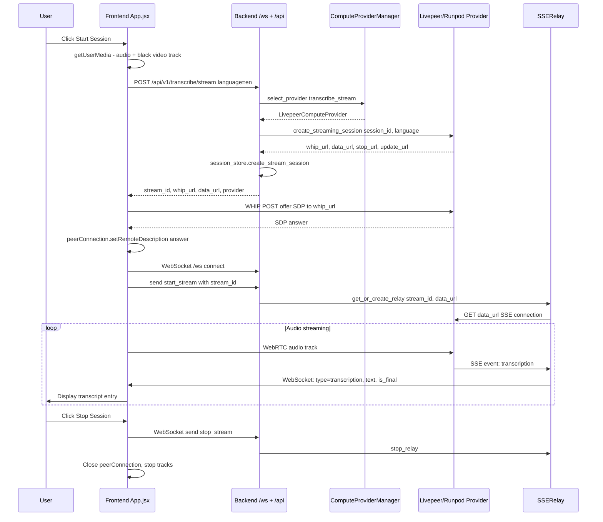

**Acceptance Criteria:**
- User clicks "Start Session" and browser requests microphone permission
- A WHIP WebRTC connection is established to the compute provider
- WebSocket connection opens to backend `/ws`
- Transcription entries appear in real-time with "Live" (partial) and "Final" badges
- Clicking "Stop Session" cleanly tears down all connections

---

#### US-W2: Upload Audio File for Batch Transcription

**As a** webapp user  
**I want to** upload an audio file for transcription  
**So that** I can get a text transcript of recorded audio

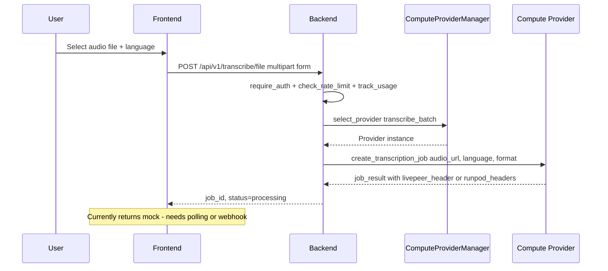

**Acceptance Criteria:**
- User can select an audio file (wav, mp3, m4a, flac, ogg)
- File is uploaded via multipart form data
- Backend selects appropriate compute provider
- Job is submitted and job_id returned
- **Note:** Current implementation returns mock response; needs completion for real async processing

---

#### US-W3: Translate Text

**As a** webapp user  
**I want to** translate text from one language to another  
**So that** I can understand content in different languages

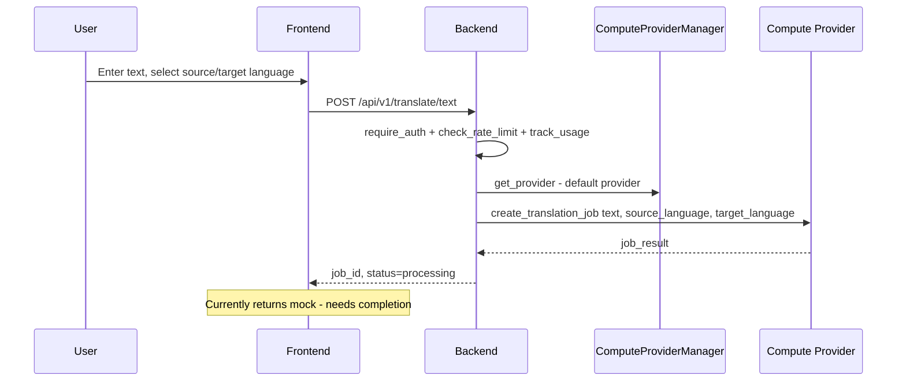

**Acceptance Criteria:**
- User enters text and selects source/target languages
- Translation request is sent to compute provider
- **Note:** Current implementation returns mock response; needs completion

---

#### US-W4: View Supported Languages

**As a** webapp user  
**I want to** see the list of supported languages  
**So that** I know which languages I can use for transcription and translation

**Flow:** `GET /api/v1/languages` → Returns list of 11 languages with code and name

**Acceptance Criteria:**
- Endpoint returns language list with code and name
- Currently returns 11 languages (spec defines 24)

---

#### US-W5: Manage Streaming Session Lifecycle

**As a** webapp user  
**I want to** check stream status and stop streams  
**So that** I can control my live transcription sessions

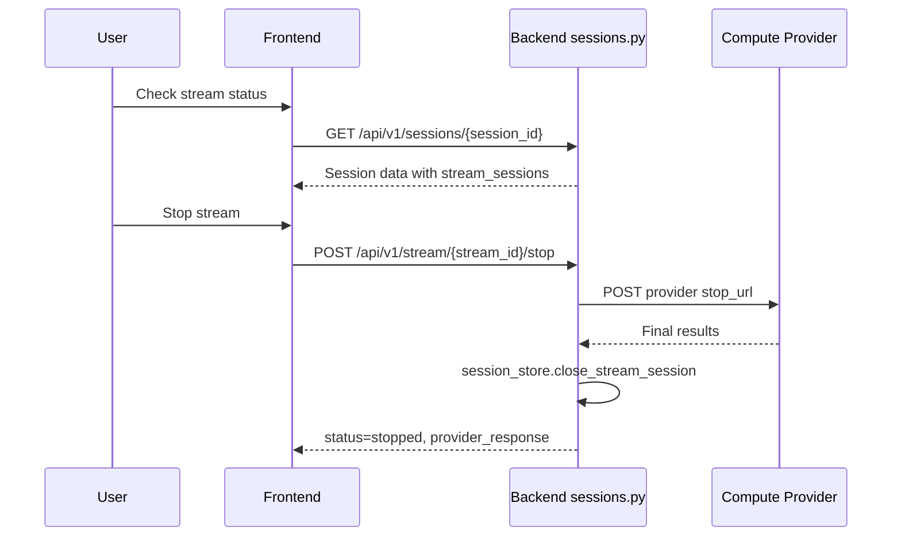

**Acceptance Criteria:**
- User can check active stream sessions
- User can stop a running stream
- Provider's stop_url is called to terminate the remote stream
- Session is marked as completed/stopped

---

### 4.2 Agent User Stories

#### US-A1: Register as an AI Agent

**As an** AI agent developer  
**I want to** register my agent and receive API credentials  
**So that** my agent can authenticate and use the transcription/translation API

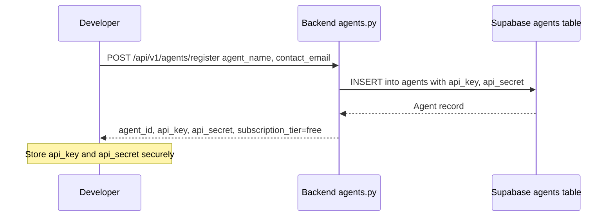

**Acceptance Criteria:**
- Agent receives unique `api_key` and `api_secret`
- Agent is created with `subscription_tier=free` and `is_active=true`
- API secret is only returned once (on registration)

---

#### US-A2: Authenticate API Requests with HMAC

**As an** AI agent  
**I want to** sign my API requests with HMAC-SHA256  
**So that** my requests are securely authenticated without sending the secret

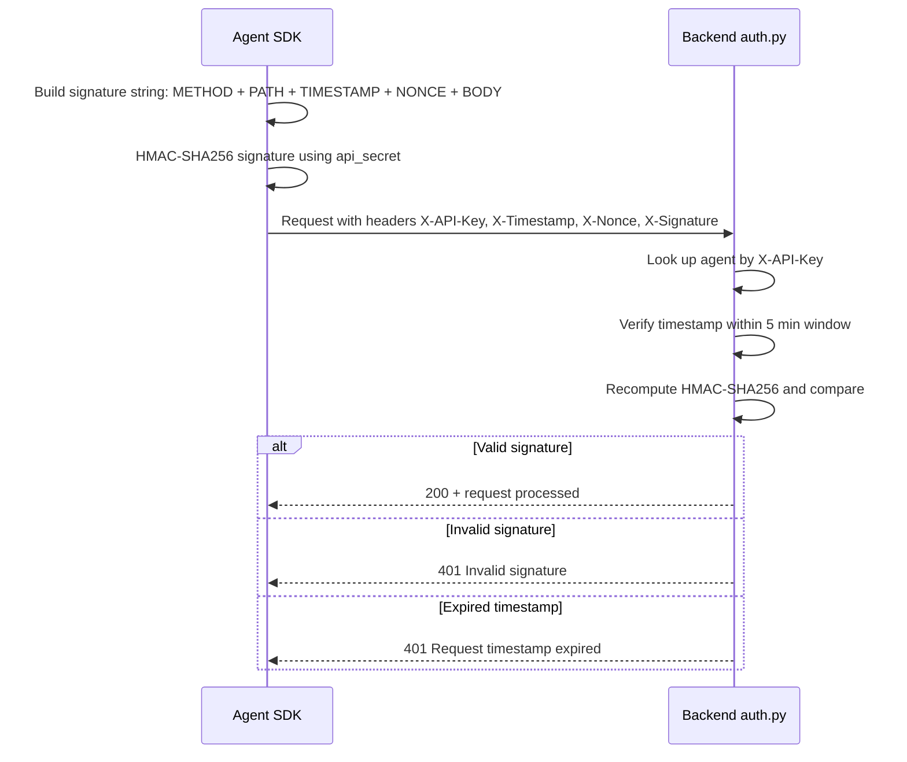

**Acceptance Criteria:**
- Agent SDK automatically signs every request
- Backend validates timestamp (5-minute window), API key existence, agent active status, and HMAC signature
- Constant-time comparison prevents timing attacks

---

#### US-A3: Transcribe Audio via Agent SDK

**As an** AI agent  
**I want to** transcribe audio files programmatically  
**So that** I can process audio content in my workflows

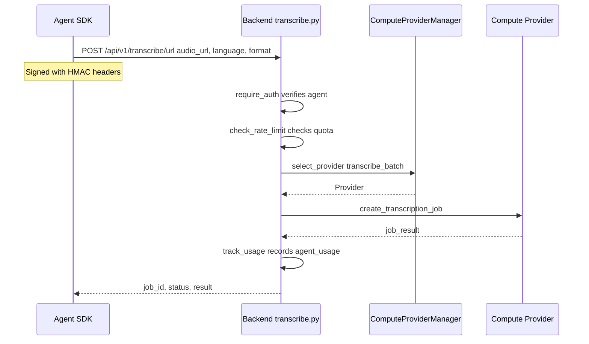

**Acceptance Criteria:**
- Agent can submit audio URL for transcription
- Rate limiting and usage tracking apply
- Response includes job_id and processing status
- **Note:** Currently returns mock response; real processing needs completion

---

#### US-A4: Translate Text via Agent SDK

**As an** AI agent  
**I want to** translate text programmatically  
**So that** I can provide multilingual capabilities in my workflows

**Flow:** Same pattern as US-A3 but calls `POST /api/v1/translate/text` with `text`, `source_language`, `target_language`

**Acceptance Criteria:**
- Agent can submit text for translation
- Usage is tracked in `agent_usage` table
- **Note:** Currently returns mock response

---

#### US-A5: Pay per Request with x402

**As an** AI agent  
**I want to** pay for API calls using USDC via x402 protocol  
**So that** I don't need a subscription for sporadic usage

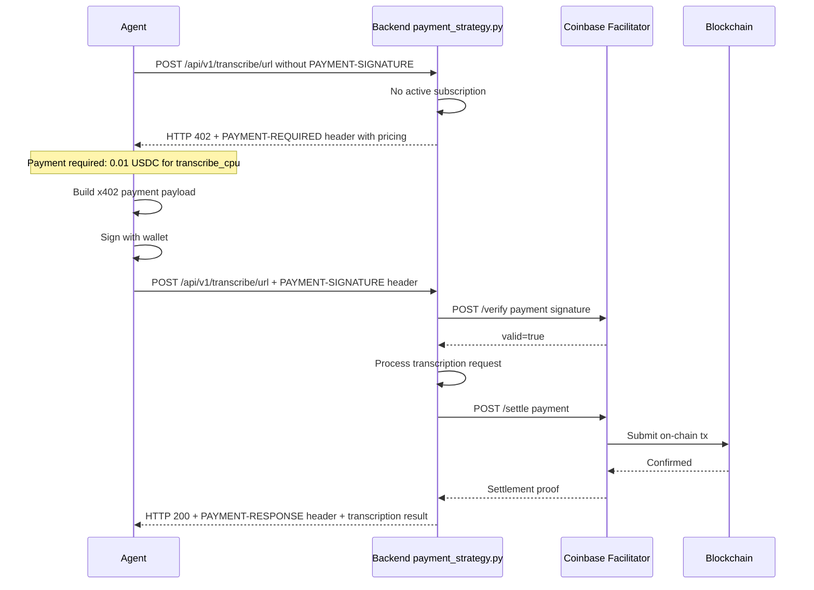

**Acceptance Criteria:**
- Agent without subscription receives HTTP 402 with payment details
- Agent can submit PAYMENT-SIGNATURE header for x402 payment
- Backend verifies with facilitator before processing
- Backend settles payment after successful service delivery
- Pricing: transcribe_cpu=$0.01, transcribe_gpu=$0.05, translate=$0.001

---

#### US-A6: Use MCP Server for Tool Integration

**As an** AI agent with MCP support  
**I want to** use the MCP server to access transcription/translation as tools  
**So that** I can integrate with LangChain, AutoGPT, or other agent frameworks

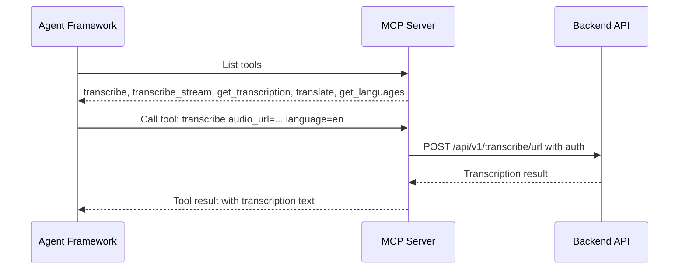

**Available MCP Tools:**
- `transcribe` — Batch transcription from audio URL
- `transcribe_stream` — Start streaming transcription
- `get_transcription` — Retrieve transcription by ID
- `translate` — Translate text between languages
- `get_languages` — List supported languages

**Acceptance Criteria:**
- MCP server exposes tools via standard MCP protocol
- Each tool maps to a backend API endpoint
- Authentication is handled via API key configuration

---

#### US-A7: Manage Agent API Keys

**As an** agent developer  
**I want to** create, list, and revoke API keys for my agent  
**So that** I can manage access for different deployments

**Flow:**
- `POST /api/v1/agents/keys` — Create new API key
- `GET /api/v1/agents/keys` — List all keys
- `DELETE /api/v1/agents/keys` — Revoke a key

**Acceptance Criteria:**
- Each key has a prefix for identification
- Keys have rate limits and daily quotas
- Revoked keys immediately stop working

---

#### US-A8: Monitor Agent Usage

**As an** agent developer  
**I want to** view my agent's usage statistics  
**So that** I can track costs and stay within quotas

**Flow:** `GET /api/v1/agents/usage` → Returns today's and total usage (transcriptions, translations, cost in USDC cents)

**Acceptance Criteria:**
- Returns per-day and total breakdown
- Tracks successful vs failed requests
- Tracks cost in USDC cents

---

## 5. Interaction Flow Summary

### 5.1 Webapp Complete Flow

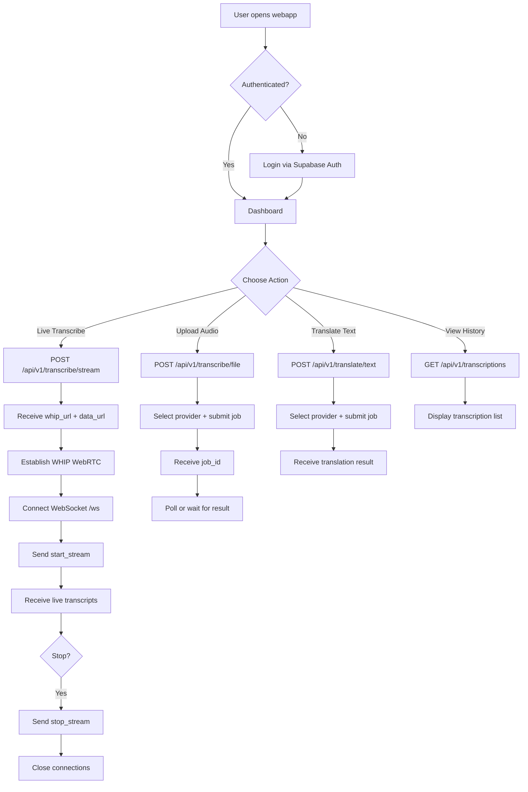

### 5.2 Agent Complete Flow

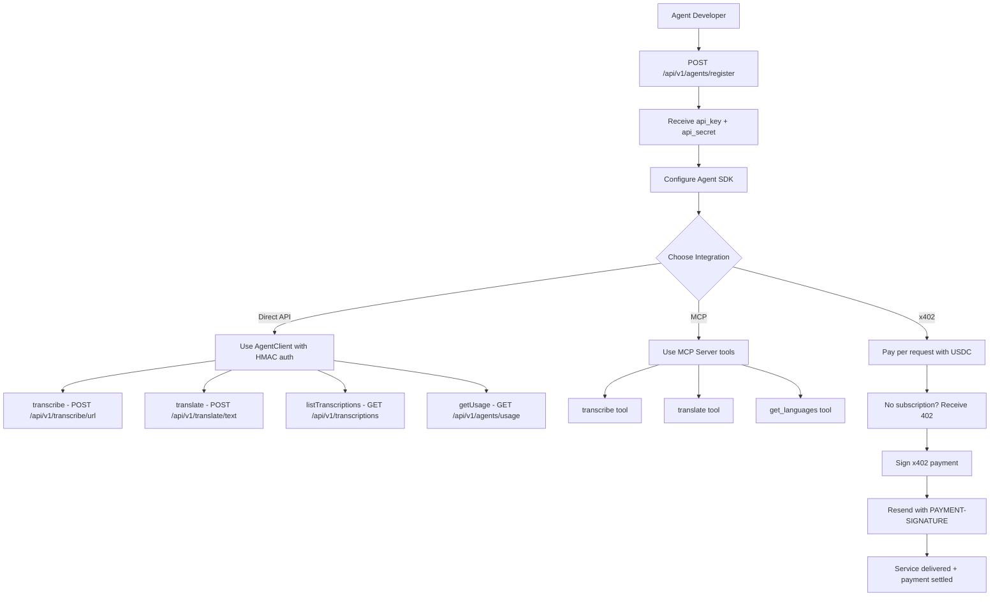

---

## 6. Priority Recommendations

| Priority | Update | Reason |
|----------|--------|--------|
| P0 | Update streaming architecture to reflect SSE→WebSocket relay | Current spec is fundamentally wrong about data flow |
| P0 | Update API endpoint paths | Spec paths don't match implementation |
| P0 | Add compute provider abstraction section | Major architectural feature not documented |
| P1 | Update auth section to reflect HMAC + JWT dual auth | SIWE is not implemented |
| P1 | Add agent API reference section | Significant implemented feature not in spec |
| P1 | Update payment section for Python implementation | Spec shows Deno Edge Functions, not Python |
| P1 | Mark Chrome Extension as not implemented | Spec describes non-existent feature |
| P2 | Update database schema to match migrations | Several tables differ or are missing |
| P2 | Update frontend section to reflect actual implementation | Spec describes TypeScript + shared libs that don't exist |
| P2 | Update languages list | 11 implemented vs 24 in spec |
| P3 | Add session management documentation | In-memory store needs documentation |
| P3 | Update environment variables section | Many new vars not in spec |